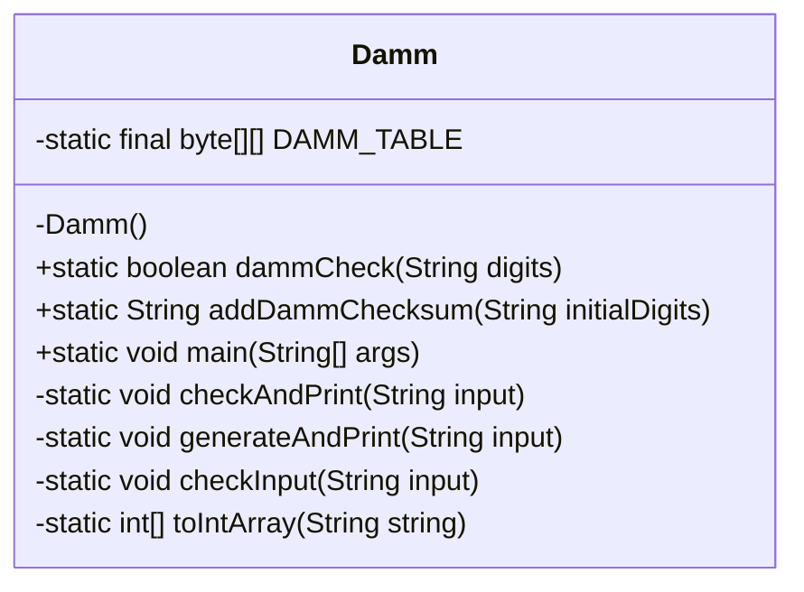
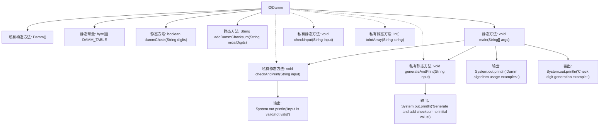

# 基础信息

|      |      |
|------|------|
| 名称 | Damm |
| 编码语言 | .java |
| 代码路径 | Java/src/main/java/com/thealgorithms/others/Damm.java |
| 包名 | com.thealgorithms.others |
| 依赖项 | ['java.util.Objects'] |
| 概述说明 | Damm算法实现校验和生成校验码，包含校验表及相关方法。 |

# 说明

Damm算法是一种用于生成和验证校验码的方法，主要用于检测数据传输或存储过程中的错误。该算法通过使用预定义的校验表和相关方法，能够有效地生成校验码，并确保数据的完整性和准确性。校验表是Damm算法的核心组成部分，它基于特定的数学规则构建，用于在计算校验码时进行参考。相关方法包括校验码的生成和验证过程，通过这些步骤可以确保数据的正确性。Damm算法因其简单性和高效性，广泛应用于各种需要数据校验的场景。

# 类列表 Class Summary

| 名称   | 类型  | 说明 |
|-------|------|-------------|
| Damm | class | Damm算法实现，用于校验和生成校验码，包含校验表和相关方法。 |

## 类 Damm

|      |      |
|------|------|
| 访问范围 | public final |
| 类型 | class |
| 名称 | Damm |
| 说明 | Damm算法实现，用于校验和生成校验码，包含校验表和相关方法。 |

### UML类图

这段代码定义了一个名为 `Damm` 的不可继承类，实现了 Damm 算法，用于校验和生成校验码。`Damm` 类包含一个私有的构造函数，防止实例化。类中定义了一个私有的二维字节数组 `DAMM_TABLE`，用于存储 Damm 算法的核心校验表。公有方法 `dammCheck` 用于校验输入的数字是否有效，`addDammChecksum` 用于生成并添加校验码。私有方法 `checkInput` 和 `toIntArray` 分别用于验证输入和将字符串转换为整数数组。`main` 方法展示了算法的使用示例，包括校验和生成校验码的功能。

### 内部方法调用关系图

这段代码实现了一个基于Damm算法的校验和计算和验证工具。Damm算法通过一个预定义的弱全反对称拟群表（DAMM_TABLE）来确保输入数字的校验和为零，从而验证其有效性。代码提供了两个主要功能：`dammCheck`用于验证输入数字的校验和是否为零，`addDammChecksum`用于为初始数字生成并添加校验和。主方法`main`展示了如何使用这两个功能，并输出验证结果和生成的校验和。私有方法`checkInput`和`toIntArray`分别用于输入验证和字符串到整数数组的转换。

### 字段列表 Field List

| 名称  | 类型  | 说明 |
|-------|-------|------|
| DAMM_TABLE = {        {0, 3, 1, 7, 5, 9, 8, 6, 4, 2},        {7, 0, 9, 2, 1, 5, 4, 8, 6, 3},        {4, 2, 0, 6, 8, 7, 1, 3, 5, 9},        {1, 7, 5, 0, 9, 8, 3, 4, 2, 6},        {6, 1, 2, 3, 0, 4, 5, 9, 7, 8},        {3, 6, 7, 4, 2, 0, 9, 5, 8, 1},        {5, 8, 6, 9, 7, 2, 0, 1, 3, 4},        {8, 9, 4, 5, 3, 6, 2, 0, 1, 7},        {9, 4, 3, 8, 6, 1, 7, 2, 0, 5},        {2, 5, 8, 1, 4, 3, 6, 7, 9, 0},    } | byte[][] | DAMM校验表，包含10x10字节数组。 |

### 方法列表 Method List

| 名称  | 类型  | 说明 |
|-------|-------|------|
| addDammChecksum | String | 静态方法`addDammChecksum`为输入数字生成并附加Damm校验和。 |
| toIntArray | int[] | 将字符串转换为整数数组。 |
| generateAndPrint | void | 生成并打印带校验和的字符串结果。 |
| checkAndPrint | void | 检查输入有效性并打印结果。 |
| main | void | Java示例展示Damm算法验证和生成校验码。 |
| dammCheck | boolean | 静态方法dammCheck验证数字串有效性，返回校验和是否为零。 |
| checkInput | void | 检查输入是否为非空且仅包含数字，否则抛出异常。 |

