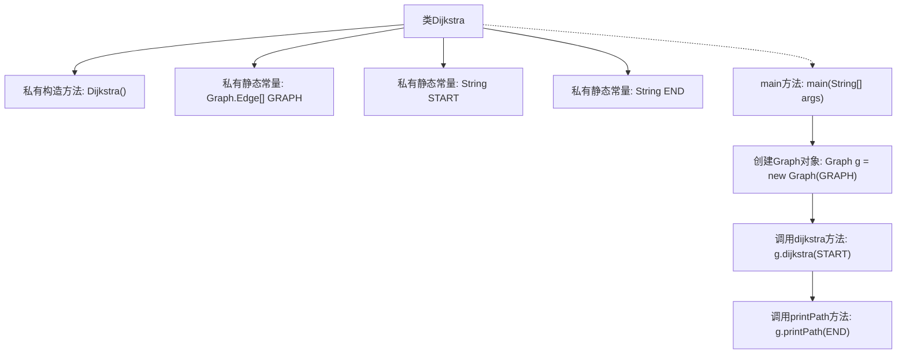
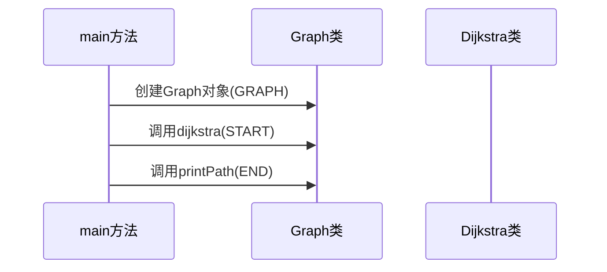
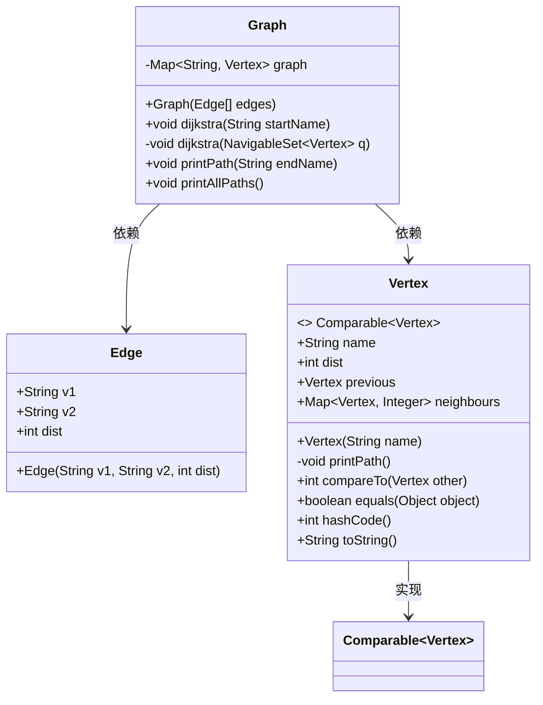

# 基础信息

|      |      |
|------|------|
| 名称 | Dijkstra |
| 编码语言 | .java |
| 代码路径 | Java/src/main/java/com/thealgorithms/others/Dijkstra.java |
| 包名 | com.thealgorithms.others |
| 依赖项 | ['java.util.HashMap', 'java.util.Map', 'java.util.NavigableSet', 'java.util.TreeSet'] |
| 概述说明 | Dijkstra算法实现计算节点a到e的最短路径，图类支持该算法。 |

# 说明

Dijkstra算法用于计算从节点a到节点e的最短路径。该算法基于图结构，图类包含顶点和边的定义，支持通过Dijkstra算法计算任意两个节点之间的最短路径。算法通过逐步遍历图中的节点，更新每个节点的最短距离，最终确定从起点到终点的最短路径。

# 类列表 Class Summary

| 名称   | 类型  | 说明 |
|-------|------|-------------|
| Dijkstra | class | Dijkstra算法实现，计算从节点a到e的最短路径。 |
| Graph | class | 图类包含顶点和边，支持Dijkstra算法计算最短路径。 |


## 类 Dijkstra

|      |      |
|------|------|
| 访问范围 | public final |
| 类型 | class |
| 名称 | Dijkstra |
| 说明 | Dijkstra算法实现，计算从节点a到e的最短路径。 |


### UML类图

```mermaid
classDiagram
    class Dijkstra {
        -Dijkstra()
        -static final Graph.Edge[] GRAPH
        -static final String START
        -static final String END
        +static void main(String[] args)
    }
    class Graph {
        +Graph(Graph.Edge[] edges)
        +void dijkstra(String start)
        +void printPath(String end)
        +void printAllPaths()
    }
    class "Graph.Edge" {
        +String source
        +String destination
        +int weight
        +Graph.Edge(String source, String destination, int weight)
    }
    Dijkstra --> Graph : 依赖
    Graph --> "Graph.Edge" : 依赖
```

这段代码实现了一个Dijkstra算法的示例。`Dijkstra`类包含一个静态的`GRAPH`数组，表示图的边及其权重，以及起始节点`START`和目标节点`END`。`main`方法创建了一个`Graph`对象，调用`dijkstra`方法计算最短路径，并通过`printPath`方法输出从起始节点到目标节点的路径。`Graph`类负责图的构建和最短路径的计算，`Graph.Edge`类表示图中的边，包含源节点、目标节点和权重。


### 内部方法调用关系图





这段代码定义了一个名为 `Dijkstra` 的类，其中包含一个私有的构造方法和一些静态常量。`main` 方法创建了一个 `Graph` 对象，并使用 `dijkstra` 方法计算从起始节点到其他节点的最短路径，最后调用 `printPath` 方法输出从起始节点到目标节点的路径。流程图展示了类的结构和方法调用关系，时序图则展示了 `main` 方法中各个步骤的执行顺序。

### 字段列表 Field List

| 名称  | 类型  | 说明 |
|-------|-------|------|
| START = "a" | String | 定义私有静态常量字符串START，值为"a"。 |
| END = "e" | String | 定义私有静态常量字符串END，值为"e"。 |
| GRAPH = {        // Distance from node "a" to node "b" is 7.        // In the current Graph there is no way to move the other way (e,g, from "b" to "a"),        // a new edge would be needed for that        new Graph.Edge("a", "b", 7),        new Graph.Edge("a", "c", 9),        new Graph.Edge("a", "f", 14),        new Graph.Edge("b", "c", 10),        new Graph.Edge("b", "d", 15),        new Graph.Edge("c", "d", 11),        new Graph.Edge("c", "f", 2),        new Graph.Edge("d", "e", 6),        new Graph.Edge("e", "f", 9),    } | Graph.Edge[] | 定义了一个包含节点间距离的有向图，节点a到b距离7，a到c距离9，a到f距离14，b到c距离10，b到d距离15，c到d距离11，c到f距离2，d到e距离6，e到f距离9。 |

### 方法列表 Method List

| 名称  | 类型  | 说明 |
|-------|-------|------|
| main | void | Java代码实现Dijkstra算法并打印最短路径。 |


## 类 Graph

|      |      |
|------|------|
| 访问范围 | None |
| 类型 | class |
| 名称 | Graph |
| 说明 | 图类包含顶点和边，支持Dijkstra算法计算最短路径。 |


### UML类图



这段代码定义了一个图结构，包含`Graph`、`Edge`和`Vertex`三个类。`Graph`类用于构建图并执行Dijkstra算法，`Edge`类表示图中的边，`Vertex`类表示图中的顶点并实现了`Comparable`接口。`Graph`类通过`Edge`数组初始化图，并通过`Vertex`类管理顶点及其邻接关系。`Vertex`类还提供了路径打印、比较和哈希等功能。


### 内部方法调用关系图



```mermaid
graph TD
    A["类Graph"]
    B["属性: Map<String, Vertex> graph"]
    C["构造方法: Graph(Edge[] edges)"]
    D["方法: void dijkstra(String startName)"]
    E["方法: void printPath(String endName)"]
    F["方法: void printAllPaths()"]
    G["私有方法: void dijkstra(NavigableSet<Vertex> q)"]
    H["内部类Edge"]
    I["属性: String v1"]
    J["属性: String v2"]
    K["属性: int dist"]
    L["构造方法: Edge(String v1, String v2, int dist)"]
    M["内部类Vertex"]
    N["属性: String name"]
    O["属性: int dist"]
    P["属性: Vertex previous"]
    Q["属性: Map<Vertex, Integer> neighbours"]
    R["构造方法: Vertex(String name)"]
    S["方法: void printPath()"]
    T["方法: int compareTo(Vertex other)"]
    U["重写方法: boolean equals(Object object)"]
    V["重写方法: int hashCode()"]
    W["重写方法: String toString()"]

    A --> B
    A --> C
    A --> D
    A --> E
    A --> F
    A --> G
    A -.-> H
    H --> I
    H --> J
    H --> K
    H --> L
    A -.-> M
    M --> N
    M --> O
    M --> P
    M --> Q
    M --> R
    M --> S
    M --> T
    M --> U
    M --> V
    M --> W
    C --> G
    D --> G
    E --> S
    F --> S
```

**描述：**
该代码定义了一个`Graph`类，用于表示图数据结构。`Graph`类包含一个`Map<String, Vertex>`属性来存储顶点，并通过`Edge`数组构造图。`Vertex`类表示图中的顶点，包含名称、距离、前驱顶点和邻居顶点等属性，并提供了路径打印、比较、相等性判断、哈希码计算和字符串表示等方法。`Graph`类提供了Dijkstra算法的实现，用于计算从指定起点到其他顶点的最短路径，并提供了打印路径的方法。整个代码结构清晰，功能完整，适用于图算法的实现和应用。

### 字段列表 Field List

| 名称  | 类型  | 说明 |
|-------|-------|------|
| graph | Map<String, Vertex> | 私有最终图结构存储顶点信息。 |

### 方法列表 Method List

| 名称  | 类型  | 说明 |
|-------|-------|------|
| printPath | void | 打印图中指定终点的路径，若不存在则报错。 |
| printAllPaths | void | 该方法遍历图中所有顶点并打印其路径。 |
| dijkstra | void | Dijkstra算法实现，遍历顶点，更新邻居最短路径。 |
| dijkstra | void | Dijkstra算法实现，检查起始点存在，初始化顶点距离，执行算法。 |


