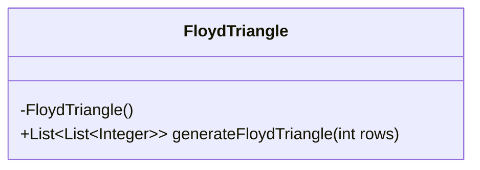
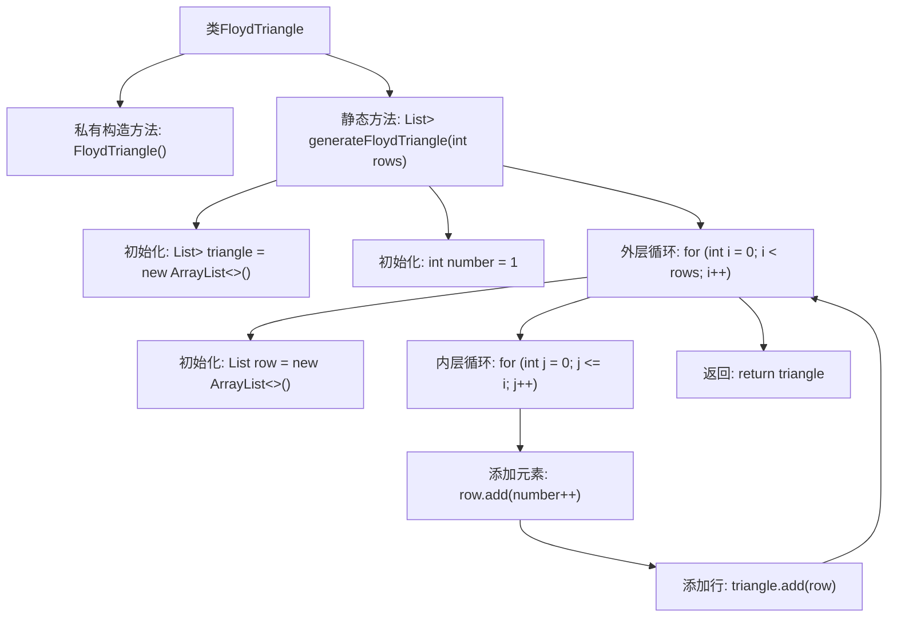

# 基础信息

|      |      |
|------|------|
| 名称 | FloydTriangle |
| 编码语言 | .java |
| 代码路径 | Java/src/main/java/com/thealgorithms/others/FloydTriangle.java |
| 包名 | com.thealgorithms.others |
| 依赖项 | ['java.util.ArrayList', 'java.util.List'] |
| 概述说明 | FloydTriangle类生成指定行数的Floyd三角形，返回二维整数列表。 |

# 说明

FloydTriangle类用于生成指定行数的Floyd三角形，并返回一个包含整数的二维列表。Floyd三角形是一种特殊的数字排列方式，其中每一行的数字从1开始依次递增，且每行的数字数量与行数相同。生成的二维列表中的每个子列表代表三角形的一行，包含该行对应的整数序列。

# 类列表 Class Summary

| 名称   | 类型  | 说明 |
|-------|------|-------------|
| FloydTriangle | class | FloydTriangle类生成指定行数的Floyd三角形，返回包含整数的二维列表。 |

## 类 FloydTriangle

|      |      |
|------|------|
| 访问范围 | final |
| 类型 | class |
| 名称 | FloydTriangle |
| 说明 | FloydTriangle类生成指定行数的Floyd三角形，返回包含整数的二维列表。 |

### UML类图

**描述**：  
`FloydTriangle` 是一个不可继承的工具类，用于生成弗洛伊德三角形。它包含一个私有构造函数，确保无法实例化该类。类中唯一的公有静态方法 `generateFloydTriangle` 接收一个整数参数 `rows`，表示三角形的行数，并返回一个包含多行整数的列表，每行表示三角形的一行。该方法通过嵌套循环逐步生成三角形，并将结果存储在列表中返回。

### 内部方法调用关系图

这段代码定义了一个名为 `FloydTriangle` 的类，其中包含一个静态方法 `generateFloydTriangle`，用于生成弗洛伊德三角形。该方法通过嵌套循环逐行生成三角形，并将每行的数字添加到列表中，最终返回包含所有行的列表。流程图展示了从初始化到返回结果的完整流程，清晰地展示了方法内部的逻辑结构和循环关系。

### 字段列表 Field List

| 名称  | 类型  | 说明 |
|-------|-------|------|

### 方法列表 Method List

| 名称  | 类型  | 说明 |
|-------|-------|------|
| generateFloydTriangle | List<List<Integer>> | 生成弗洛伊德三角形，返回指定行数的二维列表。 |

