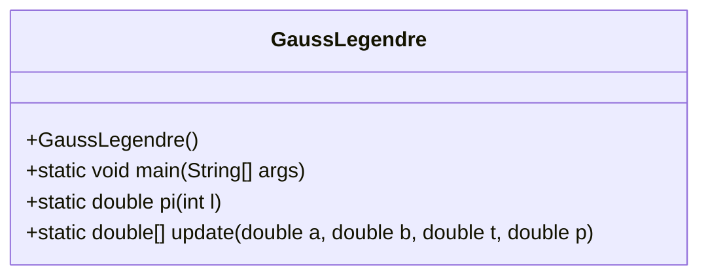
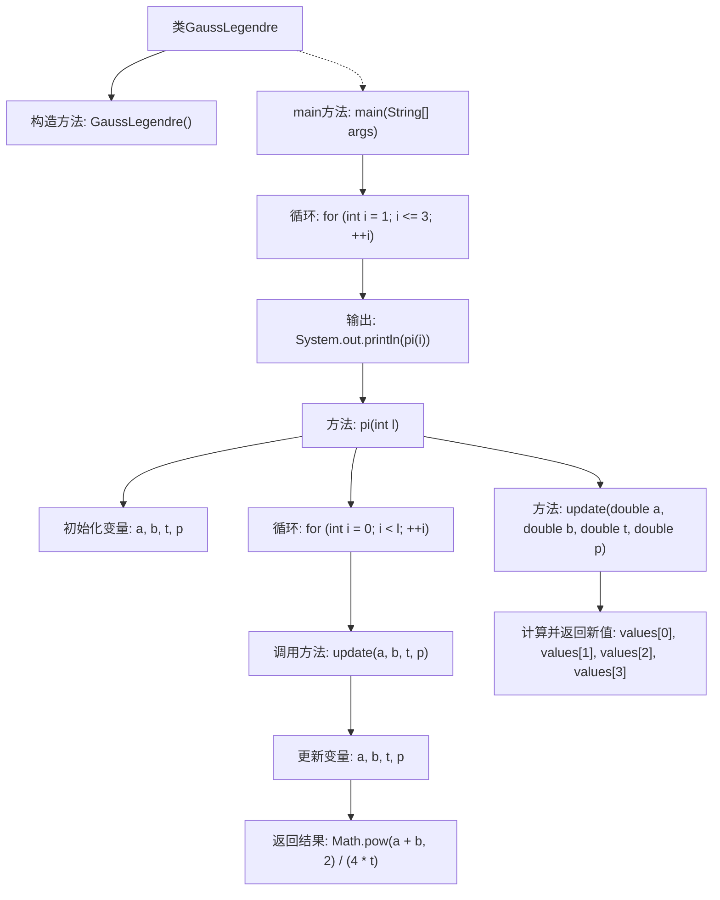

# 基础信息

|      |      |
|------|------|
| 名称 | GaussLegendre |
| 编码语言 | .java |
| 代码路径 | Java/src/main/java/com/thealgorithms/others/GaussLegendre.java |
| 包名 | com.thealgorithms.others |
| 依赖项 | [] |
| 概述说明 | GaussLegendre类通过循环更新参数计算π值并返回结果。 |

# 说明

GaussLegendre类用于计算π值，其核心机制是通过循环不断更新相关参数，最终返回精确的π值结果。该方法利用迭代过程逐步逼近π的准确值，确保计算的高精度和高效性。

# 类列表 Class Summary

| 名称   | 类型  | 说明 |
|-------|------|-------------|
| GaussLegendre | class | GaussLegendre类计算π值，通过循环更新参数并返回结果。 |

## 类 GaussLegendre

|      |      |
|------|------|
| 访问范围 | public final |
| 类型 | class |
| 名称 | GaussLegendre |
| 说明 | GaussLegendre类计算π值，通过循环更新参数并返回结果。 |

### UML类图

**描述：**  
`GaussLegendre` 类是一个工具类，用于计算π的近似值。它包含一个私有的构造函数，确保该类不能被实例化。类中的 `pi` 方法通过迭代计算π的值，使用 `update` 方法来更新迭代过程中的中间变量。`main` 方法展示了如何使用 `pi` 方法进行多次计算并输出结果。这个类的主要功能是通过高斯-勒让德算法来近似计算π的值，展示了数学算法在编程中的实现。

### 内部方法调用关系图

这段代码实现了一个计算π的Gauss-Legendre算法。`main`方法通过循环调用`pi`方法计算并输出不同迭代次数下的π值。`pi`方法通过迭代更新变量`a`, `b`, `t`, `p`，最终返回π的近似值。`update`方法用于在每次迭代中更新这些变量的值。代码通过多次迭代逐步逼近π的精确值。

### 字段列表 Field List

| 名称  | 类型  | 说明 |
|-------|-------|------|

### 方法列表 Method List

| 名称  | 类型  | 说明 |
|-------|-------|------|
| main | void | Java主函数循环三次调用pi方法并输出结果。 |
| pi | double | 计算圆周率的函数，通过迭代更新参数并返回最终结果。 |
| update | double[] | 函数update计算四个值：均值、几何平均、调整后的t值和p的两倍。 |

