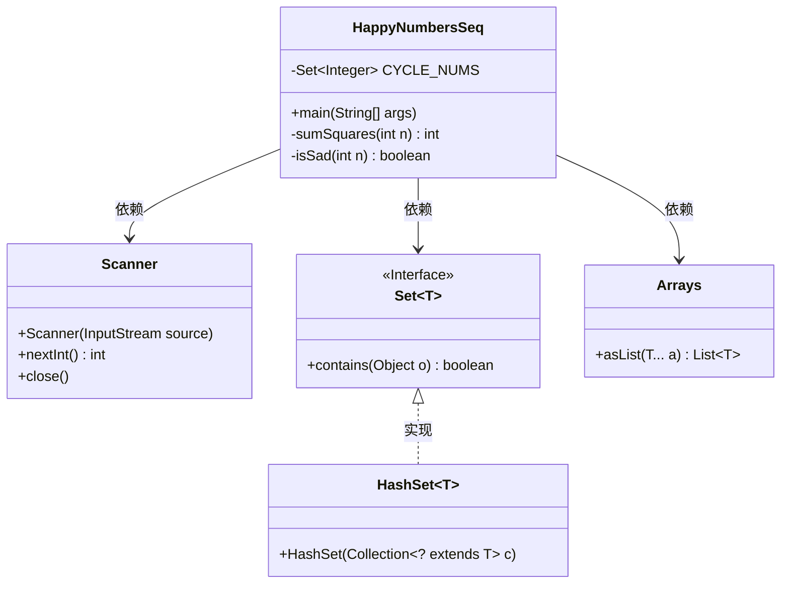
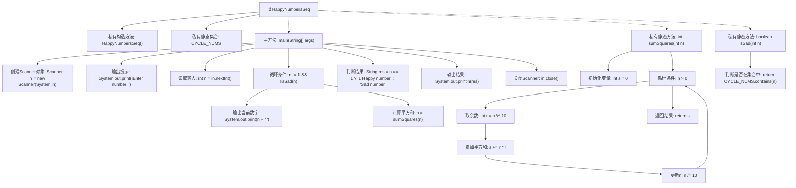

# 基础信息

|      |      |
|------|------|
| 名称 | HappyNumbersSeq |
| 编码语言 | .java |
| 代码路径 | Java/src/main/java/com/thealgorithms/others/HappyNumbersSeq.java |
| 包名 | com.thealgorithms.others |
| 依赖项 | ['java.util.Arrays', 'java.util.HashSet', 'java.util.Scanner', 'java.util.Set'] |
| 概述说明 | Java程序通过平方和循环检测判断输入数字是否为快乐数。 |

# 说明

该Java程序用于判断输入的数字是否为快乐数。程序通过计算数字的每一位的平方和，并重复这一过程，直到结果变为1或进入一个无限循环。如果最终结果为1，则该数字为快乐数；否则，不是快乐数。程序的关键在于检测循环，确保不会无限重复计算。

# 类列表 Class Summary

| 名称   | 类型  | 说明 |
|-------|------|-------------|
| HappyNumbersSeq | class | Java程序判断输入数字是否为快乐数，通过平方和计算循环检测。 |

## 类 HappyNumbersSeq

|      |      |
|------|------|
| 访问范围 | public final |
| 类型 | class |
| 名称 | HappyNumbersSeq |
| 说明 | Java程序判断输入数字是否为快乐数，通过平方和计算循环检测。 |

### UML类图

这段代码定义了一个名为 `HappyNumbersSeq` 的类，用于判断一个数字是否是“快乐数”。`HappyNumbersSeq` 类包含一个私有的静态集合 `CYCLE_NUMS`，用于存储已知的“悲伤数”循环中的数字。`main` 方法从用户输入中读取一个数字，并通过循环计算其平方和，直到数字变为1或进入已知的“悲伤数”循环。`sumSquares` 方法用于计算数字的各位平方和，`isSad` 方法用于判断数字是否在 `CYCLE_NUMS` 中。代码依赖 `Scanner` 类进行用户输入，依赖 `Set` 接口及其实现类 `HashSet` 来存储和检查数字，依赖 `Arrays` 类来初始化集合。

### 内部方法调用关系图

这段代码实现了一个判断“快乐数”的程序。用户输入一个整数，程序通过计算其各位数字的平方和，并不断迭代，直到结果为1或进入一个已知的不快乐数循环。程序最终输出该数是“快乐数”还是“不快乐数”。流程图展示了从输入到输出的完整流程，包括循环判断、平方和计算以及结果输出等步骤。

### 字段列表 Field List

| 名称  | 类型  | 说明 |
|-------|-------|------|
| CYCLE_NUMS = new HashSet<>(Arrays.asList(4, 16, 20, 37, 58, 145)) | Set<Integer> | 定义包含特定整数的静态不可变集合CYCLE_NUMS。 |

### 方法列表 Method List

| 名称  | 类型  | 说明 |
|-------|-------|------|
| main | void | Java程序判断输入数字是否为快乐数。 |
| sumSquares | int | 计算整数各位数字平方和的静态方法。 |
| isSad | boolean | 该方法检查整数n是否在CYCLE_NUMS集合中。 |

