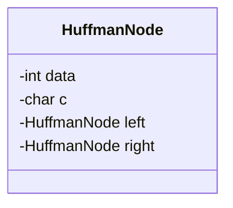
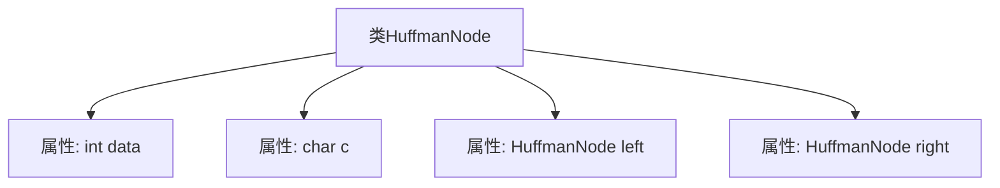
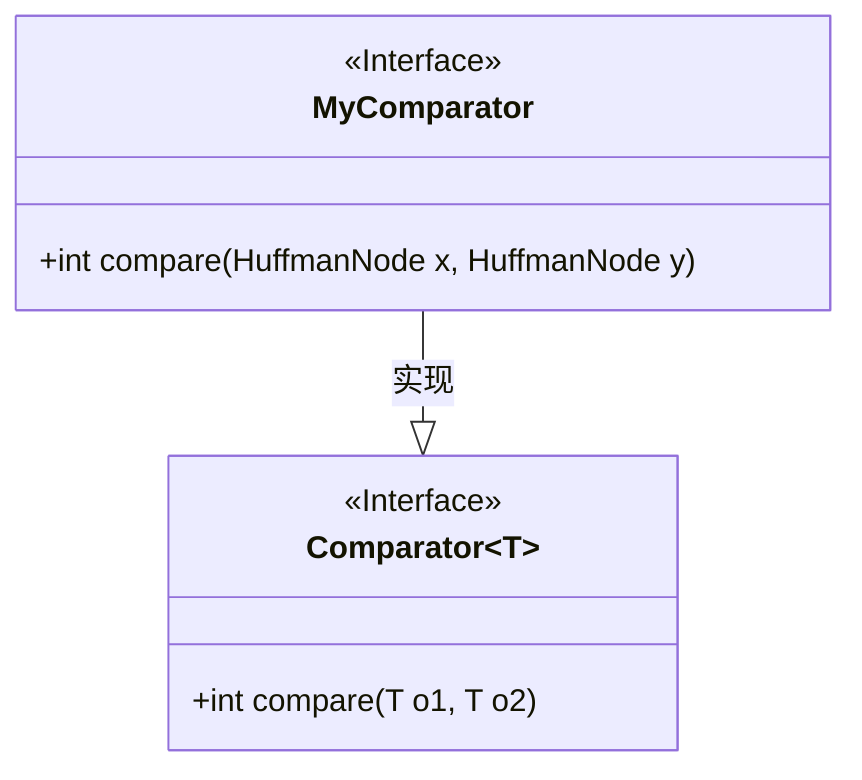
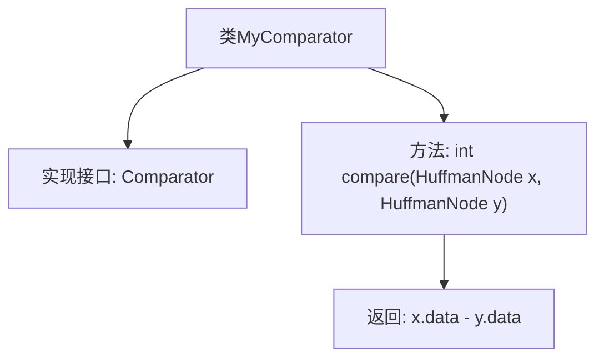
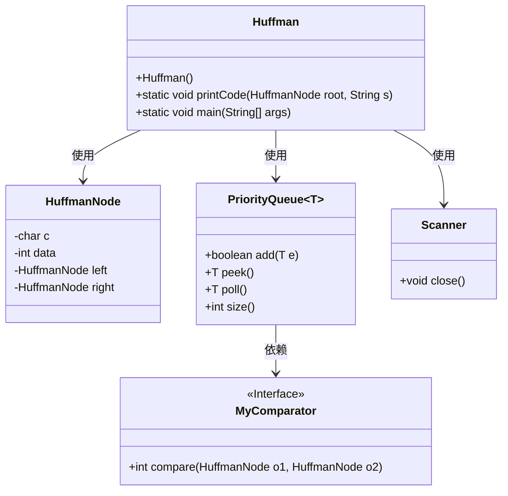
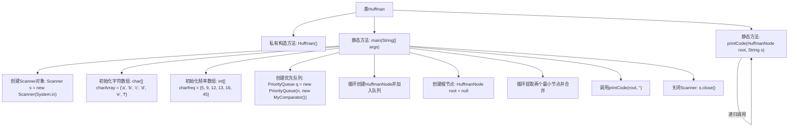

# 基础信息

|      |      |
|------|------|
| 名称 | Huffman |
| 编码语言 | .java |
| 代码路径 | Java/src/main/java/com/thealgorithms/others/Huffman.java |
| 包名 | com.thealgorithms.others |
| 依赖项 | ['java.util.Comparator', 'java.util.PriorityQueue', 'java.util.Scanner'] |
| 概述说明 | HuffmanNode类含数据、字符及子节点，MyComparator类比较节点数据，Huffman类生成并打印字符编码。 |

# 说明

HuffmanNode类用于表示哈夫曼树的节点，包含数据、字符及左右子节点。MyComparator类实现了Comparator接口，用于比较HuffmanNode的data值，以便在构建哈夫曼树时进行排序。Huffman类实现了哈夫曼编码算法，负责生成字符的哈夫曼编码并打印输出。这些类共同协作，完成了哈夫曼编码的整个过程，从构建哈夫曼树到生成字符编码。

# 类列表 Class Summary

| 名称   | 类型  | 说明 |
|-------|------|-------------|
| HuffmanNode | class | HuffmanNode类包含数据、字符及左右子节点。 |
| MyComparator | class | MyComparator类实现Comparator接口，比较HuffmanNode的data值。 |
| Huffman | class | Huffman类实现Huffman编码，生成并打印字符编码。 |

## 类 HuffmanNode

|      |      |
|------|------|
| 访问范围 | None |
| 类型 | class |
| 名称 | HuffmanNode |
| 说明 | HuffmanNode类包含数据、字符及左右子节点。 |

### UML类图

这段代码定义了一个名为 `HuffmanNode` 的类，用于表示霍夫曼编码树中的节点。该类包含四个私有成员变量：`data` 用于存储节点的权重或频率，`c` 用于存储字符，`left` 和 `right` 分别指向左子节点和右子节点。这个类通常用于构建霍夫曼树，以实现数据压缩中的霍夫曼编码算法。

### 内部方法调用关系图

这段代码定义了一个名为 `HuffmanNode` 的类，该类用于表示哈夫曼树的节点。类中包含四个属性：`data` 用于存储节点的权值，`c` 用于存储节点的字符，`left` 和 `right` 分别用于指向左子节点和右子节点。这些属性共同构成了哈夫曼树的基本结构，用于实现哈夫曼编码算法中的节点表示。

### 字段列表 Field List

| 名称  | 类型  | 说明 |
|-------|-------|------|
| data | int | 定义一个整型变量data。 |
| left | HuffmanNode | Huffman节点包含左子节点。 |
| right | HuffmanNode | Huffman节点包含指向右子节点的指针。 |
| c | char | 声明字符变量c。 |

### 方法列表 Method List

| 名称  | 类型  | 说明 |
|-------|-------|------|

## 类 MyComparator

|      |      |
|------|------|
| 访问范围 | None |
| 类型 | class |
| 名称 | MyComparator |
| 说明 | MyComparator类实现Comparator接口，比较HuffmanNode的data值。 |

### UML类图

这段代码定义了一个名为 `MyComparator` 的类，该类实现了 `Comparator<HuffmanNode>` 接口。`MyComparator` 类中有一个 `compare` 方法，用于比较两个 `HuffmanNode` 对象的 `data` 属性。`Comparator` 是一个泛型接口，`MyComparator` 类通过实现该接口来提供具体的比较逻辑。类图展示了 `MyComparator` 类与 `Comparator` 接口之间的实现关系。

### 内部方法调用关系图

这段代码定义了一个名为 `MyComparator` 的类，该类实现了 `Comparator<HuffmanNode>` 接口。`MyComparator` 类中的 `compare` 方法用于比较两个 `HuffmanNode` 对象的 `data` 属性，并返回它们的差值。该类的目的是为 `HuffmanNode` 对象提供一种自定义的比较方式，通常用于排序或优先队列等场景。

### 字段列表 Field List

| 名称  | 类型  | 说明 |
|-------|-------|------|

### 方法列表 Method List

| 名称  | 类型  | 说明 |
|-------|-------|------|
| compare | int | 比较HuffmanNode对象的数据值大小。 |

## 类 Huffman

|      |      |
|------|------|
| 访问范围 | public final |
| 类型 | class |
| 名称 | Huffman |
| 说明 | Huffman类实现Huffman编码，生成并打印字符编码。 |

### UML类图

### 描述
这段代码实现了一个Huffman编码算法，用于生成字符的最优编码。`Huffman`类包含一个私有构造函数和两个静态方法：`printCode`用于递归遍历Huffman树并打印字符的编码，`main`方法用于构建Huffman树并调用`printCode`方法。`HuffmanNode`类表示Huffman树的节点，包含字符、频率和左右子节点。`MyComparator`接口用于比较`HuffmanNode`对象的频率。`PriorityQueue`用于管理`HuffmanNode`对象，并按频率排序。`Scanner`类用于关闭输入流。

### 内部方法调用关系图

这段代码实现了一个Huffman编码的生成和打印过程。首先，代码通过一个优先队列构建了一个Huffman树，然后通过递归遍历该树来生成并打印每个字符的Huffman编码。流程图中展示了从类的构造到主方法的执行过程，包括初始化、树的构建、编码的生成和打印等步骤。整个过程通过递归调用来实现树的遍历和编码的生成。

### 字段列表 Field List

| 名称  | 类型  | 说明 |
|-------|-------|------|

### 方法列表 Method List

| 名称  | 类型  | 说明 |
|-------|-------|------|
| main | void | Java代码实现哈夫曼编码，构建最小堆并生成哈夫曼树。 |
| printCode | void | 递归打印哈夫曼树节点字符及其编码。 |

