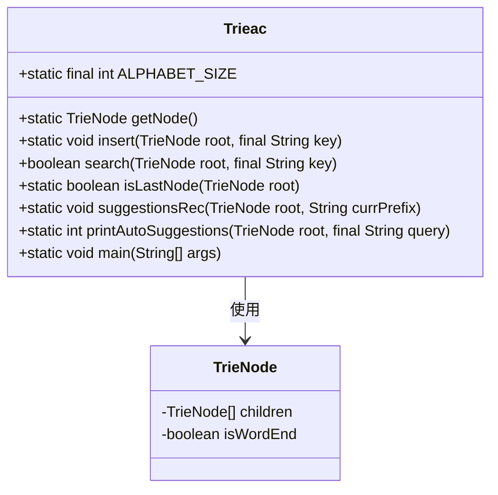
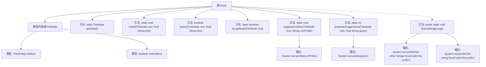

# 基础信息

|      |      |
|------|------|
| 名称 | Implementing_auto_completing_features_using_trie |
| 编码语言 | .java |
| 代码路径 | Java/src/main/java/com/thealgorithms/others/Implementing_auto_completing_features_using_trie.java |
| 包名 | com.thealgorithms.others |
| 依赖项 | [] |
| 概述说明 | 实现Trie树，支持插入、搜索和自动补全功能。 |

# 说明

实现Trie树，支持插入、搜索和自动补全功能。Trie树是一种用于高效存储和检索字符串的数据结构。插入功能允许将新字符串添加到Trie树中，确保每个字符节点按顺序排列。搜索功能用于检查特定字符串是否存在于Trie树中，通过逐字符遍历节点进行匹配。自动补全功能则根据已输入的前缀，返回所有可能的完整字符串，提升用户体验和搜索效率。

# 类列表 Class Summary

| 名称   | 类型  | 说明 |
|-------|------|-------------|
| Trieac | class | 实现Trie树，支持插入、搜索、自动补全功能。 |

## 类 Trieac

|      |      |
|------|------|
| 访问范围 | None |
| 类型 | class |
| 名称 | Trieac |
| 说明 | 实现Trie树，支持插入、搜索、自动补全功能。 |

### UML类图

这段代码实现了一个Trie（前缀树）数据结构，用于高效存储和检索字符串。`Trieac`类包含静态方法用于插入、搜索、检查是否为最后一个节点以及打印自动建议等功能。`TrieNode`类表示Trie的节点，包含一个子节点数组和一个标记是否为单词结尾的布尔值。`Trieac`类通过`TrieNode`类来构建和管理Trie树，支持字符串的插入、搜索和前缀匹配功能。

### 内部方法调用关系图

**描述：**
这段代码实现了一个Trie（前缀树）数据结构，用于高效存储和检索字符串。TrieNode类表示树的节点，包含一个子节点数组和一个标记是否为单词结尾的布尔值。主要功能包括插入字符串、搜索字符串、判断是否为最后一个节点、递归打印自动建议以及打印给定前缀的自动建议。主方法中构建了一个Trie并插入多个字符串，然后根据前缀“hel”打印自动建议结果。

### 字段列表 Field List

| 名称  | 类型  | 说明 |
|-------|-------|------|
| ALPHABET_SIZE = 26 | int | 定义常量ALPHABET_SIZE，值为26。 |

### 方法列表 Method List

| 名称  | 类型  | 说明 |
|-------|-------|------|
| suggestionsRec | void | 递归遍历Trie树，输出所有以给定前缀开头的单词。 |
| isLastNode | boolean | 判断Trie树节点是否为最后一个节点。 |
| search | boolean | 查找字符串是否存在于Trie树中，遍历字符匹配节点，返回匹配结果。 |
| insert | void | 在Trie树中插入字符串，逐字符遍历并标记词尾。 |
| main | void | Java代码实现前缀树插入和自动补全功能。 |
| getNode | TrieNode | 创建并初始化Trie节点，设置单词结束标志为假，子节点数组为空。 |
| printAutoSuggestions | int | 函数检查前缀是否存在于Trie中，并输出自动建议。 |

