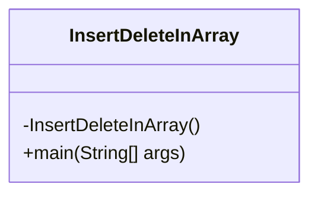
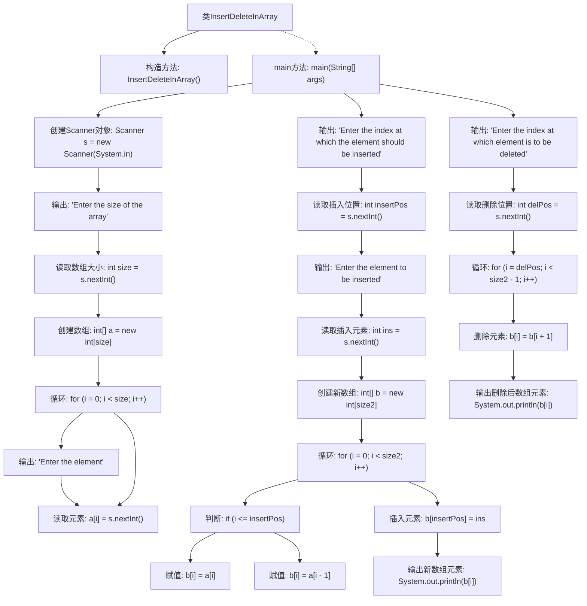

# 基础信息

|      |      |
|------|------|
| 名称 | InsertDeleteInArray |
| 编码语言 | .java |
| 代码路径 | Java/src/main/java/com/thealgorithms/others/InsertDeleteInArray.java |
| 包名 | com.thealgorithms.others |
| 依赖项 | ['java.util.Scanner'] |
| 概述说明 | Java实现数组的插入与删除操作。 |

# 说明

Java程序实现数组插入和删除操作。数组插入操作涉及在指定位置插入新元素，需将后续元素后移以腾出空间。删除操作则需移除指定位置的元素，并将后续元素前移以填补空缺。这两种操作均需考虑数组长度和边界条件，确保操作合法且不引发异常。

# 类列表 Class Summary

| 名称   | 类型  | 说明 |
|-------|------|-------------|
| InsertDeleteInArray | class | Java程序实现数组插入和删除操作。 |

## 类 InsertDeleteInArray

|      |      |
|------|------|
| 访问范围 | public final |
| 类型 | class |
| 名称 | InsertDeleteInArray |
| 说明 | Java程序实现数组插入和删除操作。 |

### UML类图

这段代码定义了一个名为 `InsertDeleteInArray` 的类，该类包含一个私有的构造函数和一个公有的 `main` 方法。`main` 方法负责处理用户输入，执行数组的插入和删除操作。首先，它读取数组的初始大小和元素，然后根据用户输入的索引和值插入新元素，最后根据用户输入的索引删除元素。整个过程通过控制台与用户交互，并输出操作后的数组内容。

### 内部方法调用关系图

这段代码实现了一个简单的数组插入和删除操作。首先，用户输入数组的大小和初始元素。然后，用户可以选择在指定位置插入一个新元素，程序会创建一个新数组并将插入后的结果输出。接着，用户可以选择删除指定位置的元素，程序会调整数组并输出删除后的结果。整个过程通过循环和条件判断实现，确保数组的正确操作。

### 字段列表 Field List

| 名称  | 类型  | 说明 |
|-------|-------|------|

### 方法列表 Method List

| 名称  | 类型  | 说明 |
|-------|-------|------|
| main | void | Java程序：输入数组大小，初始化数组，插入元素，删除元素并输出结果。 |

