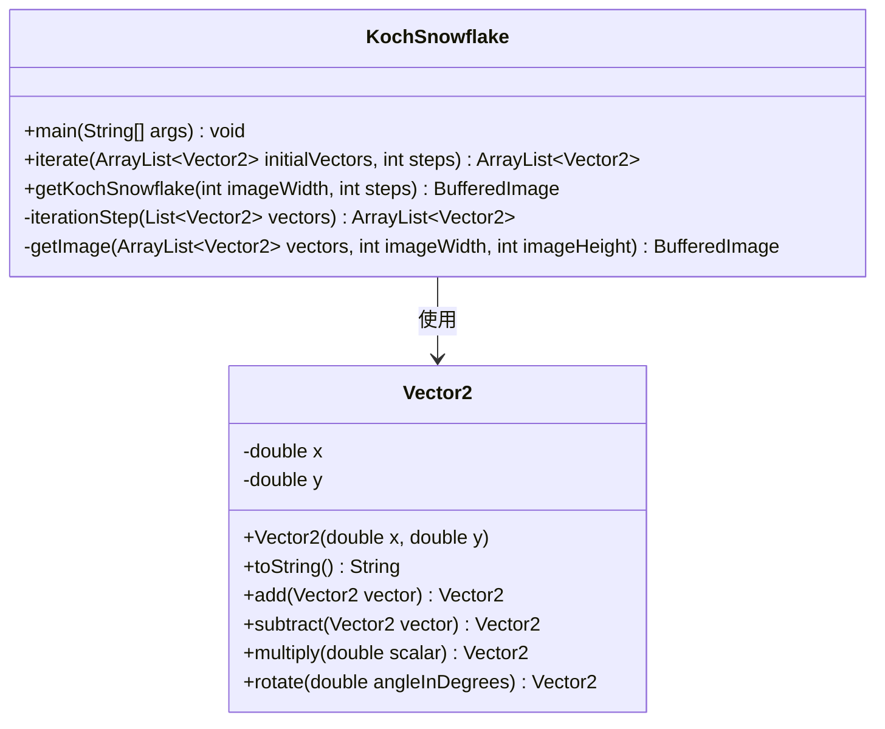
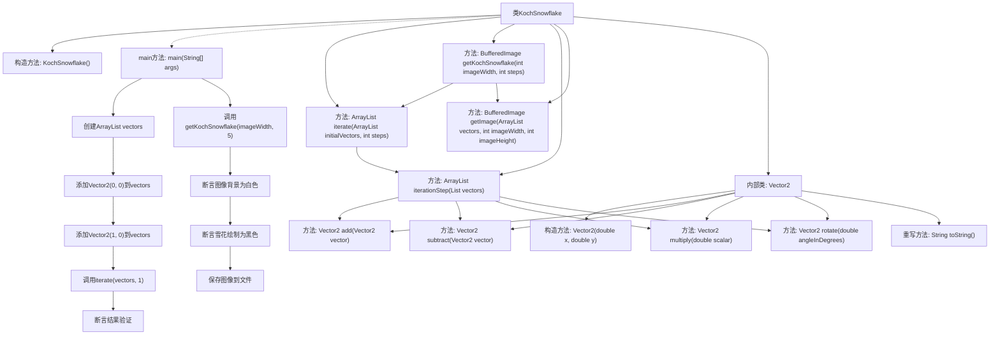

# 基础信息

|      |      |
|------|------|
| 名称 | KochSnowflake |
| 编码语言 | .java |
| 代码路径 | Java/src/main/java/com/thealgorithms/others/KochSnowflake.java |
| 包名 | com.thealgorithms.others |
| 依赖项 | ['java.awt.BasicStroke', 'java.awt.Color', 'java.awt.Graphics2D', 'java.awt.image.BufferedImage', 'java.io.File', 'java.io.IOException', 'java.util.ArrayList', 'java.util.List', 'javax.imageio.ImageIO'] |
| 概述说明 | KochSnowflake类实现科赫雪花生成与渲染，支持迭代和图像绘制。 |

# 说明

KochSnowflake类用于生成和渲染科赫雪花图案，具备迭代和图像绘制功能。该类通过迭代算法逐步构建科赫雪花的复杂结构，并能够将生成的图案渲染为图像。

# 类列表 Class Summary

| 名称   | 类型  | 说明 |
|-------|------|-------------|
| KochSnowflake | class | KochSnowflake类实现科赫雪花的生成与渲染，包含迭代和图像绘制功能。 |

## 类 KochSnowflake

|      |      |
|------|------|
| 访问范围 | public final |
| 类型 | class |
| 名称 | KochSnowflake |
| 说明 | KochSnowflake类实现科赫雪花的生成与渲染，包含迭代和图像绘制功能。 |

### UML类图

这段代码定义了一个`KochSnowflake`类，用于生成和渲染科赫雪花图案。`KochSnowflake`类包含多个静态方法，用于迭代生成科赫雪花的向量点，并将这些点渲染为图像。`Vector2`是一个内部类，用于处理二维向量的基本运算，如加法、减法、乘法和旋转。`KochSnowflake`类依赖于`Vector2`类来完成向量计算，最终生成科赫雪花的图像。

### 内部方法调用关系图

这段代码实现了一个Koch雪花的生成和渲染过程。`KochSnowflake`类包含多个方法，用于迭代生成雪花的向量、渲染图像以及处理向量计算。`main`方法测试了迭代和渲染功能，并通过断言验证结果。`Vector2`内部类提供了向量运算的基本操作。流程图展示了类之间的调用关系和方法执行的流程。

### 字段列表 Field List

| 名称  | 类型  | 说明 |
|-------|-------|------|

### 方法列表 Method List

| 名称  | 类型  | 说明 |
|-------|-------|------|
| iterationStep | ArrayList<Vector2> | 迭代计算向量列表，生成新向量并返回。 |
| iterate | ArrayList<Vector2> | 迭代处理向量列表，返回指定步数后的结果。 |
| getImage | BufferedImage | 该方法生成白色背景图像，绘制黑色线段连接向量点。 |
| main | void | 测试迭代方法验证向量结果，测试生成科赫雪花图像并保存。 |
| getKochSnowflake | BufferedImage | 生成科赫雪花图像的Java方法，验证宽度并计算初始向量。 |

