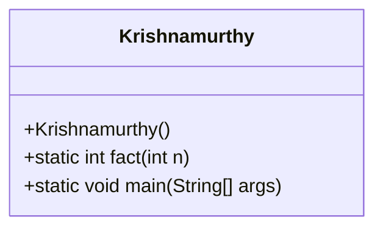
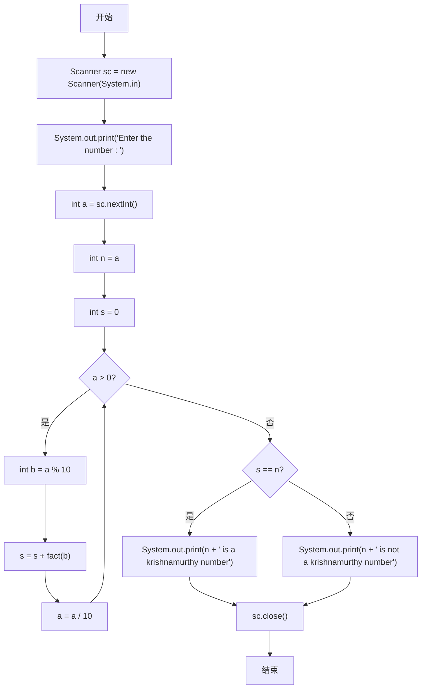
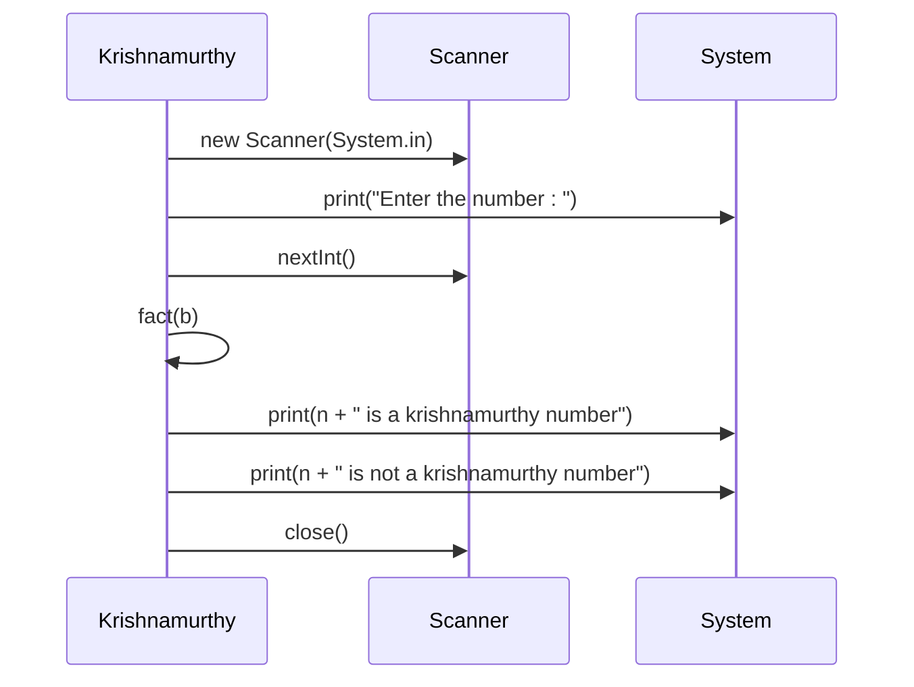
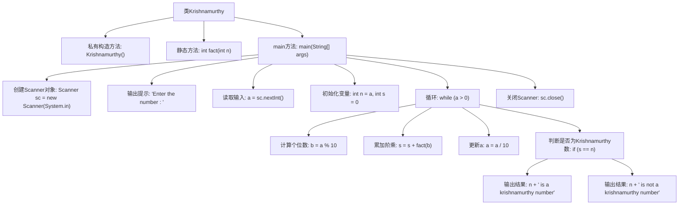

# 基础信息

|      |      |
|------|------|
| 名称 | Krishnamurthy |
| 编码语言 | .java |
| 代码路径 | Java/src/main/java/com/thealgorithms/others/Krishnamurthy.java |
| 包名 | com.thealgorithms.others |
| 依赖项 | ['java.util.Scanner'] |
| 概述说明 | Krishnamurthy类用于判断输入数字是否为Krishnamurthy数。 |

# 说明

Krishnamurthy类用于判断输入的数字是否为Krishnamurthy数。Krishnamurthy数是指一个数字等于其各位数字的阶乘之和。例如，145是一个Krishnamurthy数，因为1! + 4! + 5! = 1 + 24 + 120 = 145。该类通过计算输入数字的每一位数字的阶乘并求和，最后将结果与原始数字进行比较，以确定其是否为Krishnamurthy数。

# 类列表 Class Summary

| 名称   | 类型  | 说明 |
|-------|------|-------------|
| Krishnamurthy | class | Krishnamurthy类判断输入数字是否为Krishnamurthy数。 |

## 类 Krishnamurthy

|      |      |
|------|------|
| 访问范围 | final |
| 类型 | class |
| 名称 | Krishnamurthy |
| 说明 | Krishnamurthy类判断输入数字是否为Krishnamurthy数。 |

### UML类图

**描述：**  
该代码定义了一个名为 `Krishnamurthy` 的最终类，包含一个私有构造函数和两个静态方法。`fact` 方法用于计算给定整数的阶乘，`main` 方法则通过用户输入的数字判断其是否为 Krishnamurthy 数（即其各位数字的阶乘之和等于该数本身）。流程图展示了程序的执行流程，时序图则描述了类与外部系统（如 `Scanner` 和 `System`）之间的交互过程。

### 内部方法调用关系图

这段代码定义了一个名为`Krishnamurthy`的类，用于判断一个数是否为Krishnamurthy数（即一个数的各位数字的阶乘之和等于它本身）。代码首先通过`Scanner`获取用户输入的数字，然后通过循环计算该数字的各位数字的阶乘并累加，最后判断累加结果是否与原始数字相等，从而输出判断结果。

### 字段列表 Field List

| 名称  | 类型  | 说明 |
|-------|-------|------|

### 方法列表 Method List

| 名称  | 类型  | 说明 |
|-------|-------|------|
| fact | int | 计算整数n的阶乘并返回结果。 |
| main | void | Java程序判断输入数字是否为Krishnamurthy数。 |

