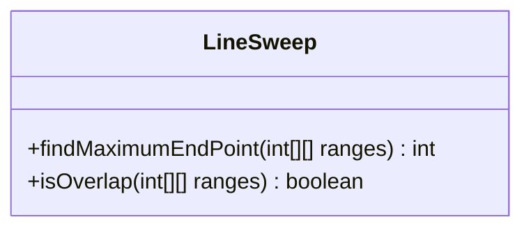
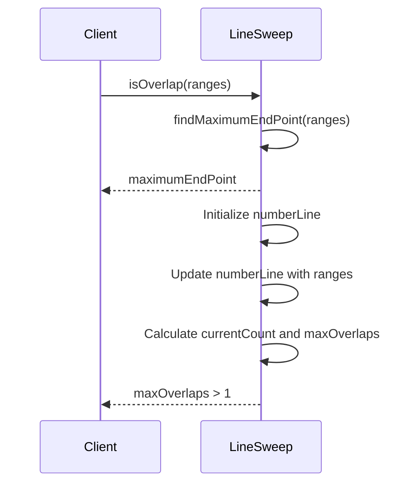
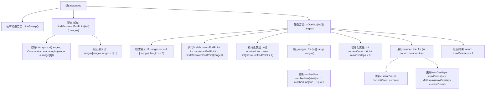

# 基础信息

|      |      |
|------|------|
| 名称 | LineSweep |
| 编码语言 | .java |
| 代码路径 | Java/src/main/java/com/thealgorithms/others/LineSweep.java |
| 包名 | com.thealgorithms.others |
| 依赖项 | ['java.util.Arrays', 'java.util.Comparator'] |
| 概述说明 | LineSweep类提供两个方法：findMaximumEndPoint查找最大终点，isOverlap判断范围重叠。 |

# 说明

LineSweep类提供了两个核心方法：findMaximumEndPoint用于从给定的范围列表中确定最大终点值，isOverlap则用于检查两个范围是否存在重叠部分。这两个方法分别处理范围的最大值计算和重叠判断，为范围相关操作提供了基础功能支持。

# 类列表 Class Summary

| 名称   | 类型  | 说明 |
|-------|------|-------------|
| LineSweep | class | LineSweep类包含两个方法：findMaximumEndPoint用于查找范围列表的最大终点，isOverlap用于判断范围是否重叠。 |

## 类 LineSweep

|      |      |
|------|------|
| 访问范围 | public final |
| 类型 | class |
| 名称 | LineSweep |
| 说明 | LineSweep类包含两个方法：findMaximumEndPoint用于查找范围列表的最大终点，isOverlap用于判断范围是否重叠。 |

### UML类图

这段代码定义了一个名为 `LineSweep` 的类，其中包含两个静态方法：`findMaximumEndPoint` 和 `isOverlap`。`findMaximumEndPoint` 方法用于查找给定范围列表中的最大端点，而 `isOverlap` 方法则用于判断这些范围是否存在重叠。代码通过排序和数轴标记的方式高效地实现了这些功能。类图展示了 `LineSweep` 类的结构，时序图则描述了 `isOverlap` 方法的调用流程。

### 内部方法调用关系图

**流程图描述：**
该流程图展示了`LineSweep`类的结构及其内部方法的调用关系。`findMaximumEndPoint`方法首先对输入的二维数组进行排序，然后返回最大端点值。`isOverlap`方法通过调用`findMaximumEndPoint`获取最大端点，初始化一个数组来记录每个点的重叠次数，最后通过遍历该数组判断是否存在重叠。整个流程清晰地展示了从输入处理到结果输出的步骤。

### 字段列表 Field List

| 名称  | 类型  | 说明 |
|-------|-------|------|

### 方法列表 Method List

| 名称  | 类型  | 说明 |
|-------|-------|------|
| isOverlap | boolean | 检查二维区间数组是否存在重叠。 |
| findMaximumEndPoint | int | 方法findMaximumEndPoint对二维数组按第二元素排序，返回最大终点值。 |

