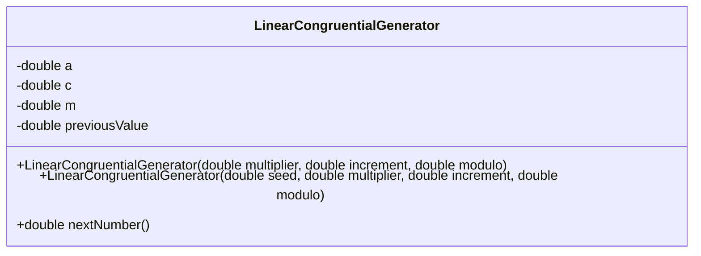
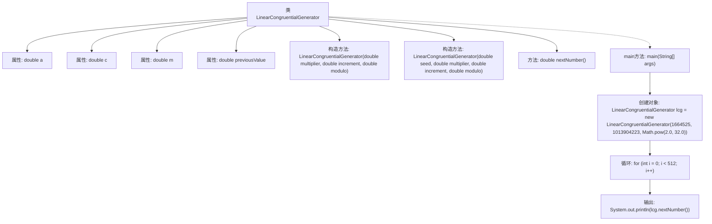

# 基础信息

|      |      |
|------|------|
| 名称 | LinearCongruentialGenerator |
| 编码语言 | .java |
| 代码路径 | Java/src/main/java/com/thealgorithms/others/LinearCongruentialGenerator.java |
| 包名 | com.thealgorithms.others |
| 依赖项 | [] |
| 概述说明 | 线性同余生成器类，生成伪随机数，可自定义乘数、增量和模数。 |

# 说明

线性同余生成器类是一种用于生成伪随机数的工具，允许用户自定义乘数、增量和模数参数。通过调整这些参数，用户可以根据需求生成不同的随机数序列，适用于需要伪随机数的各种应用场景。

# 类列表 Class Summary

| 名称   | 类型  | 说明 |
|-------|------|-------------|
| LinearCongruentialGenerator | class | 线性同余生成器类，生成伪随机数，支持自定义乘数、增量和模数。 |

## 类 LinearCongruentialGenerator

|      |      |
|------|------|
| 访问范围 | public |
| 类型 | class |
| 名称 | LinearCongruentialGenerator |
| 说明 | 线性同余生成器类，生成伪随机数，支持自定义乘数、增量和模数。 |

### UML类图

**描述：**  
`LinearCongruentialGenerator` 类实现了一个线性同余生成器（LCG），用于生成伪随机数。类中包含四个私有成员变量：`a`（乘数）、`c`（增量）、`m`（模数）和 `previousValue`（前一个生成的值）。类提供了两个构造函数，分别用于初始化生成器的参数，其中一个构造函数使用当前时间戳作为种子。`nextNumber()` 方法根据线性同余公式生成下一个伪随机数，并返回该值。该类通过简单的数学运算生成伪随机数序列，适用于需要快速生成随机数的场景。

### 内部方法调用关系图

这段代码实现了一个线性同余生成器（LCG），用于生成伪随机数。类 `LinearCongruentialGenerator` 包含两个构造方法，分别接受不同的参数来初始化生成器的状态。`nextNumber()` 方法根据线性同余公式计算下一个伪随机数，并更新内部状态。`main` 方法展示了如何使用该生成器生成并输出512个伪随机数。流程图清晰地展示了类的结构、方法调用关系以及程序的执行流程。

### 字段列表 Field List

| 名称  | 类型  | 说明 |
|-------|-------|------|
| a | double | 声明了一个私有的不可变双精度浮点数变量a。 |
| previousValue | double | 声明一个私有的双精度浮点数变量previousValue。 |
| m | double | 声明一个私有的不可变双精度浮点数变量m。 |
| c | double | 定义了一个私有的不可变双精度浮点数变量c。 |

### 方法列表 Method List

| 名称  | 类型  | 说明 |
|-------|-------|------|
| nextNumber | double | 该方法生成并返回下一个伪随机数，基于线性同余算法。 |
| main | void | Java代码演示线性同余生成器生成512个随机数。 |

