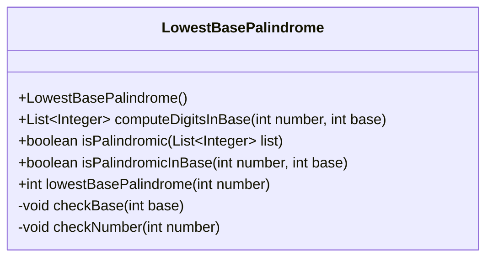
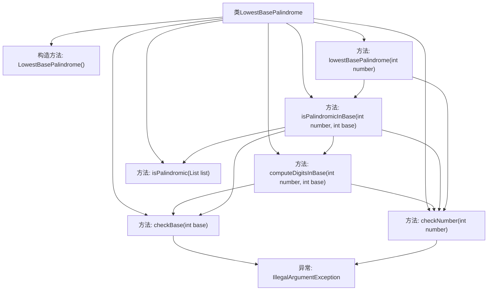

# 基础信息

|      |      |
|------|------|
| 名称 | LowestBasePalindrome |
| 编码语言 | .java |
| 代码路径 | Java/src/main/java/com/thealgorithms/others/LowestBasePalindrome.java |
| 包名 | com.thealgorithms.others |
| 依赖项 | ['java.util.ArrayList', 'java.util.List'] |
| 概述说明 | LowestBasePalindrome类验证基数、计算表示、判断回文并寻找最小回文基数。 |

# 说明

LowestBasePalindrome类提供了一系列功能，包括验证基数和数字的有效性、计算数字在不同基数下的表示形式、判断某个数字在特定基数下是否为回文，以及寻找使给定数字成为回文的最小基数。这些方法共同构成了一个完整的工具集，用于处理与回文数和基数相关的计算和验证任务。

# 类列表 Class Summary

| 名称   | 类型  | 说明 |
|-------|------|-------------|
| LowestBasePalindrome | class | LowestBasePalindrome类提供验证基数和数字、计算数字在不同基数下的表示、判断是否为回文以及寻找最小回文基数的方法。 |

## 类 LowestBasePalindrome

|      |      |
|------|------|
| 访问范围 | public final |
| 类型 | class |
| 名称 | LowestBasePalindrome |
| 说明 | LowestBasePalindrome类提供验证基数和数字、计算数字在不同基数下的表示、判断是否为回文以及寻找最小回文基数的方法。 |

### UML类图

### 描述
`LowestBasePalindrome` 类是一个工具类，用于计算给定数字在不同进制下的回文性质。它提供了多个静态方法，包括验证基数和数字的有效性、计算数字在指定进制下的表示、检查列表是否为回文、以及检查数字在指定进制下是否为回文。最终，`lowestBasePalindrome` 方法用于找到使给定数字在该进制下为回文的最小基数。该类通过严格的条件检查确保输入的合法性，并提供了高效的回文判断机制。

### 内部方法调用关系图

**描述：**  
该流程图展示了`LowestBasePalindrome`类的结构及其内部方法的调用关系。类中包含多个私有和公有方法，用于验证基数、验证数字、计算数字在特定基数下的表示、检查列表是否为回文、检查数字在特定基数下是否为回文，以及寻找使数字成为回文的最小基数。流程图中清晰地展示了方法之间的调用关系，并标识了可能抛出的`IllegalArgumentException`异常。

### 字段列表 Field List

| 名称  | 类型  | 说明 |
|-------|-------|------|

### 方法列表 Method List

| 名称  | 类型  | 说明 |
|-------|-------|------|
| checkNumber | void | 检查数字是否为非负数，否则抛出异常。 |
| isPalindromic | boolean | 判断整数列表是否为回文的静态方法。 |
| computeDigitsInBase | List<Integer> | 计算数字在指定进制下的各位数字并返回列表。 |
| lowestBasePalindrome | int | 方法查找数字在最小进制下的回文表示。 |
| checkBase | void | 检查基数，若小于等于1则抛出异常。 |
| isPalindromicInBase | boolean | 判断数字在指定进制下是否为回文数，处理边界条件和末位为0的情况。 |

