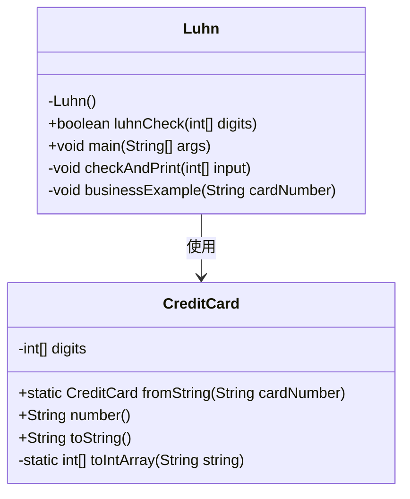
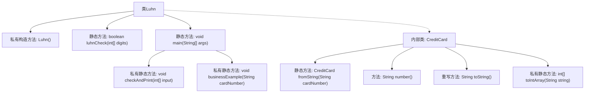
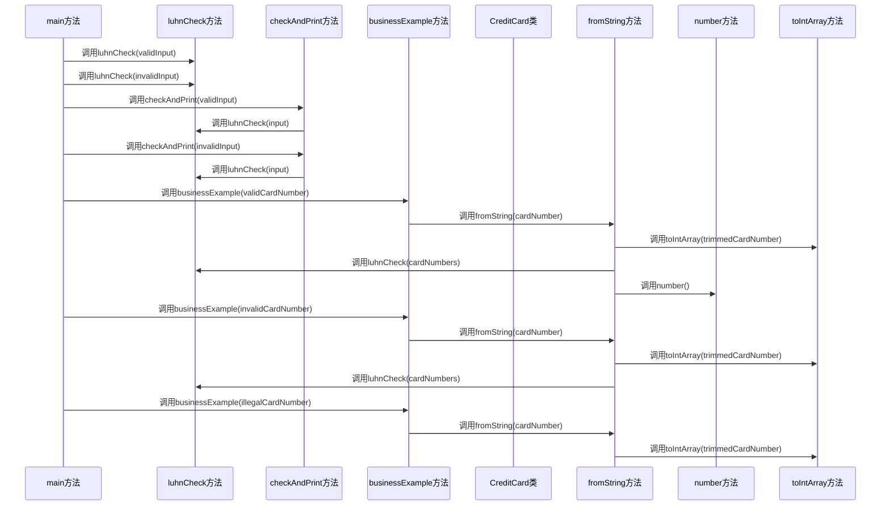

# 基础信息

|      |      |
|------|------|
| 名称 | Luhn |
| 编码语言 | .java |
| 代码路径 | Java/src/main/java/com/thealgorithms/others/Luhn.java |
| 包名 | com.thealgorithms.others |
| 依赖项 | ['java.util.Arrays', 'java.util.Objects'] |
| 概述说明 | Luhn算法验证信用卡号，含示例与业务应用。 |

# 说明

Luhn算法是一种用于验证信用卡号有效性的数学算法。它通过特定的计算步骤检查信用卡号是否符合标准，广泛应用于金融和支付系统中。该算法的主要步骤包括对信用卡号中的数字进行加权求和，并验证最终结果是否能被10整除。通过这种方式，Luhn算法能够有效检测出输入错误或伪造的信用卡号，确保交易的安全性。其业务用例包括在线支付、信用卡申请验证以及防止欺诈等场景。

# 类列表 Class Summary

| 名称   | 类型  | 说明 |
|-------|------|-------------|
| Luhn | class | Luhn算法实现用于验证信用卡号，包含示例和业务用例。 |

## 类 Luhn

|      |      |
|------|------|
| 访问范围 | public final |
| 类型 | class |
| 名称 | Luhn |
| 说明 | Luhn算法实现用于验证信用卡号，包含示例和业务用例。 |

### UML类图

### 描述
这段代码实现了一个用于验证信用卡号码的Luhn算法。`Luhn`类包含一个静态方法`luhnCheck`，用于检查输入的数组是否符合Luhn算法。`CreditCard`类是一个记录类，用于表示信用卡号码，并提供了从字符串创建信用卡对象的方法`fromString`，以及将信用卡号码格式化为字符串的方法`number`。`Luhn`类通过`businessExample`方法展示了如何在实际业务中使用`CreditCard`类来验证信用卡号码。

### 内部方法调用关系图

**描述：**  
该代码实现了一个Luhn算法验证器，用于检查信用卡号的有效性。`Luhn`类包含一个私有构造方法和多个静态方法，其中`luhnCheck`方法用于执行Luhn算法的验证。`main`方法展示了如何使用该算法验证不同的输入，并通过`checkAndPrint`和`businessExample`方法输出验证结果。`CreditCard`内部类用于表示信用卡对象，提供了从字符串创建信用卡对象的方法`fromString`，并包含用于格式化信用卡号的`number`方法。整个流程展示了从输入验证到对象创建的完整过程。

### 字段列表 Field List

| 名称  | 类型  | 说明 |
|-------|-------|------|

### 方法列表 Method List

| 名称  | 类型  | 说明 |
|-------|-------|------|
| checkAndPrint | void | 检查数组有效性并打印结果。 |
| main | void | Java代码示例展示Luhn算法验证信用卡号。 |
| luhnCheck | boolean | Luhn算法验证数组数字，计算总和并检查是否被10整除。 |
| businessExample | void | 方法尝试创建信用卡对象，成功则输出信息，失败则捕获异常并输出错误信息。 |

