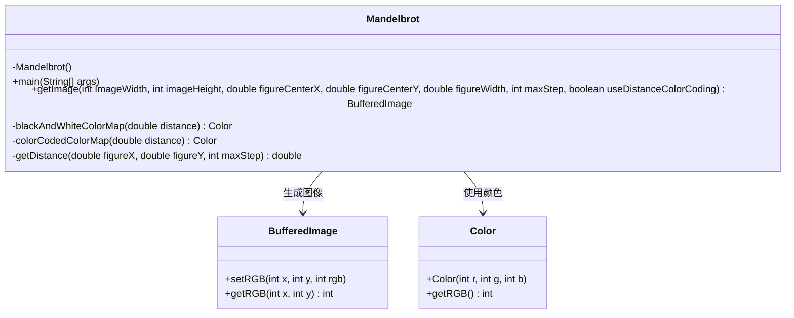
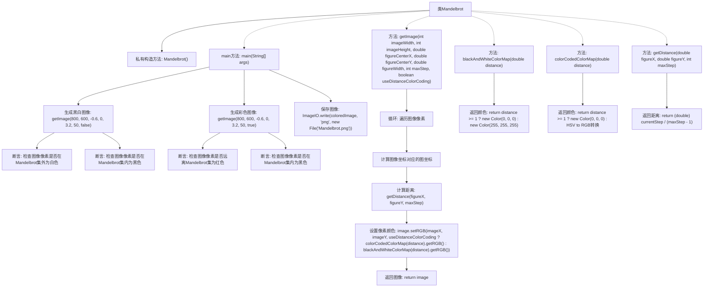

# 基础信息

|      |      |
|------|------|
| 名称 | Mandelbrot |
| 编码语言 | .java |
| 代码路径 | Java/src/main/java/com/thealgorithms/others/Mandelbrot.java |
| 包名 | com.thealgorithms.others |
| 依赖项 | ['java.awt.Color', 'java.awt.image.BufferedImage', 'java.io.File', 'java.io.IOException', 'javax.imageio.ImageIO'] |
| 概述说明 | Mandelbrot类生成黑白和彩色Mandelbrot集图像，验证像素颜色并保存。 |

# 说明

Mandelbrot类用于生成黑白和彩色的Mandelbrot集图像。该类首先验证每个像素的颜色，确保其符合Mandelbrot集的计算规则。随后，生成的图像会被保存为文件，以便后续查看或使用。整个过程涉及复杂的数学计算和图像处理，最终输出高质量的Mandelbrot集图像。

# 类列表 Class Summary

| 名称   | 类型  | 说明 |
|-------|------|-------------|
| Mandelbrot | class | Mandelbrot类生成黑白和彩色Mandelbrot集图像，验证像素颜色并保存图像。 |

## 类 Mandelbrot

|      |      |
|------|------|
| 访问范围 | public final |
| 类型 | class |
| 名称 | Mandelbrot |
| 说明 | Mandelbrot类生成黑白和彩色Mandelbrot集图像，验证像素颜色并保存图像。 |

### UML类图

这段代码定义了一个 `Mandelbrot` 类，用于生成曼德博集合的图像。`Mandelbrot` 类包含一个私有的构造函数和四个方法：`main` 方法用于测试和生成图像，`getImage` 方法用于生成曼德博集合的图像，`blackAndWhiteColorMap` 和 `colorCodedColorMap` 方法用于根据距离生成颜色，`getDistance` 方法用于计算曼德博集合中点的发散距离。`Mandelbrot` 类依赖于 `BufferedImage` 和 `Color` 类来生成和处理图像。

### 内部方法调用关系图

这段代码实现了一个Mandelbrot集合的生成和渲染过程。`Mandelbrot`类通过`getImage`方法生成图像，支持黑白和彩色两种渲染模式。`main`方法中，首先生成黑白图像并进行断言检查，确保像素颜色正确。然后生成彩色图像并进行类似的断言检查，最后将彩色图像保存为PNG文件。`getImage`方法通过遍历图像像素，计算每个像素对应的Mandelbrot集合中的坐标，并根据距离决定像素颜色。`blackAndWhiteColorMap`和`colorCodedColorMap`方法分别处理黑白和彩色渲染，而`getDistance`方法计算像素与Mandelbrot集合的距离。

### 字段列表 Field List

| 名称  | 类型  | 说明 |
|-------|-------|------|

### 方法列表 Method List

| 名称  | 类型  | 说明 |
|-------|-------|------|
| getDistance | double | 计算复数迭代距离，判断发散阈值并返回步数比例。 |
| blackAndWhiteColorMap | Color | 根据距离返回黑白颜色：距离≥1为黑色，否则为白色。 |
| main | void | 测试Mandelbrot集图像生成，验证黑白和彩色像素，保存图像为PNG。 |
| getImage | BufferedImage | 生成图像，检查参数，计算坐标，着色像素，返回图像。 |
| colorCodedColorMap | Color | 根据距离生成颜色，距离大于1为黑色，否则将距离转换为HSV再转RGB。 |

