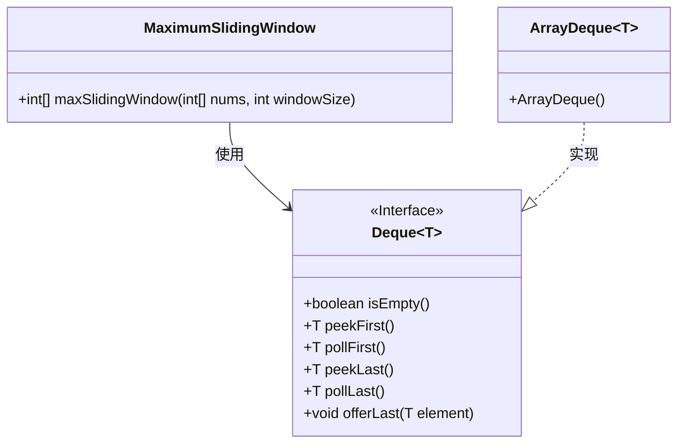
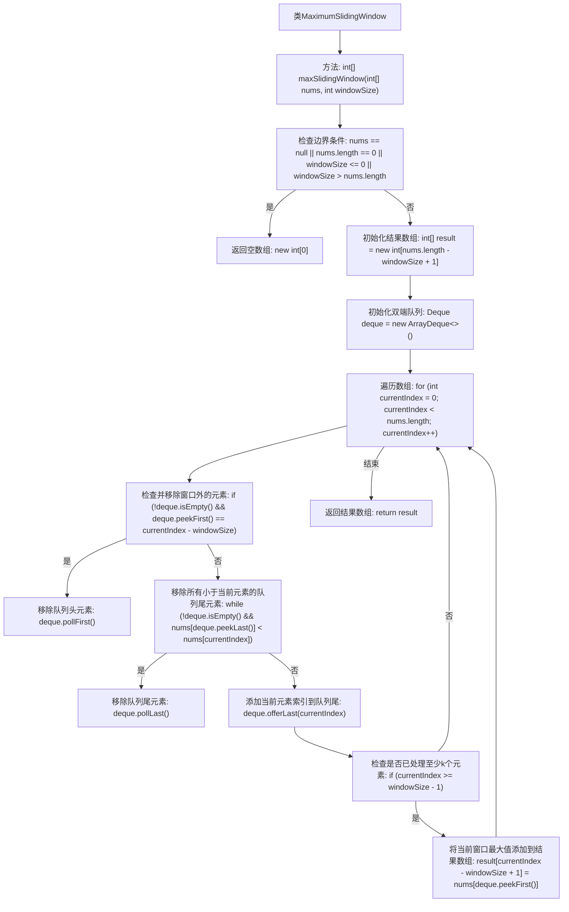

# 基础信息

|      |      |
|------|------|
| 名称 | MaximumSlidingWindow |
| 编码语言 | .java |
| 代码路径 | Java/src/main/java/com/thealgorithms/others/MaximumSlidingWindow.java |
| 包名 | com.thealgorithms.others |
| 依赖项 | ['java.util.ArrayDeque', 'java.util.Deque'] |
| 概述说明 | 滑动窗口算法用于查找窗口内最大值。 |

# 说明

滑动窗口算法是一种用于在数据流中查找窗口内最大值的高效方法。该算法通过维护一个双端队列来存储当前窗口内的潜在最大值索引，确保队列中的元素按从大到小排列。每次滑动窗口时，移除队列中不在当前窗口范围内的元素，并将新元素与队列尾部元素比较，移除所有小于新元素的尾部元素，最后将新元素加入队列。这样，队列的头部始终是当前窗口的最大值。该算法的时间复杂度为O(n)，适用于处理大规模数据流中的窗口最大值查找问题。

# 类列表 Class Summary

| 名称   | 类型  | 说明 |
|-------|------|-------------|
| MaximumSlidingWindow | class | 滑动窗口算法实现窗口内最大值查找。 |

## 类 MaximumSlidingWindow

|      |      |
|------|------|
| 访问范围 | public |
| 类型 | class |
| 名称 | MaximumSlidingWindow |
| 说明 | 滑动窗口算法实现窗口内最大值查找。 |

### UML类图

这段代码实现了一个滑动窗口最大值算法。`MaximumSlidingWindow`类中的`maxSlidingWindow`方法通过使用`Deque`（双端队列）来高效地找到每个滑动窗口中的最大值。`Deque`接口定义了队列的基本操作，而`ArrayDeque`是其具体实现。代码通过维护一个存储索引的双端队列，确保队列中的元素始终按照从大到小的顺序排列，从而在O(n)的时间复杂度内完成计算。

### 内部方法调用关系图

这段代码实现了一个滑动窗口的最大值算法。它通过使用双端队列来维护当前窗口内的最大值，并在遍历数组时不断更新队列，确保队列中的元素始终是当前窗口内的最大值。最终，返回一个包含每个窗口最大值的数组。该算法的时间复杂度为O(n)，其中n是数组的长度。

### 字段列表 Field List

| 名称  | 类型  | 说明 |
|-------|-------|------|

### 方法列表 Method List

| 名称  | 类型  | 说明 |
|-------|-------|------|
| maxSlidingWindow | int[] | 滑动窗口最大值算法，使用双端队列优化时间复杂度。 |

