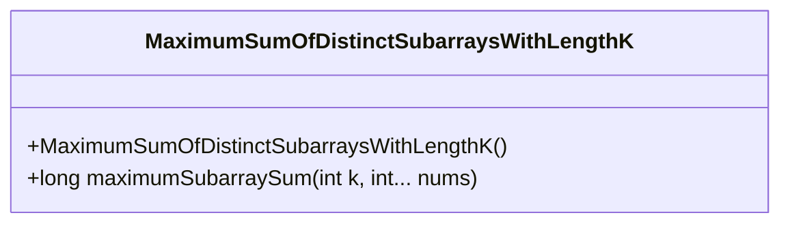
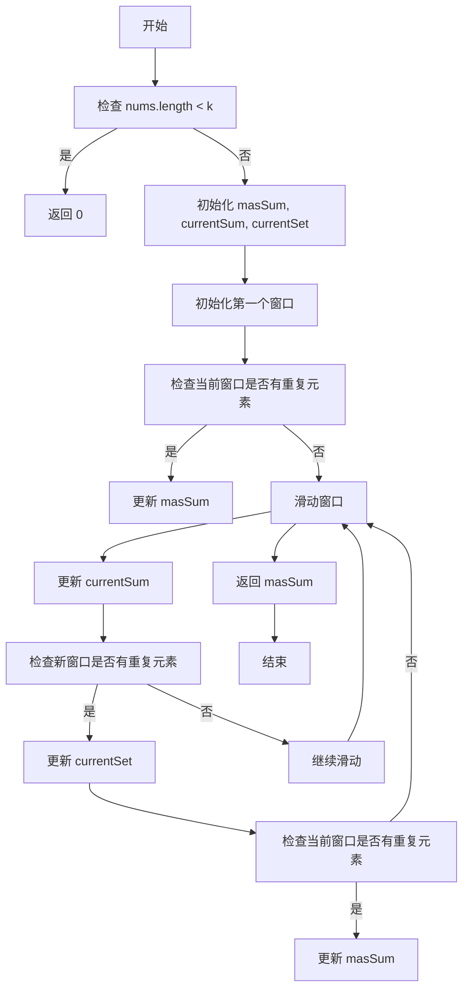
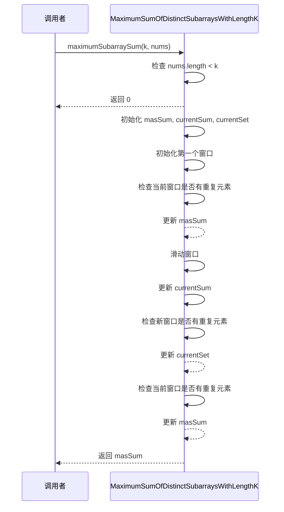
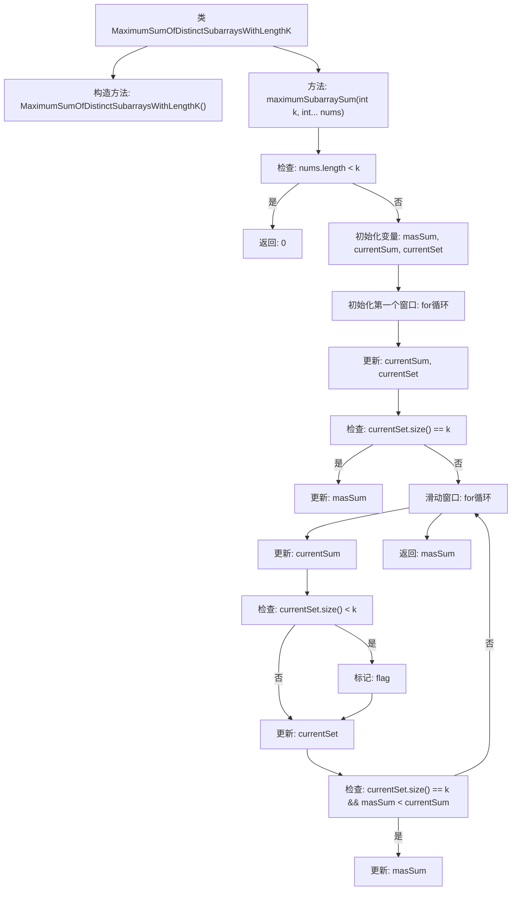

# 基础信息

|      |      |
|------|------|
| 名称 | MaximumSumOfDistinctSubarraysWithLengthK |
| 编码语言 | .java |
| 代码路径 | Java/src/main/java/com/thealgorithms/others/MaximumSumOfDistinctSubarraysWithLengthK.java |
| 包名 | com.thealgorithms.others |
| 依赖项 | ['java.util.HashSet', 'java.util.Set'] |
| 概述说明 | 求长度为K且元素互不相同的子数组的最大和。 |

# 说明

该问题要求计算长度为K且元素互不相同的子数组的最大和。具体来说，需要从给定数组中找到所有长度为K的子数组，确保这些子数组中的元素互不相同，然后计算这些子数组的和，最终找出其中的最大值。该问题涉及数组遍历、子数组生成、元素唯一性检查以及求和操作，旨在通过高效算法解决这一组合优化问题。

# 类列表 Class Summary

| 名称   | 类型  | 说明 |
|-------|------|-------------|
| MaximumSumOfDistinctSubarraysWithLengthK | class | 计算长度为K且元素互不相同的子数组的最大和。 |

## 类 MaximumSumOfDistinctSubarraysWithLengthK

|      |      |
|------|------|
| 访问范围 | public final |
| 类型 | class |
| 名称 | MaximumSumOfDistinctSubarraysWithLengthK |
| 说明 | 计算长度为K且元素互不相同的子数组的最大和。 |

### UML类图

**描述：**  
`MaximumSumOfDistinctSubarraysWithLengthK` 类包含一个静态方法 `maximumSubarraySum`，用于计算数组中长度为 `k` 且元素互不相同的子数组的最大和。方法首先检查数组长度是否小于 `k`，若是则返回 0。接着初始化变量和第一个窗口，检查窗口内元素是否互不相同，若是则更新最大和。然后通过滑动窗口的方式遍历数组，更新当前和并检查新窗口内的元素是否互不相同，最终返回最大和。

### 内部方法调用关系图

这段代码定义了一个类 `MaximumSumOfDistinctSubarraysWithLengthK`，其中包含一个静态方法 `maximumSubarraySum`，用于查找长度为 `k` 的、元素互不相同的子数组的最大和。代码通过滑动窗口技术遍历数组，维护当前窗口的和以及元素集合，并在窗口内元素唯一时更新最大和。如果数组长度小于 `k`，则直接返回 0。流程图展示了方法的执行流程，包括初始化、窗口滑动、元素检查和最大和更新等步骤。

### 字段列表 Field List

| 名称  | 类型  | 说明 |
|-------|-------|------|

### 方法列表 Method List

| 名称  | 类型  | 说明 |
|-------|-------|------|
| maximumSubarraySum | long | 计算长度为k的连续子数组的最大和，要求子数组元素互不重复。 |

