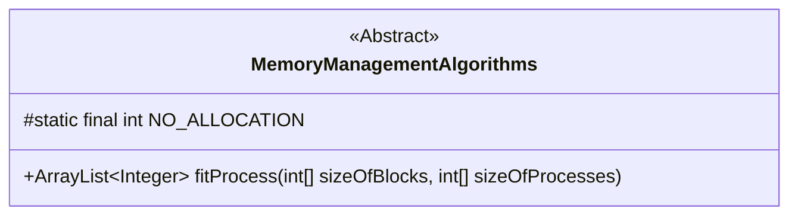
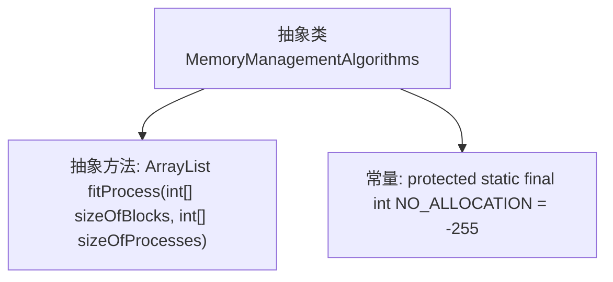
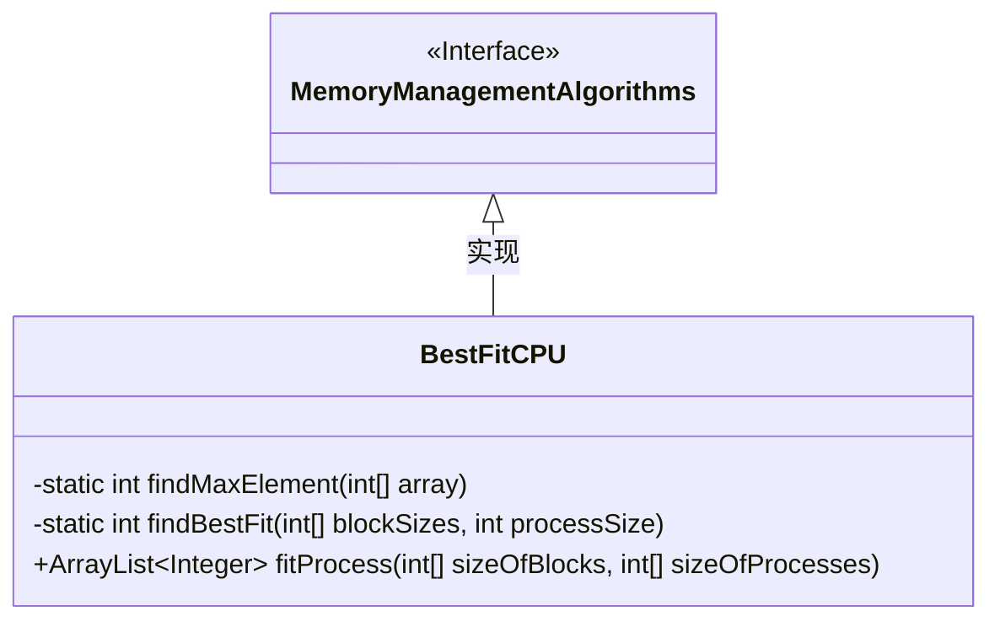
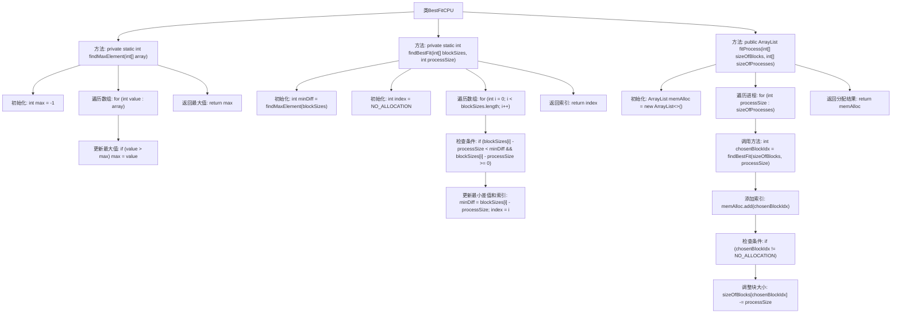
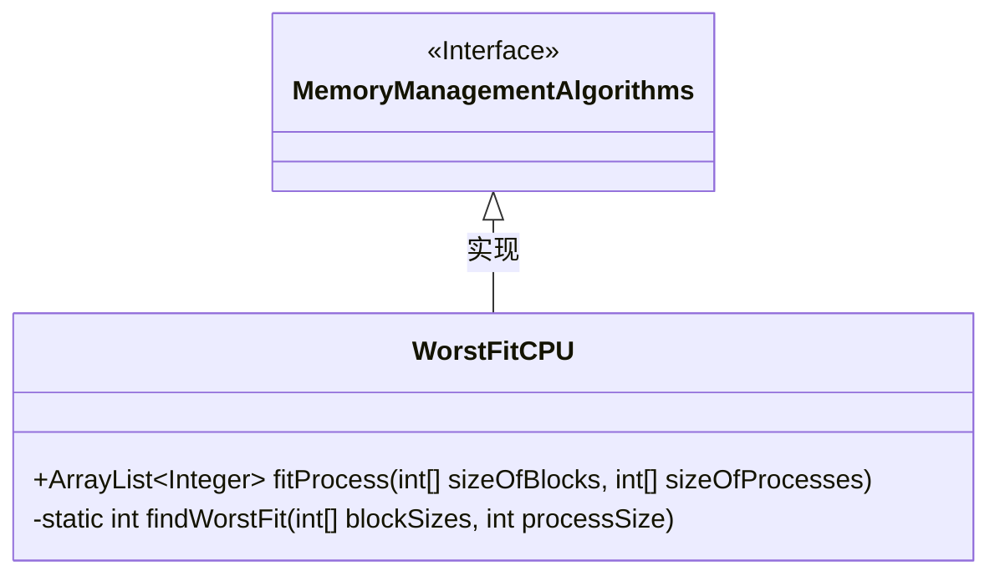
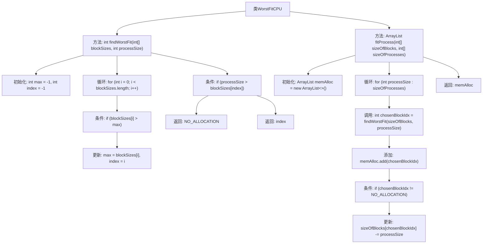
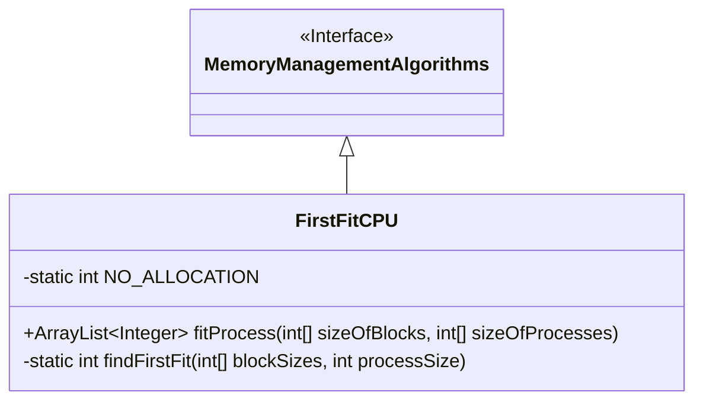
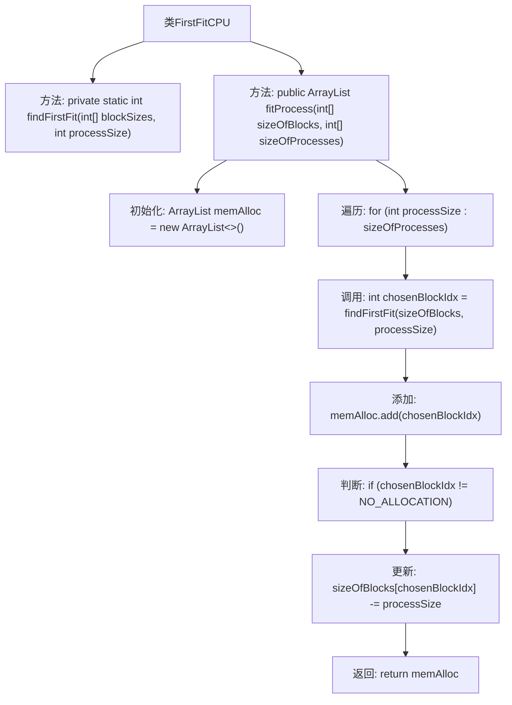
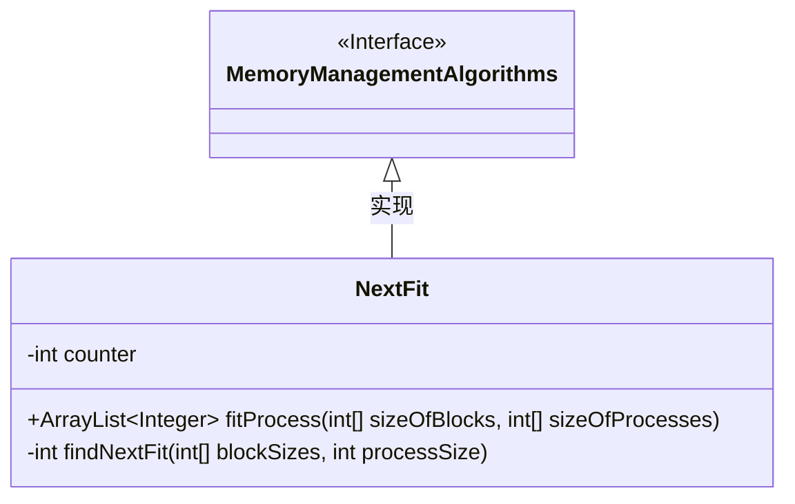
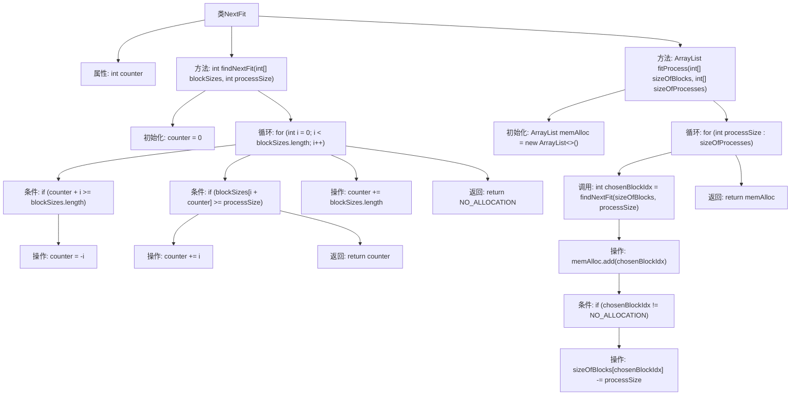

# 基础信息

|      |      |
|------|------|
| 名称 | MemoryManagementAlgorithms |
| 编码语言 | .java |
| 代码路径 | Java/src/main/java/com/thealgorithms/others/MemoryManagementAlgorithms.java |
| 包名 | com.thealgorithms.others |
| 依赖项 | ['java.util.ArrayList'] |
| 概述说明 | 抽象类定义内存管理算法，包含分配方法和未分配常量。BestFitCPU、最差适应算法、FirstFitCPU和NextFit分别实现最佳、最差、首次和下次适应内存分配算法。 |

# 说明

抽象类定义了内存管理算法，包含分配方法和未分配常量。BestFitCPU类实现最佳适应算法，通过findBestFit方法选择最合适的内存块，fitProcess方法完成内存分配。最差适应算法实现内存分配，返回分配结果列表。FirstFitCPU类实现首次适应算法，为进程分配内存块，返回分配结果。NextFit类实现内存管理算法，通过计数器记录上次分配位置，查找适合的内存块并分配进程。

# 类列表 Class Summary

| 名称   | 类型  | 说明 |
|-------|------|-------------|
| MemoryManagementAlgorithms | class | 抽象类定义内存管理算法，包含分配方法和未分配常量。 |
| BestFitCPU | class | BestFitCPU类实现最佳适应内存分配算法，通过findBestFit方法选择最合适的内存块，fitProcess方法完成内存分配。 |
| WorstFitCPU | class | 最差适应算法实现内存分配，返回分配结果列表。 |
| FirstFitCPU | class | FirstFitCPU类实现首次适应算法，为进程分配内存块，返回分配结果。 |
| NextFit | class | NextFit类实现内存管理算法，通过计数器记录上次分配位置，查找适合的内存块并分配进程。 |

## 类 MemoryManagementAlgorithms

|      |      |
|------|------|
| 访问范围 | public abstract |
| 类型 | class |
| 名称 | MemoryManagementAlgorithms |
| 说明 | 抽象类定义内存管理算法，包含分配方法和未分配常量。 |

### UML类图

**描述：**  
`MemoryManagementAlgorithms` 是一个抽象类，用于定义内存管理算法的基类。它包含一个抽象方法 `fitProcess`，用于根据不同的算法将内存块分配给进程。该方法接收两个整数数组作为参数，分别表示内存块的大小和进程的大小，并返回一个 `ArrayList<Integer>`，其中索引表示进程ID，值表示分配的内存块编号。此外，类中定义了一个受保护的常量 `NO_ALLOCATION`，用于表示未分配内存的情况，其值为 `-255`，确保在程序执行过程中保持一致且不可修改。

### 内部方法调用关系图

这段代码定义了一个名为 `MemoryManagementAlgorithms` 的抽象类，其中包含一个抽象方法 `fitProcess` 和一个常量 `NO_ALLOCATION`。抽象方法 `fitProcess` 用于根据不同的内存管理算法为进程分配内存块，返回一个 `ArrayList<Integer>`，其中索引表示进程ID，值表示分配的内存块编号。常量 `NO_ALLOCATION` 用于表示未分配内存的情况，其值为 `-255`，并且被标记为 `protected` 和 `final`，以确保其值在程序执行期间保持一致且不可修改。

### 字段列表 Field List

| 名称  | 类型  | 说明 |
|-------|-------|------|
| NO_ALLOCATION = -255 | int | NO_ALLOCATION是静态常量，值为-255，表示无分配状态。 |

### 方法列表 Method List

| 名称  | 类型  | 说明 |
|-------|-------|------|
| fitProcess | ArrayList<Integer> | 抽象方法：根据块大小和进程大小分配内存。 |

## 类 BestFitCPU

|      |      |
|------|------|
| 访问范围 | None |
| 类型 | class |
| 名称 | BestFitCPU |
| 说明 | BestFitCPU类实现最佳适应内存分配算法，通过findBestFit方法选择最合适的内存块，fitProcess方法完成内存分配。 |

### UML类图

### 描述
`BestFitCPU` 类继承自 `MemoryManagementAlgorithms` 接口，实现了内存管理的最佳适应算法。该类包含三个方法：`findMaxElement` 用于查找数组中的最大值，`findBestFit` 用于根据最佳适应算法找到最适合的内存块索引，`fitProcess` 则负责为每个进程分配内存块并返回分配结果。通过这些方法，`BestFitCPU` 能够有效地管理内存分配，确保每个进程都能找到最适合的内存块。

### 内部方法调用关系图

这段代码实现了一个基于最佳适应算法的内存管理类 `BestFitCPU`。它包含三个主要方法：`findMaxElement` 用于查找数组中的最大值，`findBestFit` 用于找到最适合的内存块索引，`fitProcess` 则负责根据最佳适应算法将进程分配到内存块中，并返回分配结果。流程图展示了这些方法之间的调用关系以及每个方法内部的详细步骤。

### 字段列表 Field List

| 名称  | 类型  | 说明 |
|-------|-------|------|

### 方法列表 Method List

| 名称  | 类型  | 说明 |
|-------|-------|------|
| findBestFit | int | 查找最适合的内存块索引，满足进程大小且差值最小。 |
| fitProcess | ArrayList<Integer> | 最佳适应算法实现内存分配，返回分配块索引列表。 |
| findMaxElement | int | 该方法通过遍历数组找到并返回最大元素。 |

## 类 WorstFitCPU

|      |      |
|------|------|
| 访问范围 | None |
| 类型 | class |
| 名称 | WorstFitCPU |
| 说明 | 最差适应算法实现内存分配，返回分配结果列表。 |

### UML类图

类图描述：
`WorstFitCPU` 类继承自 `MemoryManagementAlgorithms` 接口，实现了内存管理的最坏适应算法。`WorstFitCPU` 类包含两个方法：`fitProcess` 用于根据最坏适应算法为进程分配内存块，并返回分配结果的 `ArrayList`；`findWorstFit` 是一个私有静态方法，用于查找能够容纳给定进程的最大内存块。如果找到合适的内存块，则返回其索引，否则返回 `NO_ALLOCATION`。

### 内部方法调用关系图

这段代码实现了最坏适应算法（Worst Fit Algorithm）来管理内存分配。`findWorstFit`方法用于查找适合给定进程的最大内存块索引，如果找不到合适的内存块则返回`NO_ALLOCATION`。`fitProcess`方法则遍历所有进程，调用`findWorstFit`方法为每个进程分配内存块，并更新内存块的大小。最终返回一个包含内存分配结果的`ArrayList`。

### 字段列表 Field List

| 名称  | 类型  | 说明 |
|-------|-------|------|

### 方法列表 Method List

| 名称  | 类型  | 说明 |
|-------|-------|------|
| findWorstFit | int | 查找最大内存块，若无法容纳进程则返回-255，否则返回块索引。 |
| fitProcess | ArrayList<Integer> | 使用最差适应算法为进程分配内存块，记录分配结果并调整块大小。 |

## 类 FirstFitCPU

|      |      |
|------|------|
| 访问范围 | None |
| 类型 | class |
| 名称 | FirstFitCPU |
| 说明 | FirstFitCPU类实现首次适应算法，为进程分配内存块，返回分配结果。 |

### UML类图

**描述：**  
`FirstFitCPU` 类继承自 `MemoryManagementAlgorithms` 接口，实现了基于首次适应算法的内存分配。该类包含一个私有静态方法 `findFirstFit`，用于查找适合进程的内存块索引，以及一个公有方法 `fitProcess`，用于根据首次适应算法为进程分配内存块。`fitProcess` 方法返回一个 `ArrayList`，表示每个进程分配到的内存块索引。如果找不到合适的内存块，则返回 `NO_ALLOCATION`（值为 -255）。

### 内部方法调用关系图

**描述：**  
这段代码实现了一个基于首次适应算法的内存管理类 `FirstFitCPU`。`findFirstFit` 方法用于查找第一个能够容纳指定进程大小的内存块索引，如果找不到则返回 `-255`。`fitProcess` 方法则遍历所有进程，调用 `findFirstFit` 方法找到合适的内存块，并将结果存储在 `memAlloc` 列表中，同时更新内存块的大小。最终返回内存分配结果。

### 字段列表 Field List

| 名称  | 类型  | 说明 |
|-------|-------|------|

### 方法列表 Method List

| 名称  | 类型  | 说明 |
|-------|-------|------|
| findFirstFit | int | 查找首个适合进程的内存块索引，若无则返回-255。 |
| fitProcess | ArrayList<Integer> | 使用首次适应算法为进程分配内存块并更新剩余空间。 |

## 类 NextFit

|      |      |
|------|------|
| 访问范围 | None |
| 类型 | class |
| 名称 | NextFit |
| 说明 | NextFit类实现内存管理算法，通过计数器记录上次分配位置，查找适合的内存块并分配进程。 |

### UML类图

**描述：**  
`NextFit`类继承自`MemoryManagementAlgorithms`接口，实现了内存管理中的Next Fit算法。`NextFit`类包含一个私有成员`counter`，用于记录上次内存分配的结束位置。`findNextFit`方法用于查找适合给定进程大小的内存块，`fitProcess`方法则负责为所有进程分配内存块，并返回分配结果的`ArrayList`。该类的核心逻辑是通过`counter`记录上次分配的位置，从而优化内存分配效率。

### 内部方法调用关系图

这段代码实现了Next Fit内存管理算法。`NextFit`类继承自`MemoryManagementAlgorithms`，包含一个`counter`属性和两个方法：`findNextFit`和`fitProcess`。`findNextFit`方法用于查找适合进程的内存块，`fitProcess`方法则根据`findNextFit`的结果进行内存分配。流程图展示了类的结构和方法之间的调用关系，以及算法的主要逻辑流程。

### 字段列表 Field List

| 名称  | 类型  | 说明 |
|-------|-------|------|
| counter = 0 | int | 定义一个私有整型变量counter，初始值为0。 |

### 方法列表 Method List

| 名称  | 类型  | 说明 |
|-------|-------|------|
| findNextFit | int | 查找适合进程大小的内存块，若无则返回特定值。 |
| fitProcess | ArrayList<Integer> | 该方法使用首次适应算法为进程分配内存块，并返回分配结果。 |

