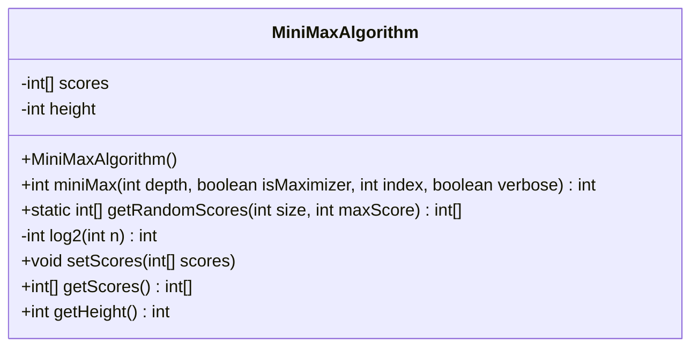
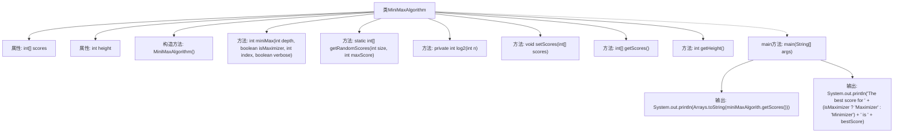

# 基础信息

|      |      |
|------|------|
| 名称 | MiniMaxAlgorithm |
| 编码语言 | .java |
| 代码路径 | Java/src/main/java/com/thealgorithms/others/MiniMaxAlgorithm.java |
| 包名 | com.thealgorithms.others |
| 依赖项 | ['java.util.Arrays', 'java.util.Random'] |
| 概述说明 | MiniMax算法实现随机分数生成、递归计算最优得分及玩家选择展示。 |

# 说明

MiniMax算法实现包括随机分数生成、递归计算最优得分及玩家选择展示。该算法通过随机生成分数模拟游戏状态，利用递归遍历所有可能的走法，计算每一步的最优得分。在递归过程中，算法交替模拟玩家和对手的选择，最大化自身得分并最小化对手得分。最终，算法展示玩家在当前状态下的最佳选择，以实现最优决策。整个过程全面考虑了游戏的所有可能状态，确保决策的准确性和高效性。

# 类列表 Class Summary

| 名称   | 类型  | 说明 |
|-------|------|-------------|
| MiniMaxAlgorithm | class | MiniMax算法实现，包含随机分数生成、递归计算最优得分及玩家选择展示。 |

## 类 MiniMaxAlgorithm

|      |      |
|------|------|
| 访问范围 | public |
| 类型 | class |
| 名称 | MiniMaxAlgorithm |
| 说明 | MiniMax算法实现，包含随机分数生成、递归计算最优得分及玩家选择展示。 |

### UML类图

### 描述
`MiniMaxAlgorithm` 类实现了一个简单的极小极大算法，用于在游戏树中寻找最优解。该类包含一个表示游戏树叶子节点得分的数组 `scores`，以及树的高度 `height`。`miniMax` 方法递归地计算每个节点的最优得分，`getRandomScores` 方法生成随机得分数组，`log2` 方法计算以2为底的对数。`setScores` 和 `getScores` 方法用于设置和获取得分数组，`getHeight` 方法返回树的高度。

### 内部方法调用关系图

这段代码实现了一个MiniMax算法，用于在游戏树中寻找最优解。代码首先初始化一个包含随机分数的数组，然后通过递归调用`miniMax`方法来计算最优分数。`miniMax`方法根据当前玩家是最大化者还是最小化者，选择最大或最小分数。最后，代码输出游戏树的分数和最优分数。

### 字段列表 Field List

| 名称  | 类型  | 说明 |
|-------|-------|------|
| scores | int[] | 声明一个私有整型数组变量scores。 |
| height | int | 私有整型变量height用于存储高度信息。 |

### 方法列表 Method List

| 名称  | 类型  | 说明 |
|-------|-------|------|
| getHeight | int | 方法返回对象的height属性值。 |
| getScores | int[] | 该方法返回整数数组scores。 |
| miniMax | int | 递归实现极小化极大算法，选择最佳得分并输出选择过程。 |
| getRandomScores | int[] | 生成指定大小的随机分数数组，范围为1到最大分数。 |
| log2 | int | 计算整数n的以2为底的对数，递归实现。 |
| main | void | 主函数调用MiniMax算法，计算并输出最佳得分。 |
| setScores | void | 设置分数数组，长度须为2的幂，否则提示错误。 |

