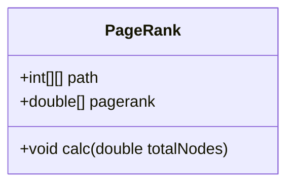
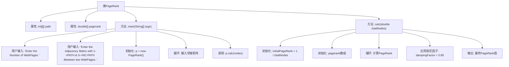

# 基础信息

|      |      |
|------|------|
| 名称 | PageRank |
| 编码语言 | .java |
| 代码路径 | Java/src/main/java/com/thealgorithms/others/PageRank.java |
| 包名 | com.thealgorithms.others |
| 依赖项 | ['java.util.Scanner'] |
| 概述说明 | PageRank算法通过网页数和邻接矩阵计算网页排名。 |

# 说明

PageRank算法用于计算网页排名，输入包括网页数量和邻接矩阵。算法通过分析网页间的链接关系，迭代计算每个网页的权重值，最终输出各网页的排名。该过程考虑了网页的链接数量和质量，确保重要网页获得更高排名。

# 类列表 Class Summary

| 名称   | 类型  | 说明 |
|-------|------|-------------|
| PageRank | class | PageRank算法实现，输入网页数和邻接矩阵，计算并输出各网页排名。 |

## 类 PageRank

|      |      |
|------|------|
| 访问范围 | None |
| 类型 | class |
| 名称 | PageRank |
| 说明 | PageRank算法实现，输入网页数和邻接矩阵，计算并输出各网页排名。 |

### UML类图

### 描述：
`PageRank` 类实现了一个简单的PageRank算法，用于计算网页的排名。类中包含一个二维数组 `path` 用于存储网页之间的连接关系，以及一个一维数组 `pagerank` 用于存储每个网页的排名值。`calc` 方法负责执行PageRank算法的计算过程，包括初始化、迭代计算PageRank值，并最终输出结果。算法的核心是通过迭代更新每个网页的排名值，直到达到预定的迭代次数。

### 内部方法调用关系图

该流程图展示了`PageRank`类的主要流程。程序首先通过用户输入获取网页数量和邻接矩阵，然后初始化PageRank值并进行迭代计算。在每次迭代中，程序计算每个节点的PageRank值，并应用阻尼因子来调整结果。最终，程序输出每个节点的PageRank值。该流程涵盖了从用户输入到最终结果输出的完整过程，确保PageRank算法的正确执行。

### 字段列表 Field List

| 名称  | 类型  | 说明 |
|-------|-------|------|
| path = new int[10][10] | int[][] | 定义一个10x10的二维整型数组path。 |
| pagerank = new double[10] | double[] | 创建长度为10的双精度浮点数数组pagerank。 |

### 方法列表 Method List

| 名称  | 类型  | 说明 |
|-------|-------|------|
| main | void | Java程序读取网页数量及邻接矩阵，调用PageRank算法计算。 |
| calc | void | 计算节点PageRank值，包括初始化、迭代计算及阻尼因子应用。 |

