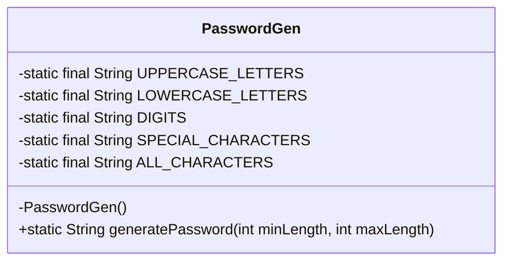
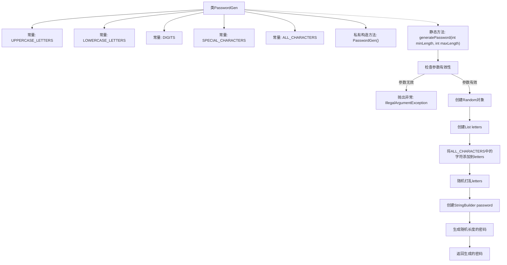

# 基础信息

|      |      |
|------|------|
| 名称 | PasswordGen |
| 编码语言 | .java |
| 代码路径 | Java/src/main/java/com/thealgorithms/others/PasswordGen.java |
| 包名 | com.thealgorithms.others |
| 依赖项 | ['java.util.ArrayList', 'java.util.Collections', 'java.util.List', 'java.util.Random'] |
| 概述说明 | 随机密码生成工具，支持自定义长度，包含多种字符类型。 |

# 说明

该工具类用于生成随机密码，允许用户自定义密码的长度范围。生成的密码包含大小写字母、数字以及特殊字符，确保密码的复杂性和安全性。通过灵活的长度设置，用户可以根据需求生成不同强度的密码，满足各种安全要求。

# 类列表 Class Summary

| 名称   | 类型  | 说明 |
|-------|------|-------------|
| PasswordGen | class | 生成随机密码的工具类，支持自定义长度范围，包含大小写字母、数字和特殊字符。 |

## 类 PasswordGen

|      |      |
|------|------|
| 访问范围 | final |
| 类型 | class |
| 名称 | PasswordGen |
| 说明 | 生成随机密码的工具类，支持自定义长度范围，包含大小写字母、数字和特殊字符。 |

### UML类图

**描述：**  
`PasswordGen` 类是一个用于生成随机密码的工具类。它包含了四种字符集：大写字母、小写字母、数字和特殊字符，并将它们组合成 `ALL_CHARACTERS`。`generatePassword` 方法根据传入的最小长度和最大长度生成一个随机密码，长度在两者之间随机选择。如果传入的参数不合法（如 `minLength` 大于 `maxLength` 或两者为负数），则会抛出 `IllegalArgumentException`。该方法通过随机选择和拼接字符来生成密码。

### 内部方法调用关系图

这段代码定义了一个`PasswordGen`类，用于生成随机密码。类中包含几个常量字符串，分别表示大写字母、小写字母、数字和特殊字符，以及它们的组合`ALL_CHARACTERS`。`generatePassword`方法接受最小长度和最大长度作为参数，生成一个长度在这两个值之间的随机密码。方法首先检查参数的有效性，如果参数无效则抛出异常。接着，方法使用`Random`类生成随机数，并将`ALL_CHARACTERS`中的字符随机打乱，最后生成并返回一个随机密码。

### 字段列表 Field List

| 名称  | 类型  | 说明 |
|-------|-------|------|
| LOWERCASE_LETTERS = "abcdefghijklmnopqrstuvwxyz" | String | 定义包含小写字母的常量字符串。 |
| SPECIAL_CHARACTERS = "!@#$%^&*(){}?" | String | 定义包含特殊字符的常量字符串。 |
| DIGITS = "0123456789" | String | 定义包含数字字符的静态常量字符串。 |
| UPPERCASE_LETTERS = "ABCDEFGHIJKLMNOPQRSTUVWXYZ" | String | 定义常量字符串包含所有大写字母。 |
| ALL_CHARACTERS = UPPERCASE_LETTERS + LOWERCASE_LETTERS + DIGITS + SPECIAL_CHARACTERS | String | 定义字符串常量ALL_CHARACTERS，包含大写字母、小写字母、数字和特殊字符。 |

### 方法列表 Method List

| 名称  | 类型  | 说明 |
|-------|-------|------|
| generatePassword | String | 生成随机密码，长度在minLength和maxLength之间，包含所有字符。 |

