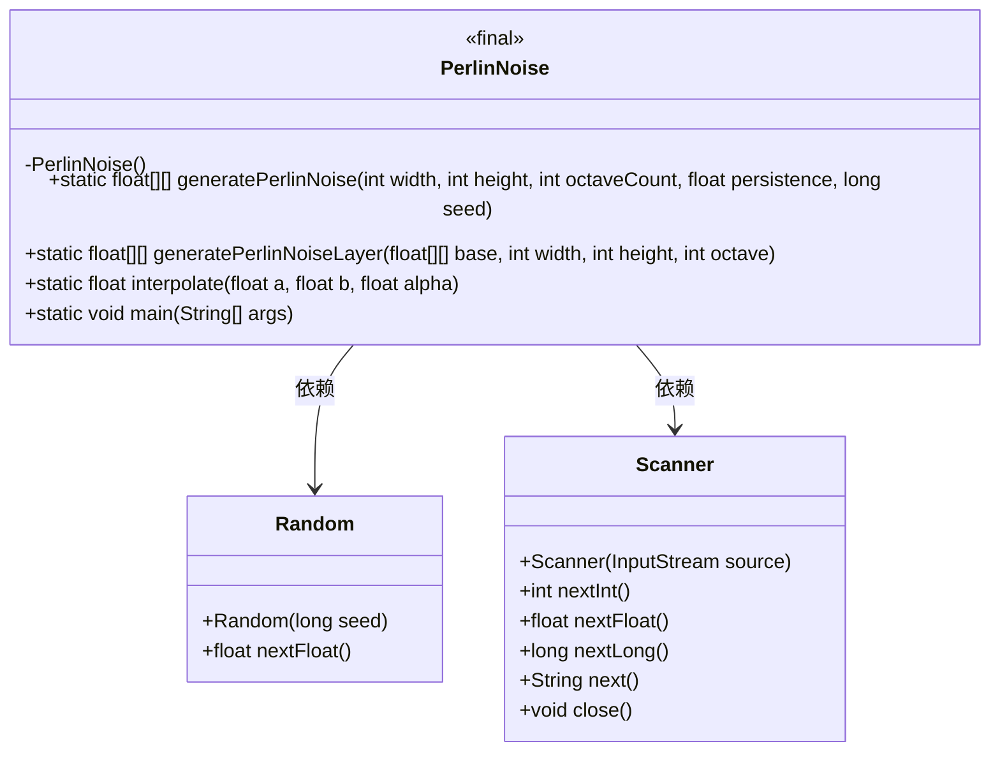
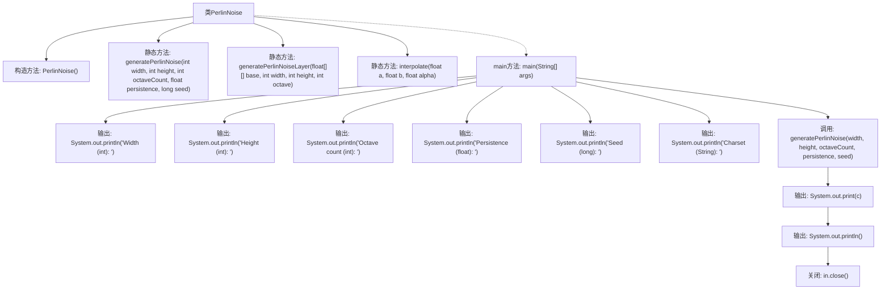

# 基础信息

|      |      |
|------|------|
| 名称 | PerlinNoise |
| 编码语言 | .java |
| 代码路径 | Java/src/main/java/com/thealgorithms/others/PerlinNoise.java |
| 包名 | com.thealgorithms.others |
| 依赖项 | ['java.util.Random', 'java.util.Scanner'] |
| 概述说明 | PerlinNoise类生成二维噪声图，支持分层叠加和归一化。 |

# 说明

PerlinNoise类用于生成二维噪声图，具备分层叠加功能，能够通过叠加多层噪声增强细节和复杂性。此外，该类还支持归一化处理，确保生成的噪声值在特定范围内，便于后续应用和调整。这种处理方式使得生成的噪声图更加平滑和可控，适用于多种图形和模拟场景。

# 类列表 Class Summary

| 名称   | 类型  | 说明 |
|-------|------|-------------|
| PerlinNoise | class | PerlinNoise类生成二维噪声图，支持分层叠加和归一化处理。 |

## 类 PerlinNoise

|      |      |
|------|------|
| 访问范围 | public final |
| 类型 | class |
| 名称 | PerlinNoise |
| 说明 | PerlinNoise类生成二维噪声图，支持分层叠加和归一化处理。 |

### UML类图

**描述：**
`PerlinNoise` 类用于生成Perlin噪声，通过随机数和插值算法生成平滑的噪声值。类中包含三个静态方法：`generatePerlinNoise` 用于生成噪声数组，`generatePerlinNoiseLayer` 用于生成噪声层，`interpolate` 用于插值计算。`main` 方法通过用户输入参数生成噪声并输出。`PerlinNoise` 类依赖于 `Random` 和 `Scanner` 类，分别用于生成随机数和处理用户输入。

### 内部方法调用关系图

这段代码实现了一个生成Perlin噪声的类`PerlinNoise`。通过`generatePerlinNoise`方法生成噪声数组，`generatePerlinNoiseLayer`方法生成噪声层，`interpolate`方法进行插值计算。`main`方法通过用户输入参数生成噪声，并根据字符集输出噪声图像。代码通过多层噪声叠加和插值计算，生成了平滑的Perlin噪声图像。

### 字段列表 Field List

| 名称  | 类型  | 说明 |
|-------|-------|------|

### 方法列表 Method List

| 名称  | 类型  | 说明 |
|-------|-------|------|
| main | void | Java程序生成Perlin噪声图，基于用户输入参数输出字符图案。 |
| interpolate | float | 插值函数：根据alpha值计算a和b的线性插值结果。 |
| generatePerlinNoise | float[][] | 生成Perlin噪声，通过多层噪声叠加并归一化。 |
| generatePerlinNoiseLayer | float[][] | 生成Perlin噪声层，基于基础网格、宽度、高度和八度参数进行插值计算。 |

