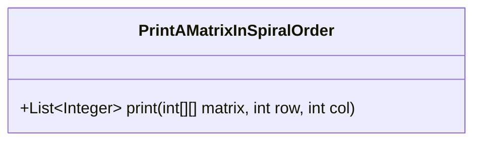
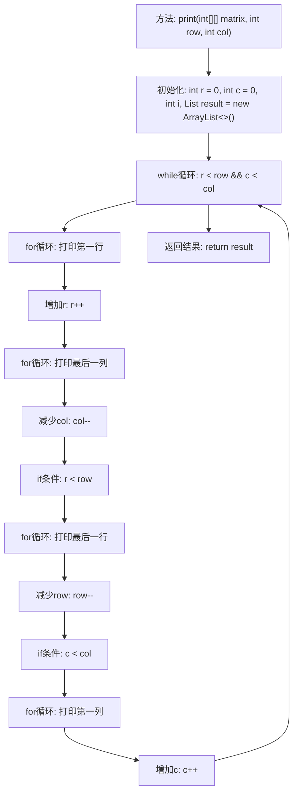

# 基础信息

|      |      |
|------|------|
| 名称 | PrintAMatrixInSpiralOrder |
| 编码语言 | .java |
| 代码路径 | Java/src/main/java/com/thealgorithms/others/PrintAMatrixInSpiralOrder.java |
| 包名 | com.thealgorithms.others |
| 依赖项 | ['java.util.ArrayList', 'java.util.List'] |
| 概述说明 | 按螺旋顺序打印二维矩阵元素。 |

# 说明

螺旋顺序打印二维矩阵是一种遍历矩阵元素的方法，按照从外向内顺时针方向依次访问矩阵的每一层元素。首先，从矩阵的左上角开始，依次向右移动，直到到达当前层的右边界；然后向下移动，直到到达当前层的下边界；接着向左移动，直到到达当前层的左边界；最后向上移动，直到回到当前层的起始点。重复这一过程，直到所有层都被遍历完毕。这种方法确保矩阵中的每个元素都被访问一次，且顺序符合螺旋形状。

# 类列表 Class Summary

| 名称   | 类型  | 说明 |
|-------|------|-------------|
| PrintAMatrixInSpiralOrder | class | 螺旋顺序打印二维矩阵。 |

## 类 PrintAMatrixInSpiralOrder

|      |      |
|------|------|
| 访问范围 | public |
| 类型 | class |
| 名称 | PrintAMatrixInSpiralOrder |
| 说明 | 螺旋顺序打印二维矩阵。 |

### UML类图

该代码定义了一个名为 `PrintAMatrixInSpiralOrder` 的类，其中包含一个公有方法 `print`，该方法接受一个二维整数数组 `matrix` 以及行数 `row` 和列数 `col` 作为参数，并返回一个按螺旋顺序遍历矩阵元素的整数列表。该方法通过逐步缩小矩阵的边界，依次遍历矩阵的外层、次外层，直到所有元素都被遍历完毕。代码通过四个循环分别处理矩阵的顶部行、右侧列、底部行和左侧列，最终返回按螺旋顺序排列的元素列表。

### 内部方法调用关系图

这段代码实现了按螺旋顺序打印矩阵的功能。通过初始化行和列的起始点，代码依次打印矩阵的第一行、最后一列、最后一行和第一列，并在每次打印后调整行和列的边界，直到所有元素都被遍历。最终返回一个包含所有按螺旋顺序排列的矩阵元素的列表。

### 字段列表 Field List

| 名称  | 类型  | 说明 |
|-------|-------|------|

### 方法列表 Method List

| 名称  | 类型  | 说明 |
|-------|-------|------|
| print | List<Integer> | 按螺旋顺序遍历二维矩阵并返回元素列表。 |

