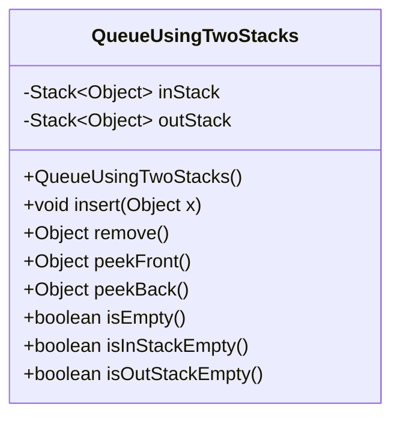
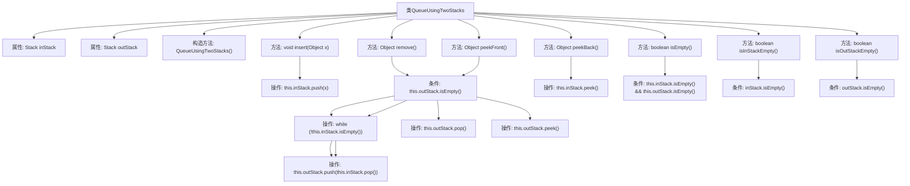

# 基础信息

|      |      |
|------|------|
| 名称 | QueueUsingTwoStacks |
| 编码语言 | .java |
| 代码路径 | Java/src/main/java/com/thealgorithms/others/QueueUsingTwoStacks.java |
| 包名 | com.thealgorithms.others |
| 依赖项 | ['java.util.Stack'] |
| 概述说明 | 双栈实现队列，支持插入、删除、查看队首队尾及判空操作。 |

# 说明

使用双栈实现队列，支持插入、删除、查看队首队尾及判空操作。通过两个栈的协作，确保队列的先进先出特性。插入操作将一个栈作为输入栈，删除操作将另一个栈作为输出栈。查看队首和队尾操作分别通过输出栈和输入栈实现。判空操作通过检查两个栈是否均为空来确定队列是否为空。这种方法在时间复杂度上保持了高效性，确保了队列操作的正确性和稳定性。

# 类列表 Class Summary

| 名称   | 类型  | 说明 |
|-------|------|-------------|
| QueueUsingTwoStacks | class | 使用双栈实现队列，支持插入、删除、查看队首队尾及判空操作。 |

## 类 QueueUsingTwoStacks

|      |      |
|------|------|
| 访问范围 | public |
| 类型 | class |
| 名称 | QueueUsingTwoStacks |
| 说明 | 使用双栈实现队列，支持插入、删除、查看队首队尾及判空操作。 |

### UML类图

### 描述：
`QueueUsingTwoStacks` 类使用两个栈 `inStack` 和 `outStack` 来实现队列的功能。通过 `insert` 方法将元素插入 `inStack`，而 `remove` 和 `peekFront` 方法则通过将 `inStack` 中的元素转移到 `outStack` 来模拟队列的先进先出行为。`peekBack` 方法直接查看 `inStack` 的顶部元素，而 `isEmpty` 方法检查两个栈是否都为空。此外，`isInStackEmpty` 和 `isOutStackEmpty` 方法分别用于检查 `inStack` 和 `outStack` 是否为空。

### 内部方法调用关系图

这段代码实现了一个使用两个栈模拟队列的类 `QueueUsingTwoStacks`。类中包含两个栈 `inStack` 和 `outStack`，分别用于存储入队和出队的元素。`insert` 方法将元素压入 `inStack`，`remove` 和 `peekFront` 方法在 `outStack` 为空时将 `inStack` 的元素依次弹出并压入 `outStack`，以保持队列的先进先出顺序。`peekBack` 方法直接返回 `inStack` 的栈顶元素。`isEmpty`、`isInStackEmpty` 和 `isOutStackEmpty` 方法分别用于检查队列和栈是否为空。

### 字段列表 Field List

| 名称  | 类型  | 说明 |
|-------|-------|------|
| inStack | Stack<Object> | 私有栈对象inStack用于存储元素。 |
| outStack | Stack<Object> | 私有栈对象用于存储输出数据。 |

### 方法列表 Method List

| 名称  | 类型  | 说明 |
|-------|-------|------|
| isEmpty | boolean | 判断两个栈是否均为空。 |
| isInStackEmpty | boolean | 检查输入栈是否为空。 |
| isOutStackEmpty | boolean | 检查输出栈是否为空。 |
| peekFront | Object | peekFront方法将inStack元素移至outStack并返回outStack顶部元素。 |
| insert | void | 在inStack中插入元素x。 |
| remove | Object | 从inStack移动元素到outStack，并返回outStack的顶部元素。 |
| peekBack | Object | peekBack方法返回inStack栈顶元素。 |

