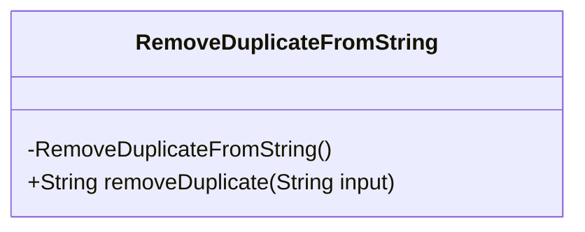
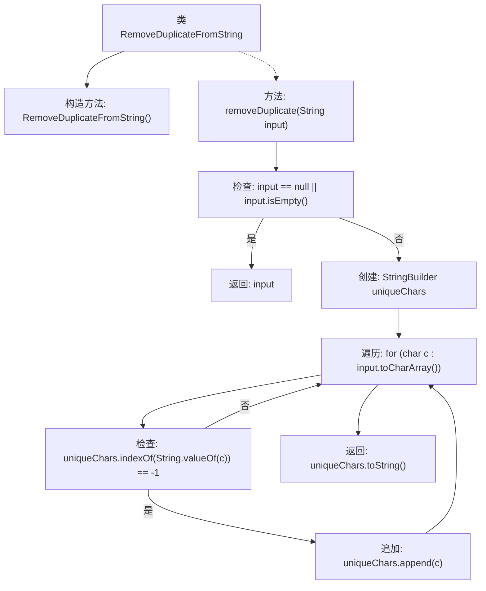

# 基础信息

|      |      |
|------|------|
| 名称 | RemoveDuplicateFromString |
| 编码语言 | .java |
| 代码路径 | Java/src/main/java/com/thealgorithms/others/RemoveDuplicateFromString.java |
| 包名 | com.thealgorithms.others |
| 依赖项 | [] |
| 概述说明 | 移除字符串重复字符，保持原有顺序。 |

# 说明

该功能旨在处理字符串，移除其中重复的字符，同时保持字符的原始顺序。具体来说，它会扫描字符串中的每个字符，仅保留首次出现的字符，删除后续重复的字符。最终输出的字符串将不包含任何重复字符，且字符顺序与输入字符串一致。

# 类列表 Class Summary

| 名称   | 类型  | 说明 |
|-------|------|-------------|
| RemoveDuplicateFromString | class | 移除字符串中重复字符，保留原顺序。 |

## 类 RemoveDuplicateFromString

|      |      |
|------|------|
| 访问范围 | public final |
| 类型 | class |
| 名称 | RemoveDuplicateFromString |
| 说明 | 移除字符串中重复字符，保留原顺序。 |

### UML类图

这段代码定义了一个名为 `RemoveDuplicateFromString` 的类，该类包含一个私有构造函数和一个公有静态方法 `removeDuplicate`。`removeDuplicate` 方法用于从输入字符串中移除重复字符，并返回一个只包含唯一字符的字符串。该方法通过遍历输入字符串的每个字符，并使用 `StringBuilder` 来存储和检查唯一字符。如果字符尚未存在于 `StringBuilder` 中，则将其追加到 `StringBuilder` 中。最终，`StringBuilder` 转换为字符串并返回。

### 内部方法调用关系图

这段代码定义了一个名为 `RemoveDuplicateFromString` 的类，其中包含一个静态方法 `removeDuplicate`，用于从输入字符串中移除重复字符。方法首先检查输入字符串是否为空或为null，如果是，则直接返回原字符串。否则，使用 `StringBuilder` 来存储唯一的字符，并通过遍历输入字符串的字符数组来确保每个字符只被添加一次。最后，返回包含唯一字符的字符串。

### 字段列表 Field List

| 名称  | 类型  | 说明 |
|-------|-------|------|

### 方法列表 Method List

| 名称  | 类型  | 说明 |
|-------|-------|------|
| removeDuplicate | String | 该方法移除字符串中的重复字符并返回结果。 |

