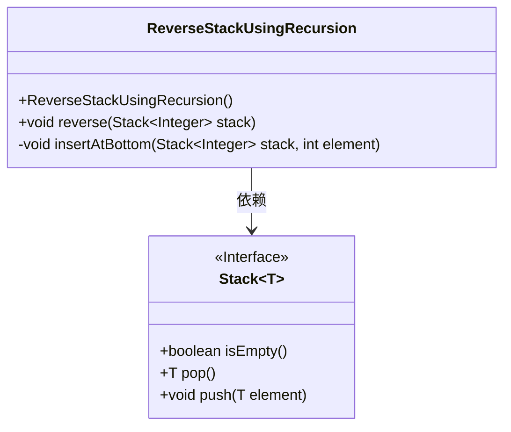
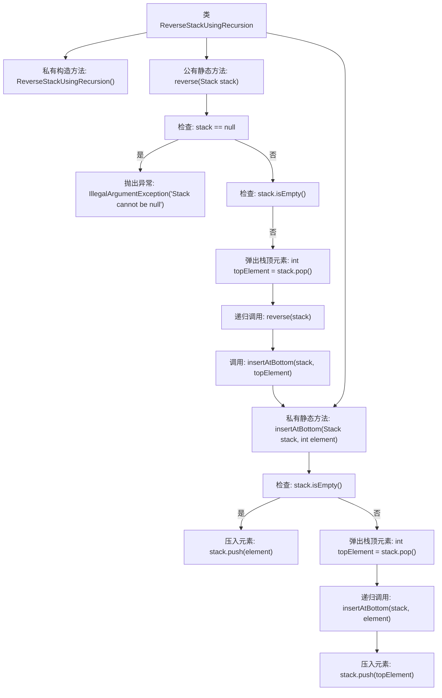

# 基础信息

|      |      |
|------|------|
| 名称 | ReverseStackUsingRecursion |
| 编码语言 | .java |
| 代码路径 | Java/src/main/java/com/thealgorithms/others/ReverseStackUsingRecursion.java |
| 包名 | com.thealgorithms.others |
| 依赖项 | ['java.util.Stack'] |
| 概述说明 | 递归反转栈元素，检查空栈，插入底部。 |

# 说明

递归反转栈元素涉及通过递归方法将栈中的元素顺序反转。首先检查栈是否为空，若为空则直接返回。若栈不为空，则递归地移除栈顶元素，直到栈为空。然后在递归返回的过程中，将之前移除的元素依次插入栈的底部，从而实现栈元素的反转。这一过程确保了栈的顺序被完全颠倒，且通过递归实现了简洁的操作逻辑。

# 类列表 Class Summary

| 名称   | 类型  | 说明 |
|-------|------|-------------|
| ReverseStackUsingRecursion | class | 递归反转栈元素，空栈检查，插入底部。 |

## 类 ReverseStackUsingRecursion

|      |      |
|------|------|
| 访问范围 | public final |
| 类型 | class |
| 名称 | ReverseStackUsingRecursion |
| 说明 | 递归反转栈元素，空栈检查，插入底部。 |

### UML类图

这段代码定义了一个名为 `ReverseStackUsingRecursion` 的类，用于递归地反转一个整数栈。类中包含一个私有的构造方法，确保无法实例化该类。`reverse` 方法用于反转栈中的元素，如果栈为空则不执行任何操作，否则递归地将栈顶元素移除并插入到栈底。`insertAtBottom` 方法用于将元素插入到栈的底部，如果栈为空则直接插入，否则递归地将栈顶元素移除并重新插入。该类依赖于 `Stack<Integer>` 接口，该接口定义了栈的基本操作，如 `isEmpty`、`pop` 和 `push`。

### 内部方法调用关系图

这段代码定义了一个名为 `ReverseStackUsingRecursion` 的类，用于通过递归方法反转栈中的元素。`reverse` 方法首先检查栈是否为空，如果不为空则弹出栈顶元素并递归调用自身，最后将元素插入栈底。`insertAtBottom` 方法用于将元素插入栈底，如果栈为空则直接压入，否则递归地将栈顶元素弹出并重新压入。流程图清晰地展示了方法的调用关系和逻辑流程。

### 字段列表 Field List

| 名称  | 类型  | 说明 |
|-------|-------|------|

### 方法列表 Method List

| 名称  | 类型  | 说明 |
|-------|-------|------|
| reverse | void | 递归反转栈，确保栈非空且处理栈顶元素。 |
| insertAtBottom | void | 递归实现栈底插入元素，保持原有顺序。 |

