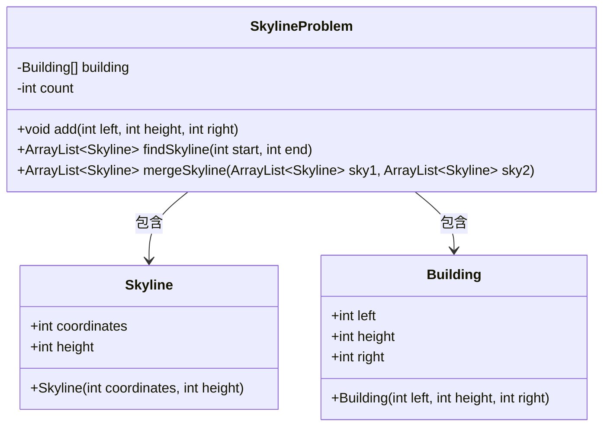
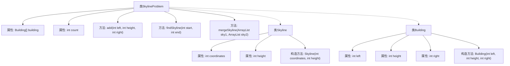
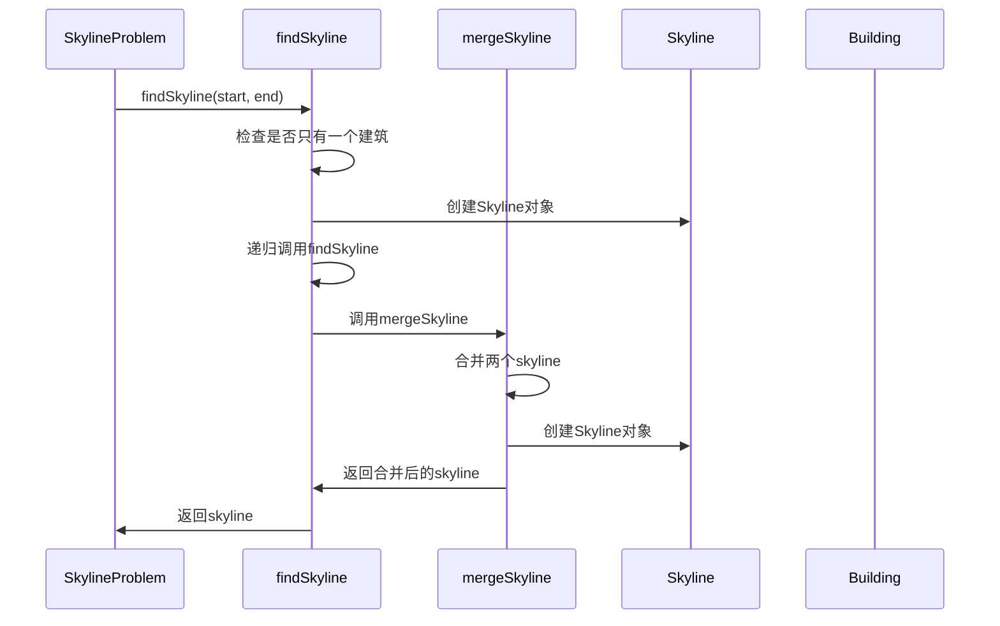

# 基础信息

|      |      |
|------|------|
| 名称 | SkylineProblem |
| 编码语言 | .java |
| 代码路径 | Java/src/main/java/com/thealgorithms/others/SkylineProblem.java |
| 包名 | com.thealgorithms.others |
| 依赖项 | ['java.util.ArrayList'] |
| 概述说明 | SkylineProblem类用于计算建筑物轮廓，支持添加和合并轮廓。 |

# 说明

SkylineProblem类是一个用于计算建筑物轮廓的工具，支持多种操作。其主要功能包括添加建筑物、使用分治法计算轮廓以及合并多个轮廓。通过这些功能，用户可以高效地生成建筑物的整体轮廓，适用于复杂的建筑群分析。

# 类列表 Class Summary

| 名称   | 类型  | 说明 |
|-------|------|-------------|
| SkylineProblem | class | SkylineProblem类用于计算建筑物轮廓，支持添加建筑物、分治法计算轮廓及合并轮廓。 |

## 类 SkylineProblem

|      |      |
|------|------|
| 访问范围 | public |
| 类型 | class |
| 名称 | SkylineProblem |
| 说明 | SkylineProblem类用于计算建筑物轮廓，支持添加建筑物、分治法计算轮廓及合并轮廓。 |

### UML类图

这段代码定义了一个 `SkylineProblem` 类，用于处理建筑物的天际线问题。`SkylineProblem` 类包含两个内部类 `Skyline` 和 `Building`，分别表示天际线点和建筑物。`SkylineProblem` 类提供了添加建筑物、计算天际线以及合并两个天际线的方法。通过分治策略，`findSkyline` 方法递归地计算建筑物的天际线，并使用 `mergeSkyline` 方法将两个天际线合并为一个。代码展示了如何通过分治和合并的方式高效地解决天际线问题。

### 内部方法调用关系图

**描述：**  
`SkylineProblem`类用于解决天际线问题，包含添加建筑、计算天际线以及合并天际线的方法。`add`方法用于添加建筑，`findSkyline`方法通过分治法计算天际线，`mergeSkyline`方法合并两个天际线。`Skyline`和`Building`类分别表示天际线点和建筑。流程图中展示了类之间的属性和方法关系，时序图描述了`findSkyline`和`mergeSkyline`方法的调用顺序和交互过程。

### 字段列表 Field List

| 名称  | 类型  | 说明 |
|-------|-------|------|
| building | Building[] | 定义了一个Building类型的数组变量building。 |
| count | int | 定义一个整数变量count。 |

### 方法列表 Method List

| 名称  | 类型  | 说明 |
|-------|-------|------|
| add | void | 定义方法`add`，用于添加包含左、高、右属性的建筑对象。 |
| mergeSkyline | ArrayList<Skyline> | 合并两个天际线，按坐标排序，保留最高点。 |
| findSkyline | ArrayList<Skyline> | 递归分治法求解建筑物天际线，合并左右部分结果。 |

