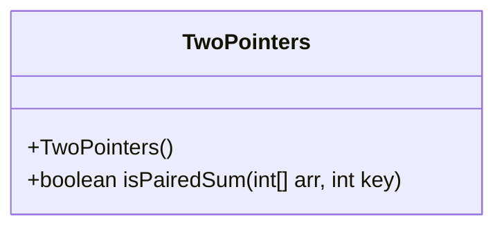
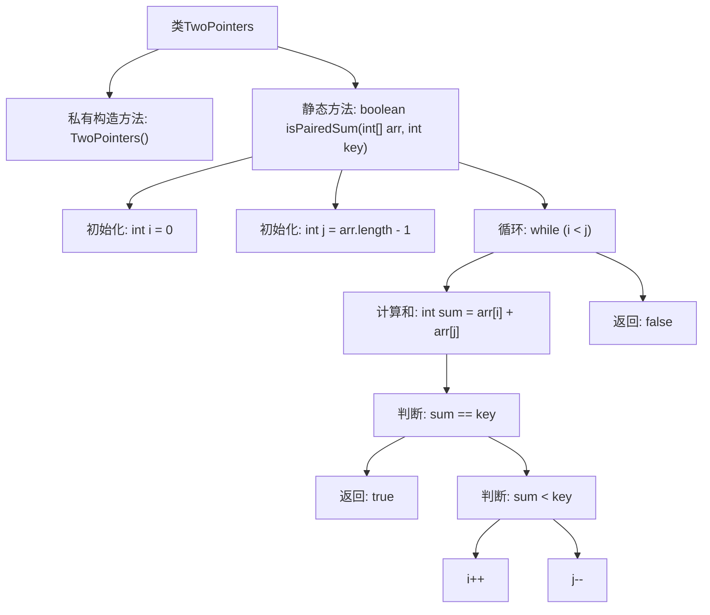

# 基础信息

|      |      |
|------|------|
| 名称 | TwoPointers |
| 编码语言 | .java |
| 代码路径 | Java/src/main/java/com/thealgorithms/others/TwoPointers.java |
| 包名 | com.thealgorithms.others |
| 依赖项 | [] |
| 概述说明 | 双指针算法在有序数组中查找两数之和等于指定值。 |

# 说明

在有序数组中查找是否存在两数之和等于指定值的双指针算法，通过使用两个指针分别指向数组的起始和末尾，逐步向中间移动。若两指针所指元素之和等于目标值，则返回存在；若和小于目标值，则左指针右移；若和大于目标值，则右指针左移。该算法时间复杂度为O(n)，空间复杂度为O(1)，适用于有序数组的高效查找。

# 类列表 Class Summary

| 名称   | 类型  | 说明 |
|-------|------|-------------|
| TwoPointers | class | 在有序数组中查找是否存在两数之和等于指定值的双指针算法。 |

## 类 TwoPointers

|      |      |
|------|------|
| 访问范围 | final |
| 类型 | class |
| 名称 | TwoPointers |
| 说明 | 在有序数组中查找是否存在两数之和等于指定值的双指针算法。 |

### UML类图

类图描述：
`TwoPointers` 类是一个工具类，用于检查已排序数组中是否存在两个元素的和等于给定的键值。该类包含一个私有构造函数，防止实例化，并提供了一个静态方法 `isPairedSum`，该方法通过双指针技术高效地搜索符合条件的元素对。该方法接收一个已排序的数组和一个键值作为参数，返回一个布尔值表示是否存在满足条件的元素对。

### 内部方法调用关系图

这段代码定义了一个名为 `TwoPointers` 的类，其中包含一个静态方法 `isPairedSum`，用于在已排序的数组中查找是否存在两个元素的和等于给定的键值。该方法使用双指针技术，通过移动指针来逐步缩小搜索范围，直到找到符合条件的元素对或遍历完整个数组。如果找到符合条件的元素对，则返回 `true`，否则返回 `false`。

### 字段列表 Field List

| 名称  | 类型  | 说明 |
|-------|-------|------|

### 方法列表 Method List

| 名称  | 类型  | 说明 |
|-------|-------|------|
| isPairedSum | boolean | 检查数组中是否存在两数之和等于给定值。 |

