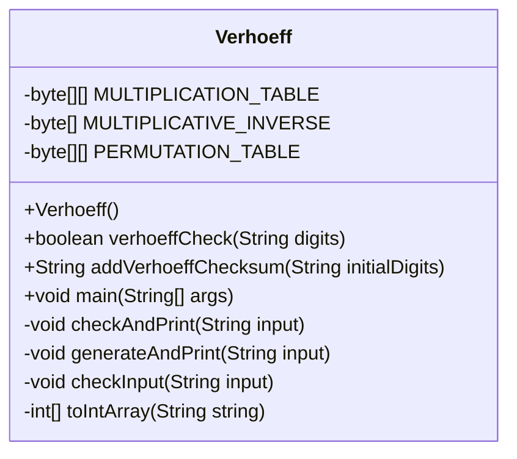
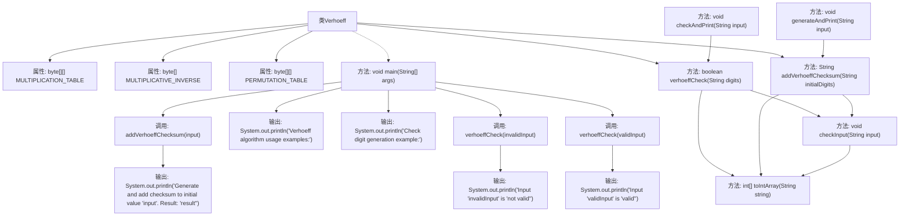

# 基础信息

|      |      |
|------|------|
| 名称 | Verhoeff |
| 编码语言 | .java |
| 代码路径 | Java/src/main/java/com/thealgorithms/others/Verhoeff.java |
| 包名 | com.thealgorithms.others |
| 依赖项 | ['java.util.Objects'] |
| 概述说明 | Verhoeff算法实现校验和生成，包含乘法、逆表和置换表，支持计算与验证。 |

# 说明

Verhoeff类实现了一种校验和生成算法，该算法基于乘法表、逆表和置换表进行运算。该类的核心功能包括校验和的计算与验证。通过使用这些预定义的表结构，Verhoeff类能够高效地生成校验和，并验证数据的完整性。这种方法适用于需要确保数据准确性和完整性的场景，如数据传输或存储过程中的错误检测。

# 类列表 Class Summary

| 名称   | 类型  | 说明 |
|-------|------|-------------|
| Verhoeff | class | Verhoeff类实现校验和生成算法，包含乘法表、逆表和置换表，支持校验和计算与验证。 |

## 类 Verhoeff

|      |      |
|------|------|
| 访问范围 | public final |
| 类型 | class |
| 名称 | Verhoeff |
| 说明 | Verhoeff类实现校验和生成算法，包含乘法表、逆表和置换表，支持校验和计算与验证。 |

### UML类图

这段代码定义了一个名为 `Verhoeff` 的类，用于实现 Verhoeff 算法。Verhoeff 算法是一种用于校验数字的算法，通过使用乘法表、逆元表和置换表来验证数字的有效性或生成校验位。类中包含两个公共方法：`verhoeffCheck` 用于验证输入数字的有效性，`addVerhoeffChecksum` 用于生成并添加校验位。此外，类中还包含一些私有方法用于辅助计算和输入验证。整个类的设计旨在确保输入数字的准确性和完整性。

### 内部方法调用关系图

这段代码实现了Verhoeff算法，用于验证和生成校验码。类`Verhoeff`包含三个静态属性：`MULTIPLICATION_TABLE`、`MULTIPLICATIVE_INVERSE`和`PERMUTATION_TABLE`，分别用于乘法运算、逆运算和排列运算。`verhoeffCheck`方法用于验证输入的校验码是否正确，`addVerhoeffChecksum`方法用于生成并添加校验码。`main`方法展示了算法的使用示例，`checkAndPrint`和`generateAndPrint`方法分别用于验证和生成校验码，并输出结果。`checkInput`方法用于检查输入是否合法，`toIntArray`方法将字符串转换为整数数组。

### 字段列表 Field List

| 名称  | 类型  | 说明 |
|-------|-------|------|
| MULTIPLICATION_TABLE = {        {0, 1, 2, 3, 4, 5, 6, 7, 8, 9},        {1, 2, 3, 4, 0, 6, 7, 8, 9, 5},        {2, 3, 4, 0, 1, 7, 8, 9, 5, 6},        {3, 4, 0, 1, 2, 8, 9, 5, 6, 7},        {4, 0, 1, 2, 3, 9, 5, 6, 7, 8},        {5, 9, 8, 7, 6, 0, 4, 3, 2, 1},        {6, 5, 9, 8, 7, 1, 0, 4, 3, 2},        {7, 6, 5, 9, 8, 2, 1, 0, 4, 3},        {8, 7, 6, 5, 9, 3, 2, 1, 0, 4},        {9, 8, 7, 6, 5, 4, 3, 2, 1, 0},    } | byte[][] | 定义了一个10x10的静态字节乘法表。 |
| MULTIPLICATIVE_INVERSE = {        0,        4,        3,        2,        1,        5,        6,        7,        8,        9,    } | byte[] | 定义了一个包含10个元素的字节数组，存储乘法逆元。 |
| PERMUTATION_TABLE = {        {0, 1, 2, 3, 4, 5, 6, 7, 8, 9},        {1, 5, 7, 6, 2, 8, 3, 0, 9, 4},        {5, 8, 0, 3, 7, 9, 6, 1, 4, 2},        {8, 9, 1, 6, 0, 4, 3, 5, 2, 7},        {9, 4, 5, 3, 1, 2, 6, 8, 7, 0},        {4, 2, 8, 6, 5, 7, 3, 9, 0, 1},        {2, 7, 9, 3, 8, 0, 6, 4, 1, 5},        {7, 0, 4, 6, 9, 1, 3, 2, 5, 8},    } | byte[][] | 定义了一个包含8组10个字节的置换表。 |

### 方法列表 Method List

| 名称  | 类型  | 说明 |
|-------|-------|------|
| toIntArray | int[] | 将字符串转换为整数数组。 |
| checkAndPrint | void | 检查输入字符串有效性并打印验证结果。 |
| main | void | Java示例：验证Verhoeff算法，生成并打印校验码。 |
| verhoeffCheck | boolean | Verhoeff算法实现，验证数字串校验和是否为零。 |
| addVerhoeffChecksum | String | 为初始数字添加Verhoeff校验和，返回带校验和的结果。 |
| checkInput | void | 检查输入是否为纯数字，若为空或含非数字字符则抛出异常。 |
| generateAndPrint | void | 生成并打印带校验和的结果，初始值为input，输出结果包含校验和。 |

