# 基础信息

|      |      |
|------|------|
| 名称 | others |
| 编码语言 | .java |
| 代码路径 | Java/src/main/java/com/thealgorithms/others |
| 包名 | Java.src.main.java.com.thealgorithms.others |
| 概述说明 | MiniMax算法递归计算最优得分，移除字符串重复字符，递归反转栈，高效计算置位数，Damm算法校验数据，判断Krishnamurthy数，范围最大值与重叠判断，生成Floyd三角形，Mandelbrot集图像生成，双栈实现队列，计算π值，最小回文基数，查找最小k元素，哈夫曼编码，数组插入删除，科赫雪花生成，伪随机数生成，Trie树实现，数数并说序列，数组右旋，CRC错误检测，数组左旋，滑动窗口最大值，PageRank网页排名，螺旋打印矩阵，Verhoeff校验和，Dijkstra最短路径，内存管理算法，银行家算法，Luhn信用卡验证，随机密码生成，汉明距离计算，双指针查找两数之和，CRC16校验，快乐数判断，最大和子数组，建筑物轮廓计算，多数元素查找，Perlin噪声生成，CRC32校验。 |

# 说明

## 概述
该代码模块是一个包含多种算法和数据结构的Java实现集合，涵盖了从经典算法（如Dijkstra算法、PageRank算法）到数据处理（如CRC校验、汉明距离计算）以及数据结构操作（如Trie树、双栈队列）等多个领域。这些实现旨在提供高效、可靠的解决方案，适用于各种业务场景，包括数据验证、图像生成、字符串处理、数组操作等。

## 主要业务场景
1. **算法优化与决策**：
   - **MiniMax算法**：用于游戏决策，通过递归遍历所有可能的走法，计算最优得分。
   - **BFPRT算法**：用于查找数组中最小的k个元素，通过中位数选择和分区策略提高效率。
   - **Dijkstra算法**：用于计算图中节点之间的最短路径，适用于路径规划等场景。
   - **PageRank算法**：用于计算网页排名，分析网页间的链接关系，确保重要网页获得更高排名。

2. **数据处理与验证**：
   - **CRC算法**：用于数据完整性验证，支持CRC16和CRC32校验，确保数据传输或存储的准确性。
   - **Luhn算法**：用于验证信用卡号的有效性，广泛应用于金融和支付系统。
   - **Verhoeff算法**：用于生成和验证校验码，确保数据的完整性和准确性。

3. **字符串与数组操作**：
   - **RemoveDuplicateFromString**：移除字符串中的重复字符，保持字符的原始顺序。
   - **ArrayRightRotation/ArrayLeftRotation**：实现数组的右旋和左旋操作，返回新数组。
   - **MaximumSumOfDistinctSubarraysWithLengthK**：计算长度为K且元素互不相同的子数组的最大和。

4. **数据结构实现**：
   - **QueueUsingTwoStacks**：使用双栈实现队列，支持插入、删除、查看队首队尾及判空操作。
   - **Implementing_auto_completing_features_using_trie**：实现Trie树，支持插入、搜索和自动补全功能。

5. **图像生成与模拟**：
   - **Mandelbrot**：生成黑白和彩色的Mandelbrot集图像，涉及复杂的数学计算和图像处理。
   - **KochSnowflake**：生成和渲染科赫雪花图案，通过迭代算法构建复杂结构。
   - **PerlinNoise**：生成二维噪声图，支持分层叠加和归一化处理，适用于图形和模拟场景。

6. **数学计算与序列生成**：
   - **GaussLegendre**：计算π值，通过迭代过程逐步逼近精确值。
   - **Conway**：生成“数数并说”序列，根据指定次数生成序列中的元素。
   - **HappyNumbersSeq**：判断输入的数字是否为快乐数，通过计算平方和检测循环。

7. **资源管理与死锁避免**：
   - **BankersAlgorithm**：用于操作系统中的资源分配和死锁避免，确保系统安全状态。
   - **MemoryManagementAlgorithms**：实现最佳适应、最差适应和首次适应等内存管理算法。

这些业务场景展示了该模块的多样性和广泛适用性，能够满足不同领域的需求，从基础的数据处理到复杂的算法优化，均提供了高效的解决方案。

### 包内部结构视图

```mermaid
graph TD
    others --> MiniMaxAlgorithm.java
    others --> RemoveDuplicateFromString.java
    others --> ReverseStackUsingRecursion.java
    others --> BrianKernighanAlgorithm.java
    others --> Damm.java
    others --> Krishnamurthy.java
    others --> LineSweep.java
    others --> FloydTriangle.java
    others --> Mandelbrot.java
    others --> QueueUsingTwoStacks.java
    others --> GaussLegendre.java
    others --> LowestBasePalindrome.java
    others --> BFPRT.java
    others --> Huffman.java
    others --> InsertDeleteInArray.java
    others --> KochSnowflake.java
    others --> LinearCongruentialGenerator.java
    others --> Implementing_auto_completing_features_using_trie.java
    others --> Conway.java
    others --> ArrayRightRotation.java
    others --> CRCAlgorithm.java
    others --> ArrayLeftRotation.java
    others --> MaximumSlidingWindow.java
    others --> PageRank.java
    others --> PrintAMatrixInSpiralOrder.java
    others --> Verhoeff.java
    others --> Dijkstra.java
    others --> MemoryManagementAlgorithms.java
    others --> BankersAlgorithm.java
    others --> Luhn.java
    others --> PasswordGen.java
    others --> cn
    others --> TwoPointers.java
    others --> CRC16.java
    others --> HappyNumbersSeq.java
    others --> MaximumSumOfDistinctSubarraysWithLengthK.java
    others --> SkylineProblem.java
    others --> BoyerMoore.java
    others --> PerlinNoise.java
    others --> CRC32.java
    cn --> HammingDistance.java
```

该流程图展示了`others`目录下的所有文件及其子目录`cn`的结构。每个文件都直接连接到`others`节点，而`cn`目录则包含一个单独的文件`HammingDistance.java`。这种结构清晰地反映了路径的层级关系，便于理解文件之间的组织方式。

# 文件列表 File List

| 名称   | 类型  | 说明 |
|-------|------|-------------|
| [PerlinNoise.java](PerlinNoise.md) | file | PerlinNoise类生成二维噪声图，支持分层叠加和归一化。 |
| [HappyNumbersSeq.java](HappyNumbersSeq.md) | file | Java程序通过平方和循环检测判断输入数字是否为快乐数。 |
| [Dijkstra.java](Dijkstra.md) | file | Dijkstra算法实现计算节点a到e的最短路径，图类支持该算法。 |
| [PageRank.java](PageRank.md) | file | PageRank算法通过网页数和邻接矩阵计算网页排名。 |
| [ArrayLeftRotation.java](ArrayLeftRotation.md) | file | 数组左旋转功能，返回旋转后的新数组。 |
| [LinearCongruentialGenerator.java](LinearCongruentialGenerator.md) | file | 线性同余生成器类，生成伪随机数，可自定义乘数、增量和模数。 |
| [KochSnowflake.java](KochSnowflake.md) | file | KochSnowflake类实现科赫雪花生成与渲染，支持迭代和图像绘制。 |
| [LowestBasePalindrome.java](LowestBasePalindrome.md) | file | LowestBasePalindrome类验证基数、计算表示、判断回文并寻找最小回文基数。 |
| [FloydTriangle.java](FloydTriangle.md) | file | FloydTriangle类生成指定行数的Floyd三角形，返回二维整数列表。 |
| [ReverseStackUsingRecursion.java](ReverseStackUsingRecursion.md) | file | 递归反转栈元素，检查空栈，插入底部。 |
| [CRC32.java](CRC32.md) | file | CRC32类实现CRC32校验，支持字符串和字节数组输入，输出十六进制校验值。 |
| [BoyerMoore.java](BoyerMoore.md) | file | BoyerMoore类通过投票算法寻找数组多数元素。 |
| [SkylineProblem.java](SkylineProblem.md) | file | SkylineProblem类用于计算建筑物轮廓，支持添加和合并轮廓。 |
| [MaximumSumOfDistinctSubarraysWithLengthK.java](MaximumSumOfDistinctSubarraysWithLengthK.md) | file | 求长度为K且元素互不相同的子数组的最大和。 |
| [CRC16.java](CRC16.md) | file | CRC16类用于计算字符串的CRC16校验值并输出。 |
| [TwoPointers.java](TwoPointers.md) | file | 双指针算法在有序数组中查找两数之和等于指定值。 |
| [PasswordGen.java](PasswordGen.md) | file | 随机密码生成工具，支持自定义长度，包含多种字符类型。 |
| [Luhn.java](Luhn.md) | file | Luhn算法验证信用卡号，含示例与业务应用。 |
| [BankersAlgorithm.java](BankersAlgorithm.md) | file | 银行家算法实现，计算进程需求并检查系统安全状态。 |
| [MemoryManagementAlgorithms.java](MemoryManagementAlgorithms.md) | file | 抽象类定义内存管理算法，包含分配方法和未分配常量。BestFitCPU、最差适应算法、FirstFitCPU和NextFit分别实现最佳、最差、首次和下次适应内存分配算法。 |
| [Verhoeff.java](Verhoeff.md) | file | Verhoeff算法实现校验和生成，包含乘法、逆表和置换表，支持计算与验证。 |
| [PrintAMatrixInSpiralOrder.java](PrintAMatrixInSpiralOrder.md) | file | 按螺旋顺序打印二维矩阵元素。 |
| [MaximumSlidingWindow.java](MaximumSlidingWindow.md) | file | 滑动窗口算法用于查找窗口内最大值。 |
| [CRCAlgorithm.java](CRCAlgorithm.md) | file | CRC算法类用于生成随机消息，检测错误，支持消息重构和错误率控制。 |
| [ArrayRightRotation.java](ArrayRightRotation.md) | file | 数组右旋方法利用三次反转处理异常输入。 |
| [Conway.java](Conway.md) | file | Conway类生成“数数并说”序列，支持指定次数元素生成。 |
| [Implementing_auto_completing_features_using_trie.java](Implementing_auto_completing_features_using_trie.md) | file | 实现Trie树，支持插入、搜索和自动补全功能。 |
| [InsertDeleteInArray.java](InsertDeleteInArray.md) | file | Java实现数组的插入与删除操作。 |
| [Huffman.java](Huffman.md) | file | HuffmanNode类含数据、字符及子节点，MyComparator类比较节点数据，Huffman类生成并打印字符编码。 |
| [BFPRT.java](BFPRT.md) | file | BFPRT算法用于查找数组中最小k个元素，涵盖复制、分区和中位数选择。 |
| [GaussLegendre.java](GaussLegendre.md) | file | GaussLegendre类通过循环更新参数计算π值并返回结果。 |
| [QueueUsingTwoStacks.java](QueueUsingTwoStacks.md) | file | 双栈实现队列，支持插入、删除、查看队首队尾及判空操作。 |
| [Mandelbrot.java](Mandelbrot.md) | file | Mandelbrot类生成黑白和彩色Mandelbrot集图像，验证像素颜色并保存。 |
| [LineSweep.java](LineSweep.md) | file | LineSweep类提供两个方法：findMaximumEndPoint查找最大终点，isOverlap判断范围重叠。 |
| [Krishnamurthy.java](Krishnamurthy.md) | file | Krishnamurthy类用于判断输入数字是否为Krishnamurthy数。 |
| [Damm.java](Damm.md) | file | Damm算法实现校验和生成校验码，包含校验表及相关方法。 |
| [BrianKernighanAlgorithm.java](BrianKernighanAlgorithm.md) | file | BrianKernighan算法实现Java计算整数置位数。 |
| [RemoveDuplicateFromString.java](RemoveDuplicateFromString.md) | file | 移除字符串重复字符，保持原有顺序。 |
| [MiniMaxAlgorithm.java](MiniMaxAlgorithm.md) | file | MiniMax算法实现随机分数生成、递归计算最优得分及玩家选择展示。 |
| [cn](cn/_module.md) | package | 计算等长二进制字符串的汉明距离。 |

