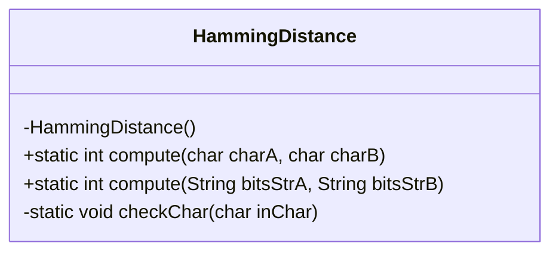
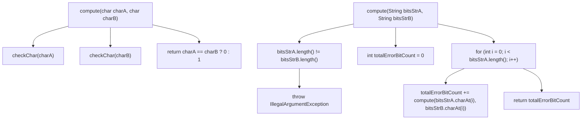
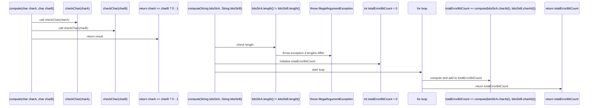
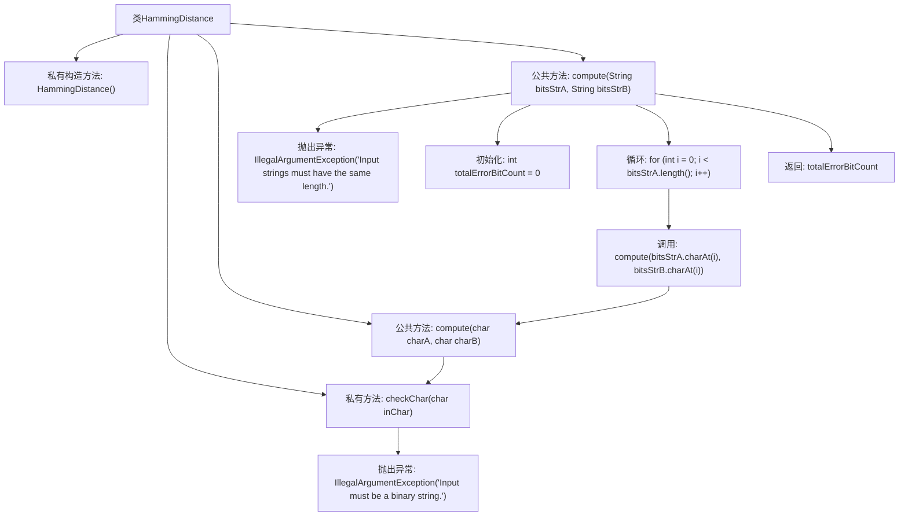

# 基础信息

|      |      |
|------|------|
| 名称 | HammingDistance |
| 编码语言 | .java |
| 代码路径 | Java/src/main/java/com/thealgorithms/others/cn/HammingDistance.java |
| 包名 | com.thealgorithms.others.cn |
| 依赖项 | [] |
| 概述说明 | 计算等长二进制字符串的汉明距离。 |

# 说明

计算二进制字符或字符串的汉明距离时，要求输入的两个二进制字符串长度必须相同。汉明距离是指两个等长字符串在相同位置上不同字符的个数。通过逐位比较两个字符串的字符，统计不同字符的数量，即可得到汉明距离。这种方法适用于比较二进制数据的相似性或差异性。

# 类列表 Class Summary

| 名称   | 类型  | 说明 |
|-------|------|-------------|
| HammingDistance | class | 计算二进制字符或字符串的汉明距离，输入需为相同长度的二进制字符串。 |

## 类 HammingDistance

|      |      |
|------|------|
| 访问范围 | public final |
| 类型 | class |
| 名称 | HammingDistance |
| 说明 | 计算二进制字符或字符串的汉明距离，输入需为相同长度的二进制字符串。 |

### UML类图

**描述**：`HammingDistance` 类提供了计算汉明距离的功能。它包含两个静态方法：`compute(char, char)` 用于计算两个字符的汉明距离，`compute(String, String)` 用于计算两个二进制字符串的汉明距离。`checkChar` 方法用于验证输入字符是否为二进制字符。类图展示了类的结构，流程图和时序图分别展示了方法的执行流程和调用顺序。

### 内部方法调用关系图

这段代码定义了一个名为 `HammingDistance` 的类，用于计算两个二进制字符串之间的汉明距离。类中包含两个 `compute` 方法，分别用于计算单个字符和字符串的汉明距离。`checkChar` 方法用于验证输入字符是否为二进制字符，如果不是则抛出异常。`compute(String, String)` 方法首先检查两个字符串长度是否相同，然后逐个字符计算汉明距离并返回总错误位数。

### 字段列表 Field List

| 名称  | 类型  | 说明 |
|-------|-------|------|

### 方法列表 Method List

| 名称  | 类型  | 说明 |
|-------|-------|------|
| compute | int | 静态方法计算两字符是否相等，相等返回0，不等返回1。 |
| checkChar | void | 检查字符是否为0或1，否则抛出非法参数异常。 |
| compute | int | 计算两个等长字符串的比特差异总数。 |

