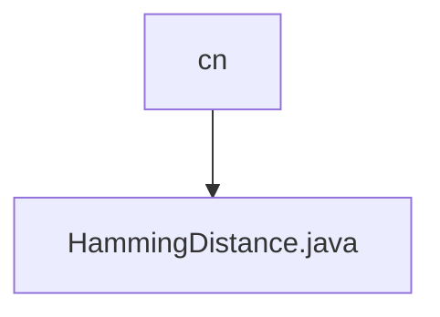

# 基础信息

|      |      |
|------|------|
| 名称 | cn |
| 编码语言 | .java |
| 代码路径 | Java/src/main/java/com/thealgorithms/others/cn |
| 包名 | Java.src.main.java.com.thealgorithms.others.cn |
| 概述说明 | 计算等长二进制字符串的汉明距离。 |

# 说明

计算二进制字符或字符串的汉明距离时，要求输入的两个二进制字符串长度必须相同。汉明距离是指两个等长字符串在相同位置上不同字符的个数。通过逐位比较两个字符串的字符，统计不同字符的数量，即可得到汉明距离。这种方法适用于比较二进制数据的相似性或差异性。

### 包内部结构视图

该流程图展示了路径层级关系，`cn` 是父节点，`HammingDistance.java` 是其子节点。`cn` 是一个文件夹，而 `HammingDistance.java` 是位于该文件夹中的一个文件。这种层级关系清晰地表示了文件在项目结构中的位置。

# 文件列表 File List

| 名称   | 类型  | 说明 |
|-------|------|-------------|
| [HammingDistance.java](HammingDistance.md) | file | 计算等长二进制字符串的汉明距离。 |

