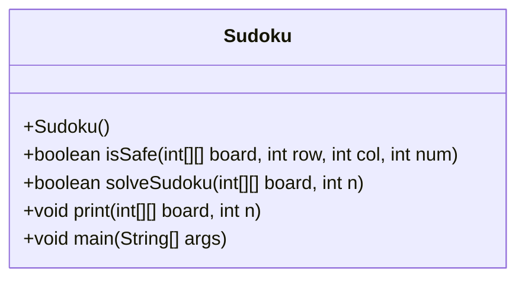
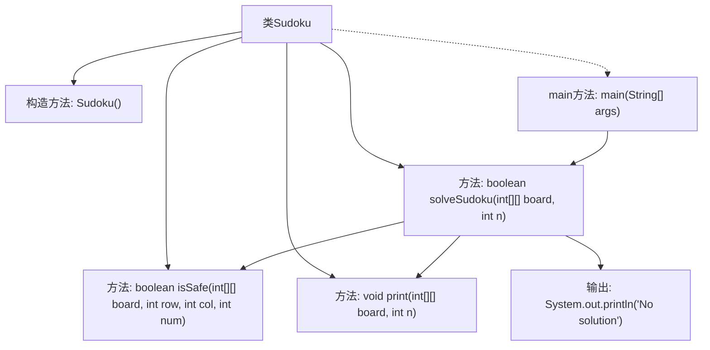

# 基础信息

|      |      |
|------|------|
| 名称 | Sudoku |
| 编码语言 | .java |
| 代码路径 | Java/src/main/java/com/thealgorithms/puzzlesandgames/Sudoku.java |
| 包名 | com.thealgorithms.puzzlesandgames |
| 依赖项 | [] |
| 概述说明 | 数独类具备安全检查、求解和打印功能，采用回溯算法解谜。 |

# 说明

数独类具备安全检查、求解和打印三大功能。它通过回溯算法有效解决数独谜题，确保每一步操作都经过严格的验证，以保持谜题的正确性和完整性。求解功能能够快速找到并填充缺失的数字，而打印功能则可以将最终解答清晰地展示出来。整个类设计合理，功能全面，适用于各种数独问题的解决。

# 类列表 Class Summary

| 名称   | 类型  | 说明 |
|-------|------|-------------|
| Sudoku | class | 数独类包含安全检查、求解和打印功能，使用回溯算法解决数独谜题。 |

## 类 Sudoku

|      |      |
|------|------|
| 访问范围 | final |
| 类型 | class |
| 名称 | Sudoku |
| 说明 | 数独类包含安全检查、求解和打印功能，使用回溯算法解决数独谜题。 |

### UML类图

### 描述
`Sudoku` 类是一个用于解决数独谜题的实用工具类。它提供了三个主要方法：`isSafe` 用于检查在特定位置放置数字是否安全，`solveSudoku` 使用回溯算法来解决数独谜题，`print` 用于打印当前数独板的状态。`main` 方法演示了如何使用这些方法来解决一个示例数独谜题。该类是 `final` 的，表示它不能被继承。

### 内部方法调用关系图

这段代码实现了一个数独求解器，主要包含四个方法：`isSafe`用于检查在指定位置放置数字是否安全，`solveSudoku`使用回溯算法求解数独，`print`用于打印数独板，`main`方法作为程序的入口。流程图展示了类内部方法之间的调用关系，`main`方法调用`solveSudoku`，后者在求解过程中调用`isSafe`和`print`，并在无解时输出“No solution”。

### 字段列表 Field List

| 名称  | 类型  | 说明 |
|-------|-------|------|

### 方法列表 Method List

| 名称  | 类型  | 说明 |
|-------|-------|------|
| print | void | 打印nxn格式的二维数组，按sqrt(n)分组换行。 |
| solveSudoku | boolean | 递归求解数独，寻找空格并尝试填入数字，若失败则回溯。 |
| isSafe | boolean | 检查数独棋盘在指定位置插入数字是否安全，包括行、列和3x3子网格的重复检测。 |
| main | void | Java代码初始化数独棋盘并调用求解函数。 |

