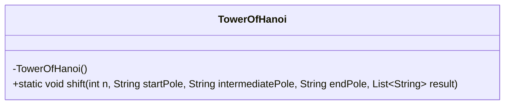
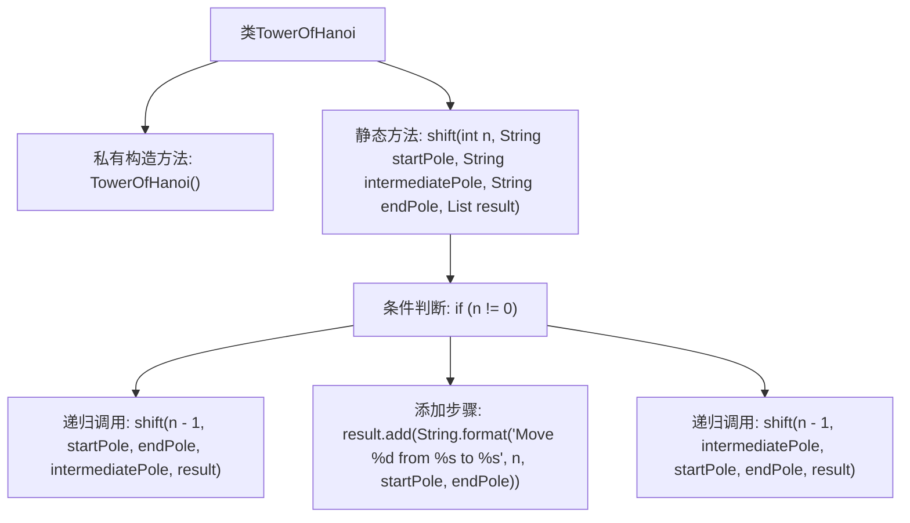

# 基础信息

|      |      |
|------|------|
| 名称 | TowerOfHanoi |
| 编码语言 | .java |
| 代码路径 | Java/src/main/java/com/thealgorithms/puzzlesandgames/TowerOfHanoi.java |
| 包名 | com.thealgorithms.puzzlesandgames |
| 依赖项 | ['java.util.List'] |
| 概述说明 | 递归解决汉诺塔问题，时间O(2^n)，空间O(n)。 |

# 说明

递归方法用于解决汉诺塔问题，其时间复杂度为O(2^n)，意味着随着盘子数量的增加，计算量呈指数级增长。空间复杂度为O(n)，表示递归调用栈的深度与盘子数量成正比。这种方法通过将问题分解为更小的子问题，逐步移动盘子，最终实现将所有盘子从起始柱移动到目标柱的目标。递归策略简洁但效率较低，适用于理解问题本质和较小规模的实例。

# 类列表 Class Summary

| 名称   | 类型  | 说明 |
|-------|------|-------------|
| TowerOfHanoi | class | 递归解决汉诺塔问题，时间复杂度O(2^n)，空间复杂度O(n)。 |

## 类 TowerOfHanoi

|      |      |
|------|------|
| 访问范围 | final |
| 类型 | class |
| 名称 | TowerOfHanoi |
| 说明 | 递归解决汉诺塔问题，时间复杂度O(2^n)，空间复杂度O(n)。 |

### UML类图

这段代码定义了一个名为 `TowerOfHanoi` 的最终类，该类包含一个私有的构造函数和一个静态方法 `shift`。`shift` 方法通过递归的方式解决汉诺塔问题，将 `n` 个盘子从起始柱子 `startPole` 移动到目标柱子 `endPole`，并使用中间柱子 `intermediatePole` 作为临时存放点。每一步移动操作会被记录到 `result` 列表中。该方法的时间复杂度为 O(2^n)，空间复杂度为 O(n)。

### 内部方法调用关系图

这段代码实现了汉诺塔问题的递归解法。`TowerOfHanoi`类包含一个私有构造方法和一个静态方法`shift`，该方法通过递归调用将`n`个盘子从起始柱移动到目标柱，并使用中间柱作为临时存储。每次递归调用都会将`n-1`个盘子移动到中间柱，然后将第`n`个盘子移动到目标柱，最后再将`n-1`个盘子从中间柱移动到目标柱。整个过程的时间复杂度为O(2^n)，空间复杂度为O(n)。

### 字段列表 Field List

| 名称  | 类型  | 说明 |
|-------|-------|------|

### 方法列表 Method List

| 名称  | 类型  | 说明 |
|-------|-------|------|
| shift | void | 递归实现汉诺塔移动步骤记录。 |

