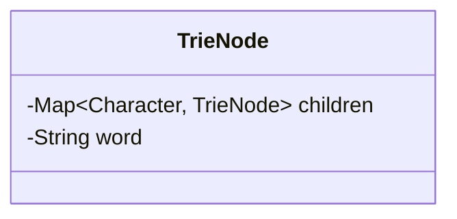
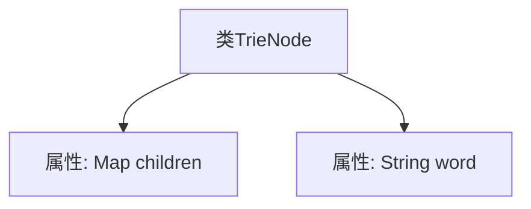
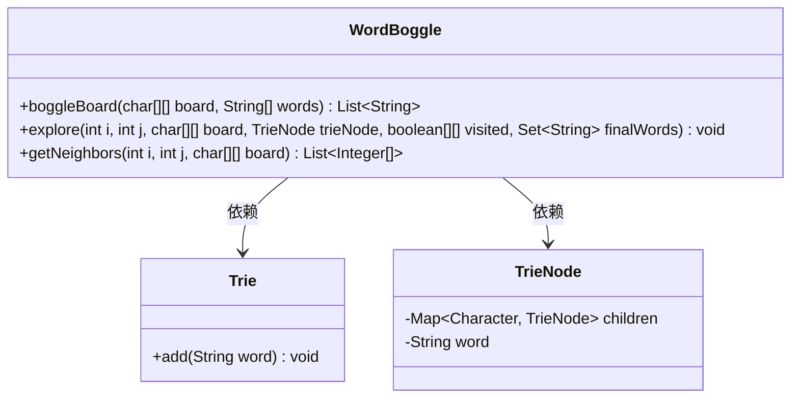
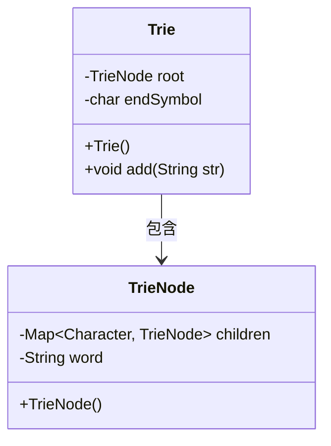
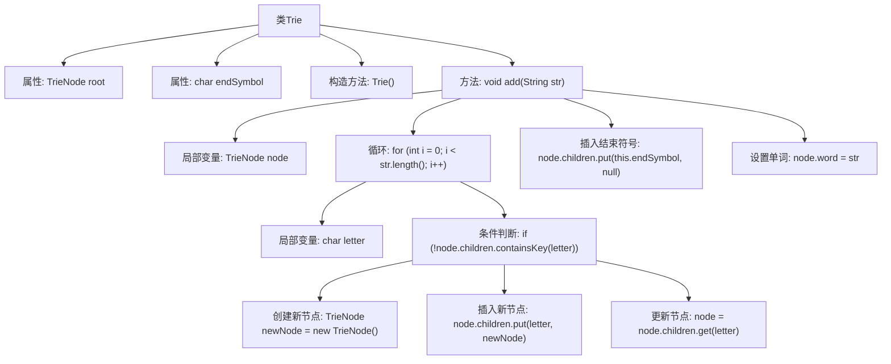

# 基础信息

|      |      |
|------|------|
| 名称 | WordBoggle |
| 编码语言 | .java |
| 代码路径 | Java/src/main/java/com/thealgorithms/puzzlesandgames/WordBoggle.java |
| 包名 | com.thealgorithms.puzzlesandgames |
| 依赖项 | ['java.util.ArrayList', 'java.util.HashMap', 'java.util.HashSet', 'java.util.List', 'java.util.Map', 'java.util.Set'] |
| 概述说明 | WordBoggle类用Trie和DFS实现Boggle游戏，TrieNode和Trie类支持单词存储与查找。 |

# 说明

WordBoggle类实现了Boggle游戏，利用Trie（前缀树）和深度优先搜索（DFS）算法在棋盘上查找单词。TrieNode类包含一个子节点映射和一个用于存储单词的字符串。Trie类实现了前缀树结构，支持字符串的插入操作，并能够标记单词的结束符号。这一设计通过高效的数据结构和算法，确保在Boggle游戏中快速准确地查找所有可能的单词。

# 类列表 Class Summary

| 名称   | 类型  | 说明 |
|-------|------|-------------|
| TrieNode | class | TrieNode类包含子节点映射和存储单词的字符串。 |
| WordBoggle | class | WordBoggle类实现Boggle游戏，通过Trie和DFS查找棋盘上的单词。 |
| Trie | class | Trie类实现前缀树，支持字符串插入和标记结束符号。 |

## 类 TrieNode

|      |      |
|------|------|
| 访问范围 | None |
| 类型 | class |
| 名称 | TrieNode |
| 说明 | TrieNode类包含子节点映射和存储单词的字符串。 |

### UML类图

### 描述
`TrieNode` 类表示字典树中的一个节点，包含两个主要成员：`children` 和 `word`。`children` 是一个 `Map`，用于存储字符到子节点的映射，支持快速查找和插入操作。`word` 是一个字符串，用于存储从根节点到当前节点的路径所表示的完整单词。这个类通常用于实现字典树（Trie）数据结构，适用于高效的字符串存储和检索。

### 内部方法调用关系图

这段代码定义了一个名为 `TrieNode` 的类，该类包含两个属性：`children` 和 `word`。`children` 是一个 `Map`，用于存储字符与子节点的映射关系，而 `word` 是一个字符串，用于存储当前节点代表的完整单词。这个类通常用于实现字典树（Trie）数据结构，用于高效地存储和检索字符串。

### 字段列表 Field List

| 名称  | 类型  | 说明 |
|-------|-------|------|
| word = "" | String | 定义空字符串变量。 |
| children = new HashMap<>() | Map<Character, TrieNode> | 创建字符到TrieNode的映射哈希表。 |

### 方法列表 Method List

| 名称  | 类型  | 说明 |
|-------|-------|------|

## 类 WordBoggle

|      |      |
|------|------|
| 访问范围 | public final |
| 类型 | class |
| 名称 | WordBoggle |
| 说明 | WordBoggle类实现Boggle游戏，通过Trie和DFS查找棋盘上的单词。 |

### UML类图

类图描述：
`WordBoggle` 类包含三个静态方法：`boggleBoard`、`explore` 和 `getNeighbors`。`boggleBoard` 方法用于在给定的字母矩阵中查找所有可能的单词，`explore` 方法用于递归探索矩阵中的每个单元格，`getNeighbors` 方法用于获取当前单元格的所有相邻单元格。`Trie` 类用于构建单词的前缀树，`TrieNode` 类表示前缀树的节点。`WordBoggle` 类依赖于 `Trie` 和 `TrieNode` 类来实现单词查找功能。

### 内部方法调用关系图

```mermaid
graph TD
    A["类WordBoggle"]
    B["构造方法: WordBoggle()"]
    C["方法: List<String> boggleBoard(char[][] board, String[] words)"]
    D["方法: void explore(int i, int j, char[][] board, TrieNode trieNode, boolean[][] visited, Set<String> finalWords)"]
    E["方法: List<Integer[]> getNeighbors(int i, int j, char[][] board)"]
    F["创建Trie对象: Trie trie = new Trie()"]
    G["遍历words数组: for (String word : words)"]
    H["添加单词到Trie: trie.add(word)"]
    I["创建Set对象: Set<String> finalWords = new HashSet<>()"]
    J["创建visited数组: boolean[][] visited = new boolean[board.length][board.length]"]
    K["遍历board数组: for (int i = 0; i < board.length; i++)"]
    L["遍历board[i]数组: for (int j = 0; j < board[i].length; j++)"]
    M["调用explore方法: explore(i, j, board, trie.root, visited, finalWords)"]
    N["返回结果: return new ArrayList<>(finalWords)"]
    O["检查visited[i][j]: if (visited[i][j])"]
    P["返回: return"]
    Q["获取letter: char letter = board[i][j]"]
    R["检查trieNode.children: if (!trieNode.children.containsKey(letter))"]
    S["返回: return"]
    T["设置visited[i][j]: visited[i][j] = true"]
    U["更新trieNode: trieNode = trieNode.children.get(letter)"]
    V["检查trieNode.children: if (trieNode.children.containsKey('*'))"]
    W["添加单词到finalWords: finalWords.add(trieNode.word)"]
    X["获取邻居: List<Integer[]> neighbors = getNeighbors(i, j, board)"]
    Y["遍历邻居: for (Integer[] neighbor : neighbors)"]
    Z["递归调用explore: explore(neighbor[0], neighbor[1], board, trieNode, visited, finalWords)"]
    AA["重置visited[i][j]: visited[i][j] = false"]
    AB["创建neighbors列表: List<Integer[]> neighbors = new ArrayList<>()"]
    AC["添加邻居: neighbors.add(new Integer[] {i - 1, j - 1})"]
    AD["添加邻居: neighbors.add(new Integer[] {i - 1, j + 1})"]
    AE["添加邻居: neighbors.add(new Integer[] {i + 1, j + 1})"]
    AF["添加邻居: neighbors.add(new Integer[] {i + 1, j - 1})"]
    AG["添加邻居: neighbors.add(new Integer[] {i - 1, j})"]
    AH["添加邻居: neighbors.add(new Integer[] {i + 1, j})"]
    AI["添加邻居: neighbors.add(new Integer[] {i, j - 1})"]
    AJ["添加邻居: neighbors.add(new Integer[] {i, j + 1})"]
    AK["返回neighbors: return neighbors"]

    A --> B
    A --> C
    A --> D
    A --> E
    C --> F
    C --> G
    G --> H
    C --> I
    C --> J
    C --> K
    K --> L
    L --> M
    C --> N
    D --> O
    O --> P
    D --> Q
    D --> R
    R --> S
    D --> T
    D --> U
    D --> V
    V --> W
    D --> X
    X --> Y
    Y --> Z
    D --> AA
    E --> AB
    E --> AC
    E --> AD
    E --> AE
    E --> AF
    E --> AG
    E --> AH
    E --> AI
    E --> AJ
    E --> AK
```

这段代码实现了一个名为WordBoggle的类，用于在给定的字母矩阵中查找单词。代码通过Trie数据结构来高效地存储和查找单词，并使用深度优先搜索（DFS）算法遍历矩阵中的每个单元格，检查是否存在有效的单词路径。流程图展示了从初始化Trie、遍历矩阵、探索邻居到最终返回结果的全过程。

### 字段列表 Field List

| 名称  | 类型  | 说明 |
|-------|-------|------|

### 方法列表 Method List

| 名称  | 类型  | 说明 |
|-------|-------|------|
| boggleBoard | List<String> | BoggleBoard方法通过Trie树和深度优先搜索查找所有有效单词。 |
| getNeighbors | List<Integer[]> | 获取二维数组中指定位置的所有相邻位置坐标。 |
| explore | void | 递归探索字符矩阵，匹配Trie树节点，记录有效单词。 |

## 类 Trie

|      |      |
|------|------|
| 访问范围 | None |
| 类型 | class |
| 名称 | Trie |
| 说明 | Trie类实现前缀树，支持字符串插入和标记结束符号。 |

### UML类图

**描述：**  
该代码实现了一个Trie（前缀树）数据结构，用于高效存储和检索字符串。`Trie`类包含一个根节点`root`和一个结束符号`endSymbol`。`TrieNode`类表示Trie中的节点，包含一个子节点映射`children`和一个表示完整单词的字段`word`。`Trie`类的`add`方法用于将字符串插入到Trie中，通过遍历字符串的每个字符，逐步构建树结构，并在字符串末尾标记结束符号。

### 内部方法调用关系图

这段代码定义了一个`Trie`类，用于实现字典树（Trie）数据结构。`Trie`类包含两个属性：`root`表示字典树的根节点，`endSymbol`表示单词结束的符号。`Trie`类的构造方法初始化根节点和结束符号。`add`方法用于向字典树中添加一个字符串，通过遍历字符串的每个字符，逐步构建字典树的节点结构，并在字符串末尾插入结束符号和设置单词。

### 字段列表 Field List

| 名称  | 类型  | 说明 |
|-------|-------|------|
| root | TrieNode | Trie树根节点定义。 |
| endSymbol | char | 代码片段定义字符变量endSymbol。 |

### 方法列表 Method List

| 名称  | 类型  | 说明 |
|-------|-------|------|
| add | void | 将字符串插入Trie树，逐字符遍历并更新节点，最后标记单词结束。 |

