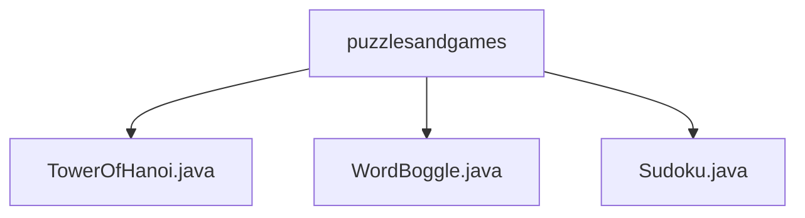

# 基础信息

|      |      |
|------|------|
| 名称 | puzzlesandgames |
| 编码语言 | .java |
| 代码路径 | Java/src/main/java/com/thealgorithms/puzzlesandgames |
| 包名 | Java.src.main.java.com.thealgorithms.puzzlesandgames |
| 概述说明 | 汉诺塔递归解法复杂度高，Boggle用Trie和DFS找词，数独回溯求解打印全。 |

# 说明

## 概述
该代码模块主要包含三个核心算法实现，分别用于解决汉诺塔问题、Boggle游戏和数独谜题。这些算法均采用了经典的递归或回溯策略，并结合高效的数据结构（如Trie）来优化性能。模块的设计旨在通过清晰的代码结构和高效的算法实现，解决各种经典的逻辑和数学问题。

## 主要业务场景
1. **汉诺塔问题**：通过递归方法解决汉诺塔问题，适用于理解递归思想和解决小规模实例。其时间复杂度为O(2^n)，空间复杂度为O(n)，适合用于教学或小规模问题求解。
2. **Boggle游戏**：利用Trie（前缀树）和深度优先搜索（DFS）算法在Boggle游戏棋盘上查找所有可能的单词。该实现通过高效的数据结构和算法，确保在游戏中快速准确地查找单词，适用于游戏开发或单词搜索类应用。
3. **数独谜题**：通过回溯算法解决数独谜题，具备安全检查、求解和打印功能。该实现能够快速找到并填充缺失的数字，同时确保每一步操作的合法性和谜题的完整性，适用于各种数独问题的自动化求解和展示。

### 包内部结构视图

该流程图展示了 `puzzlesandgames` 目录下的三个文件：`TowerOfHanoi.java`、`WordBoggle.java` 和 `Sudoku.java`。这些文件直接隶属于 `puzzlesandgames` 目录，没有更深层次的子目录结构。每个文件都代表一个独立的算法实现，分别对应汉诺塔、单词拼图和数独游戏。

# 文件列表 File List

| 名称   | 类型  | 说明 |
|-------|------|-------------|
| [WordBoggle.java](WordBoggle.md) | file | WordBoggle类用Trie和DFS实现Boggle游戏，TrieNode和Trie类支持单词存储与查找。 |
| [Sudoku.java](Sudoku.md) | file | 数独类具备安全检查、求解和打印功能，采用回溯算法解谜。 |
| [TowerOfHanoi.java](TowerOfHanoi.md) | file | 递归解决汉诺塔问题，时间O(2^n)，空间O(n)。 |

