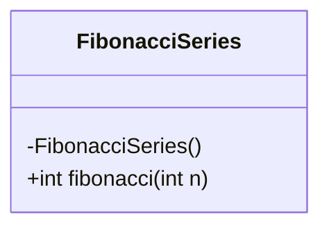
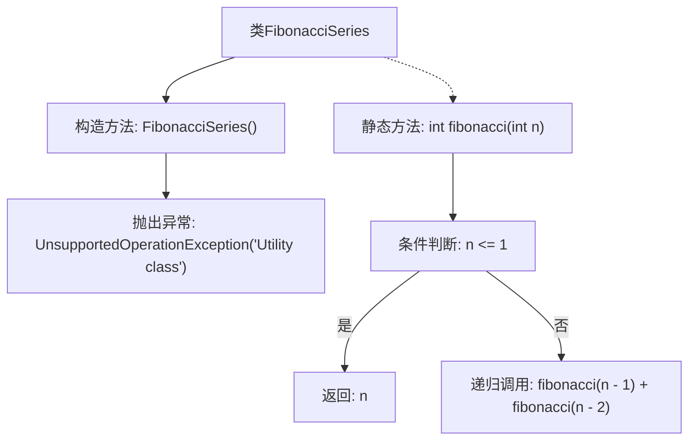

# 基础信息

|      |      |
|------|------|
| 名称 | FibonacciSeries |
| 编码语言 | .java |
| 代码路径 | Java/src/main/java/com/thealgorithms/recursion/FibonacciSeries.java |
| 包名 | com.thealgorithms.recursion |
| 依赖项 | [] |
| 概述说明 | 斐波那契工具类，禁止实例化，递归计算第n项。 |

# 说明

斐波那契数列工具类是一个禁止实例化的类，专门用于递归计算斐波那契数列的第n项。该类设计为静态工具类，不允许多次实例化，确保其功能专注于提供高效的递归计算能力，适用于需要快速获取斐波那契数列特定项的场景。

# 类列表 Class Summary

| 名称   | 类型  | 说明 |
|-------|------|-------------|
| FibonacciSeries | class | 斐波那契数列工具类，禁止实例化，递归计算第n项。 |

## 类 FibonacciSeries

|      |      |
|------|------|
| 访问范围 | public final |
| 类型 | class |
| 名称 | FibonacciSeries |
| 说明 | 斐波那契数列工具类，禁止实例化，递归计算第n项。 |

### UML类图

这段代码定义了一个名为 `FibonacciSeries` 的最终类，该类包含一个私有构造函数和一个公有静态方法 `fibonacci`。私有构造函数用于防止类被实例化，并在尝试实例化时抛出 `UnsupportedOperationException`。`fibonacci` 方法通过递归计算斐波那契数列的第 `n` 项，如果 `n` 小于或等于 1，则直接返回 `n`；否则，返回前两项的和。这个类是一个工具类，主要用于计算斐波那契数列的值。

### 内部方法调用关系图

这段代码定义了一个名为 `FibonacciSeries` 的实用工具类，该类包含一个私有构造方法，用于防止类被实例化，并在尝试实例化时抛出 `UnsupportedOperationException` 异常。类中定义了一个静态方法 `fibonacci`，该方法通过递归计算斐波那契数列的第 `n` 项。如果 `n` 小于或等于 1，则直接返回 `n`；否则，递归调用 `fibonacci(n - 1)` 和 `fibonacci(n - 2)` 并将结果相加返回。

### 字段列表 Field List

| 名称  | 类型  | 说明 |
|-------|-------|------|

### 方法列表 Method List

| 名称  | 类型  | 说明 |
|-------|-------|------|
| fibonacci | int | 计算斐波那契数列的递归函数。 |

