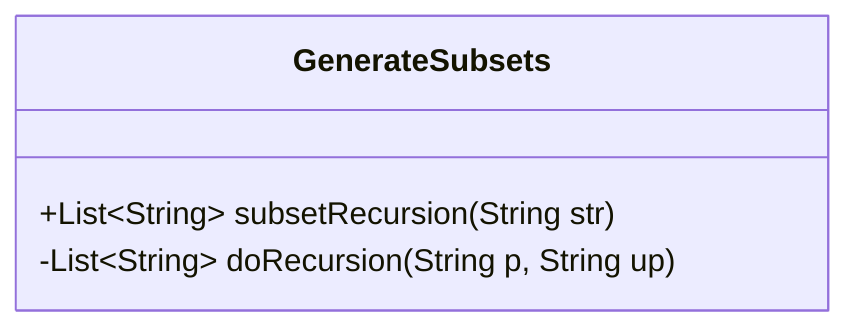
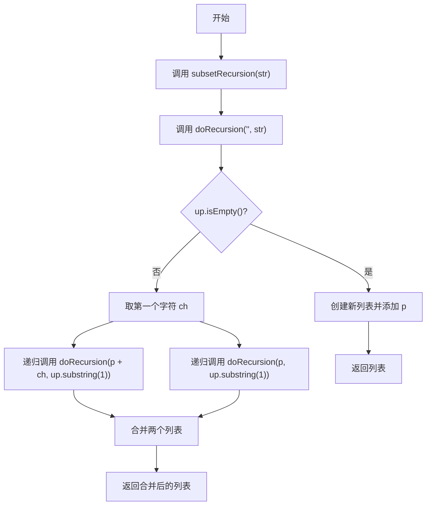
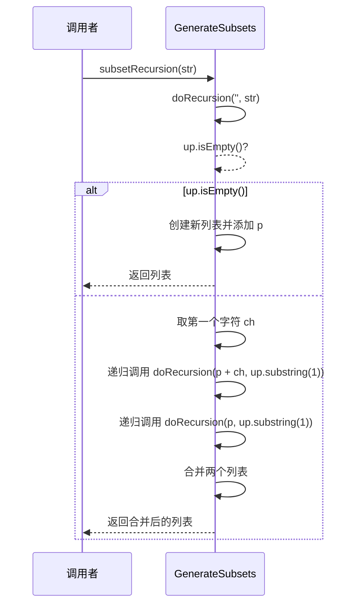
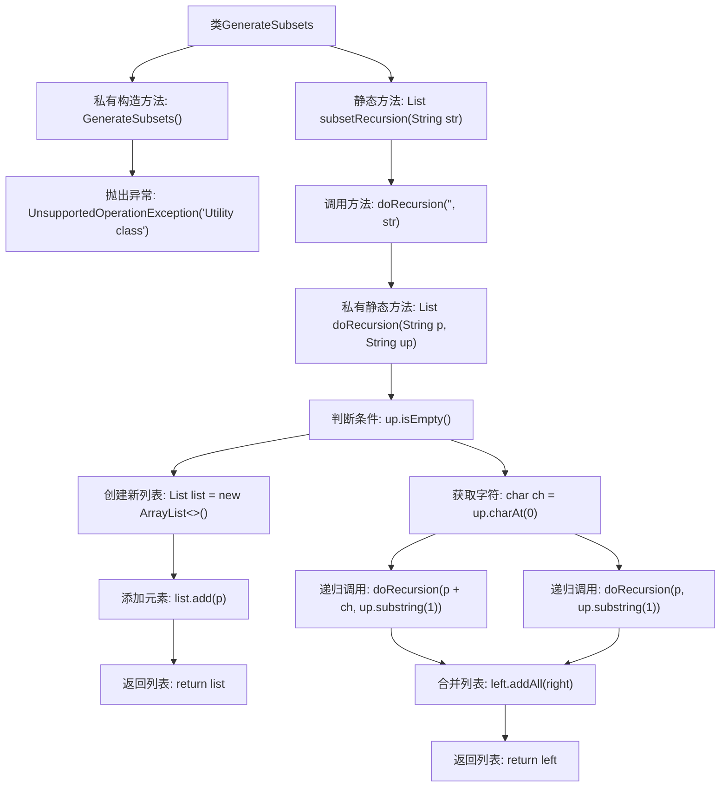

# 基础信息

|      |      |
|------|------|
| 名称 | GenerateSubsets |
| 编码语言 | .java |
| 代码路径 | Java/src/main/java/com/thealgorithms/recursion/GenerateSubsets.java |
| 包名 | com.thealgorithms.recursion |
| 依赖项 | ['java.util.ArrayList', 'java.util.List'] |
| 概述说明 | 工具类GenerateSubsets递归生成字符串所有子集。 |

# 说明

工具类GenerateSubsets采用递归方法，用于生成给定字符串的所有可能子集。该方法通过逐步构建子集，确保涵盖所有组合，从而实现全面覆盖。递归策略允许系统高效地处理不同长度的子集，确保每个字符都被纳入考虑，最终生成完整的子集列表。

# 类列表 Class Summary

| 名称   | 类型  | 说明 |
|-------|------|-------------|
| GenerateSubsets | class | 工具类GenerateSubsets通过递归生成字符串的所有子集。 |

## 类 GenerateSubsets

|      |      |
|------|------|
| 访问范围 | public final |
| 类型 | class |
| 名称 | GenerateSubsets |
| 说明 | 工具类GenerateSubsets通过递归生成字符串的所有子集。 |

### UML类图

这段代码定义了一个工具类 `GenerateSubsets`，用于生成字符串的所有子集。通过递归方法 `doRecursion`，代码将字符串的每个字符分为包含和不包含两种情况，最终合并所有可能的子集并返回。类图展示了类的结构，流程图和时序图分别展示了方法的执行流程和调用顺序。

### 内部方法调用关系图

这段代码定义了一个工具类 `GenerateSubsets`，用于生成字符串的所有子集。通过递归方法 `doRecursion`，代码在每一步选择是否将当前字符加入子集，最终将所有可能的子集合并并返回。流程图展示了从类定义到递归调用的完整流程，包括条件判断、列表操作和递归合并等关键步骤。

### 字段列表 Field List

| 名称  | 类型  | 说明 |
|-------|-------|------|

### 方法列表 Method List

| 名称  | 类型  | 说明 |
|-------|-------|------|
| subsetRecursion | List<String> | 递归生成字符串子集。 |
| doRecursion | List<String> | 递归方法处理字符串，生成包含和不包含首字符的所有组合列表。 |

