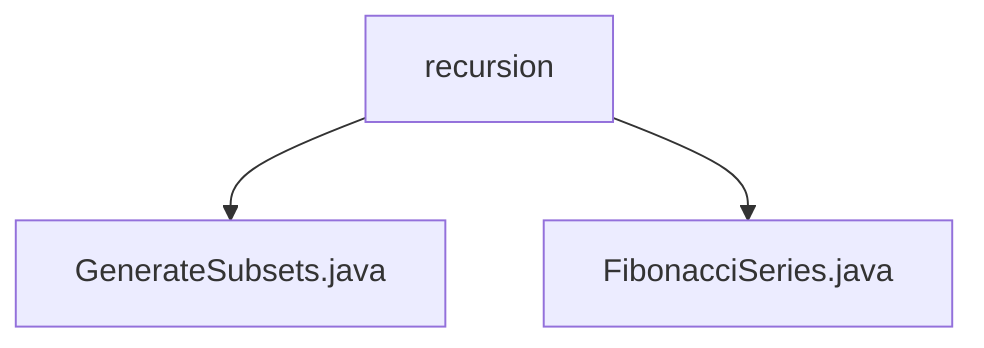

# 基础信息

|      |      |
|------|------|
| 名称 | recursion |
| 编码语言 | .java |
| 代码路径 | Java/src/main/java/com/thealgorithms/recursion |
| 包名 | Java.src.main.java.com.thealgorithms.recursion |
| 概述说明 | GenerateSubsets递归生成字符串子集，FibonacciSeries递归计算斐波那契数列第n项。 |

# 说明

## 概述
该代码模块主要包含两个工具类，分别用于生成给定字符串的所有可能子集和递归计算斐波那契数列的第n项。这两个工具类均采用递归方法来实现其核心功能，确保了代码的高效性和全面性。

## 主要业务场景
1. **生成字符串子集**：`GenerateSubsets`类通过递归方法生成给定字符串的所有可能子集。该功能适用于需要全面覆盖字符串所有组合的场景，例如在字符串匹配、组合分析或密码破解等应用中。
2. **计算斐波那契数列**：`FibonacciSeries`类是一个静态工具类，专门用于递归计算斐波那契数列的第n项。该功能适用于需要快速获取斐波那契数列特定项的场景，例如在数学计算、算法测试或金融分析等领域。

### 包内部结构视图

该流程图展示了递归算法目录下的两个文件：`GenerateSubsets.java` 和 `FibonacciSeries.java`。这两个文件都位于 `recursion` 目录下，分别用于生成子集和计算斐波那契数列。

# 文件列表 File List

| 名称   | 类型  | 说明 |
|-------|------|-------------|
| [FibonacciSeries.java](FibonacciSeries.md) | file | 斐波那契工具类，禁止实例化，递归计算第n项。 |
| [GenerateSubsets.java](GenerateSubsets.md) | file | 工具类GenerateSubsets递归生成字符串所有子集。 |

