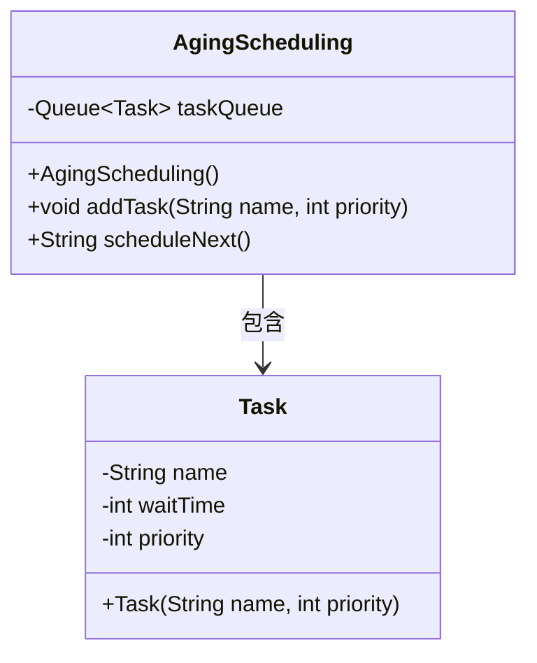
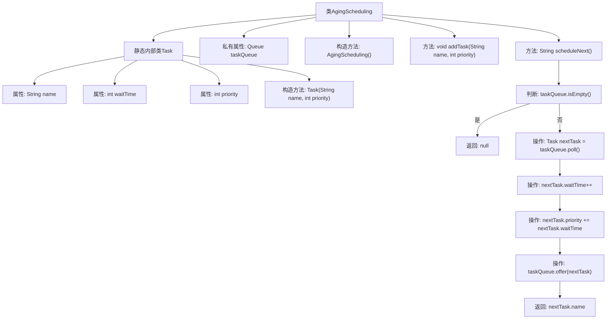

# 基础信息

|      |      |
|------|------|
| 名称 | AgingScheduling |
| 编码语言 | .java |
| 代码路径 | Java/src/main/java/com/thealgorithms/scheduling/AgingScheduling.java |
| 包名 | com.thealgorithms.scheduling |
| 依赖项 | ['java.util.LinkedList', 'java.util.Queue'] |
| 概述说明 | AgingScheduling类实现任务调度，任务优先级随等待时间增加。 |

# 说明

AgingScheduling类负责实现任务调度功能，其核心特点是任务的优先级会随着等待时间的增加而动态调整。这种机制确保长时间未被执行的任务能够逐渐获得更高的优先级，从而提高系统的公平性和响应效率。通过这种方式，AgingScheduling类有效避免了任务长时间被忽略的问题，优化了任务调度过程。

# 类列表 Class Summary

| 名称   | 类型  | 说明 |
|-------|------|-------------|
| AgingScheduling | class | AgingScheduling类实现任务调度，任务优先级随等待时间增加。 |

## 类 AgingScheduling

|      |      |
|------|------|
| 访问范围 | public final |
| 类型 | class |
| 名称 | AgingScheduling |
| 说明 | AgingScheduling类实现任务调度，任务优先级随等待时间增加。 |

### UML类图

这段代码定义了一个名为 `AgingScheduling` 的类，用于实现一个基于优先级和时间等待的任务调度器。`AgingScheduling` 类包含一个 `Task` 类的队列 `taskQueue`，用于存储待调度的任务。`Task` 类表示一个任务，包含任务名称、等待时间和优先级。`AgingScheduling` 类提供了两个主要方法：`addTask` 用于添加任务，`scheduleNext` 用于调度下一个任务，调度时会根据任务的等待时间动态调整其优先级。

### 内部方法调用关系图

这段代码实现了一个基于优先级和等待时间的任务调度器。`AgingScheduling`类包含一个静态内部类`Task`，用于表示任务及其属性。`addTask`方法用于将任务添加到队列中，`scheduleNext`方法根据任务的优先级和等待时间调度下一个任务。每次调度时，任务的等待时间增加，优先级也随之调整，任务重新加入队列。

### 字段列表 Field List

| 名称  | 类型  | 说明 |
|-------|-------|------|
| taskQueue | Queue<Task> | 私有任务队列存储任务实例。 |

### 方法列表 Method List

| 名称  | 类型  | 说明 |
|-------|-------|------|
| addTask | void | 方法addTask将任务名称和优先级加入任务队列。 |
| scheduleNext | String | 调度任务队列中的下一个任务，更新等待时间和优先级，返回任务名称。 |

