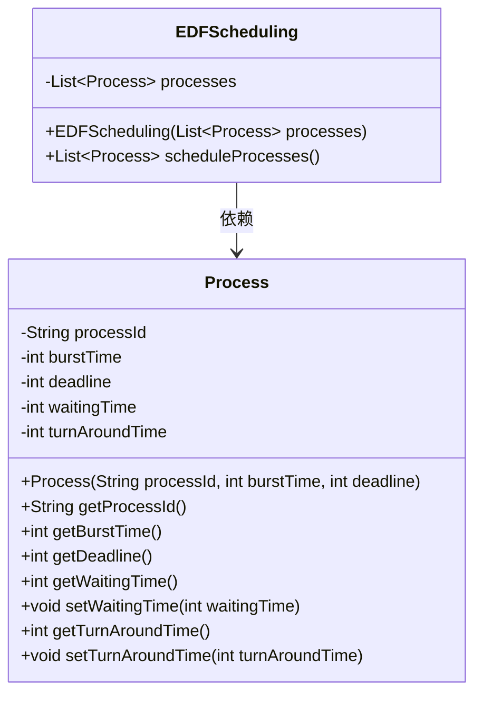

# 基础信息

|      |      |
|------|------|
| 名称 | EDFScheduling |
| 编码语言 | .java |
| 代码路径 | Java/src/main/java/com/thealgorithms/scheduling/EDFScheduling.java |
| 包名 | com.thealgorithms.scheduling |
| 依赖项 | ['java.util.ArrayList', 'java.util.Comparator', 'java.util.List'] |
| 概述说明 | EDFScheduling类实现最早截止期优先调度，模拟进程执行并计算时间。 |

# 说明

EDFScheduling类实现了最早截止期优先调度算法，通过排序和模拟进程执行过程，计算每个进程的等待时间和周转时间。该算法优先调度截止期最早的进程，确保任务按时完成，同时通过模拟执行过程，准确记录每个进程的等待时间和从提交到完成的周转时间，从而评估调度效果。

# 类列表 Class Summary

| 名称   | 类型  | 说明 |
|-------|------|-------------|
| EDFScheduling | class | EDFScheduling类实现最早截止期优先调度算法，排序并模拟进程执行，计算等待和周转时间。 |

## 类 EDFScheduling

|      |      |
|------|------|
| 访问范围 | public final |
| 类型 | class |
| 名称 | EDFScheduling |
| 说明 | EDFScheduling类实现最早截止期优先调度算法，排序并模拟进程执行，计算等待和周转时间。 |

### UML类图

**描述：**  
该代码定义了一个 `EDFScheduling` 类，用于实现最早截止时间优先（EDF）调度算法。`EDFScheduling` 类包含一个 `Process` 类的列表，`Process` 类表示一个进程，包含进程ID、执行时间、截止时间、等待时间和周转时间等属性。`EDFScheduling` 类的 `scheduleProcesses` 方法根据进程的截止时间进行排序，并模拟执行这些进程，计算每个进程的等待时间和周转时间。如果进程的执行时间超过了其截止时间，系统会发出警告。

### 内部方法调用关系图

```mermaid
graph TD
    A["类EDFScheduling"]
    B["属性: List<Process> processes"]
    C["构造方法: EDFScheduling(List<Process> processes)"]
    D["方法: List<Process> scheduleProcesses()"]
    E["类Process"]
    F["属性: String processId"]
    G["属性: int burstTime"]
    H["属性: int deadline"]
    I["属性: int waitingTime"]
    J["属性: int turnAroundTime"]
    K["构造方法: Process(String processId, int burstTime, int deadline)"]
    L["方法: String getProcessId()"]
    M["方法: int getBurstTime()"]
    N["方法: int getDeadline()"]
    O["方法: int getWaitingTime()"]
    P["方法: void setWaitingTime(int waitingTime)"]
    Q["方法: int getTurnAroundTime()"]
    R["方法: void setTurnAroundTime(int turnAroundTime)"]
    S["流程: processes.sort(Comparator.comparingInt(Process::getDeadline))"]
    T["流程: currentTime = 0"]
    U["流程: List<Process> executedProcesses = new ArrayList<>()"]
    V["流程: for (Process process : processes)"]
    W["流程: process.setWaitingTime(currentTime)"]
    X["流程: currentTime += process.getBurstTime()"]
    Y["流程: process.setTurnAroundTime(process.getWaitingTime() + process.getBurstTime())"]
    Z["流程: if (currentTime > process.getDeadline())"]
    AA["输出: System.out.println('Warning: Process ' + process.getProcessId() + ' missed its deadline.')"]
    AB["流程: executedProcesses.add(process)"]
    AC["返回: executedProcesses"]

    A --> B
    A --> C
    A --> D
    A -.-> E
    E --> F
    E --> G
    E --> H
    E --> I
    E --> J
    E --> K
    E --> L
    E --> M
    E --> N
    E --> O
    E --> P
    E --> Q
    E --> R
    D --> S
    D --> T
    D --> U
    D --> V
    V --> W
    V --> X
    V --> Y
    V --> Z
    Z --> AA
    V --> AB
    D --> AC
```

这段代码实现了一个最早截止时间优先（EDF）调度算法。`EDFScheduling`类包含一个`Process`类的列表，`scheduleProcesses`方法通过排序进程的截止时间并模拟执行来计算每个进程的等待时间和周转时间。如果进程的执行时间超过了其截止时间，系统会输出警告信息。流程图展示了类的结构和方法调用关系，以及调度算法的执行流程。

### 字段列表 Field List

| 名称  | 类型  | 说明 |
|-------|-------|------|
| processes | List<Process> | 私有列表，存储Process对象。 |

### 方法列表 Method List

| 名称  | 类型  | 说明 |
|-------|-------|------|
| scheduleProcesses | List<Process> | 按截止时间排序并调度进程，计算等待时间和周转时间，检查是否超时。 |

