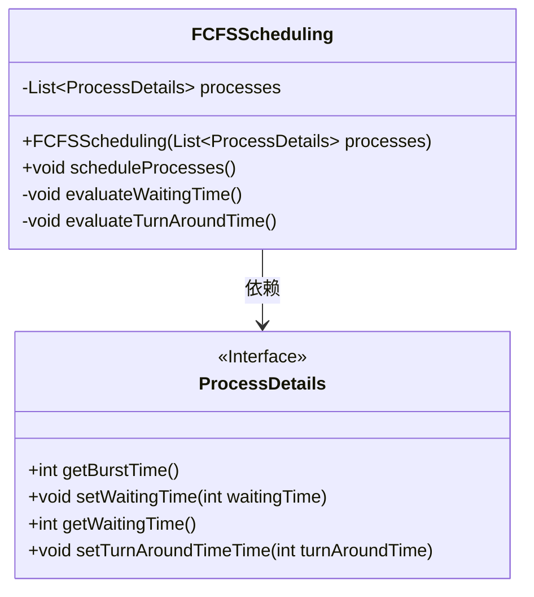
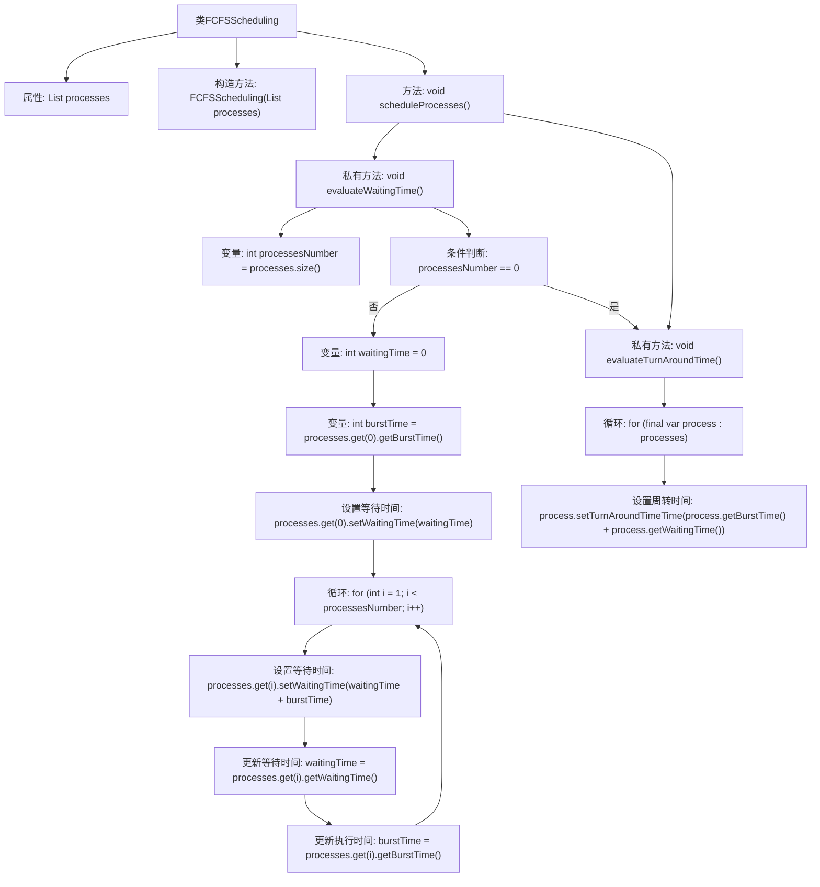

# 基础信息

|      |      |
|------|------|
| 名称 | FCFSScheduling |
| 编码语言 | .java |
| 代码路径 | Java/src/main/java/com/thealgorithms/scheduling/FCFSScheduling.java |
| 包名 | com.thealgorithms.scheduling |
| 依赖项 | ['com.thealgorithms.devutils.entities.ProcessDetails', 'java.util.List'] |
| 概述说明 | FCFS调度算法计算进程等待和周转时间。 |

# 说明

FCFS调度算法是一种先来先服务的进程调度方法。它按照进程到达的顺序依次执行，不进行优先级调整。计算进程等待时间时，每个进程的等待时间等于前一个进程的完成时间减去当前进程的到达时间。周转时间则是进程的完成时间减去其到达时间。该算法简单易实现，但可能导致短进程等待时间过长，影响系统整体效率。

# 类列表 Class Summary

| 名称   | 类型  | 说明 |
|-------|------|-------------|
| FCFSScheduling | class | FCFS调度算法计算进程等待时间和周转时间。 |

## 类 FCFSScheduling

|      |      |
|------|------|
| 访问范围 | public |
| 类型 | class |
| 名称 | FCFSScheduling |
| 说明 | FCFS调度算法计算进程等待时间和周转时间。 |

### UML类图

这段代码实现了一个先来先服务（FCFS）调度算法。`FCFSScheduling`类包含一个`processes`列表，用于存储进程信息。`scheduleProcesses`方法调用了`evaluateWaitingTime`和`evaluateTurnAroundTime`两个私有方法，分别计算每个进程的等待时间和周转时间。`ProcessDetails`接口定义了获取和设置进程相关时间的方法。通过这种设计，代码能够有效地模拟FCFS调度算法的执行过程。

### 内部方法调用关系图

这段代码实现了一个先来先服务（FCFS）调度算法。`FCFSScheduling`类包含一个`processes`列表，用于存储进程的详细信息。`scheduleProcesses`方法调用`evaluateWaitingTime`和`evaluateTurnAroundTime`两个私有方法来计算每个进程的等待时间和周转时间。`evaluateWaitingTime`方法通过遍历进程列表，依次计算并设置每个进程的等待时间。`evaluateTurnAroundTime`方法则根据进程的执行时间和等待时间计算并设置周转时间。整个流程通过循环和条件判断实现了FCFS调度算法的核心逻辑。

### 字段列表 Field List

| 名称  | 类型  | 说明 |
|-------|-------|------|
| processes | List<ProcessDetails> | 私有成员变量，存储进程详情列表。 |

### 方法列表 Method List

| 名称  | 类型  | 说明 |
|-------|-------|------|
| scheduleProcesses | void | 该方法用于调度进程，评估等待时间和周转时间。 |
| evaluateWaitingTime | void | 计算进程等待时间，首个进程为0，后续进程累加前序进程的突发时间。 |
| evaluateTurnAroundTime | void | 计算每个进程的周转时间，为执行时间与等待时间之和。 |

