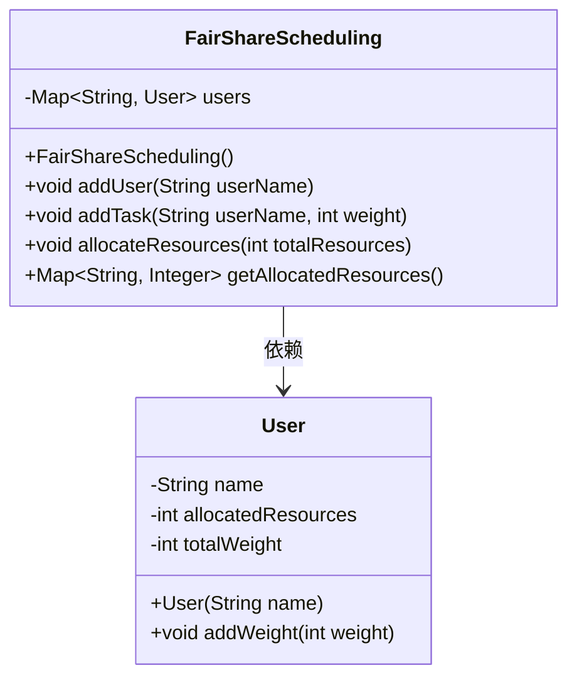
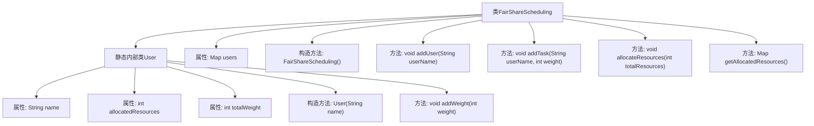

# 基础信息

|      |      |
|------|------|
| 名称 | FairShareScheduling |
| 编码语言 | .java |
| 代码路径 | Java/src/main/java/com/thealgorithms/scheduling/FairShareScheduling.java |
| 包名 | com.thealgorithms.scheduling |
| 依赖项 | ['java.util.HashMap', 'java.util.Map'] |
| 概述说明 | 公平调度类实现用户资源分配，支持添加用户、任务及按权重分配资源。 |

# 说明

公平调度类旨在实现用户资源的合理分配，支持通过添加用户和任务来管理资源分配过程。该调度机制根据用户的权重进行资源分配，确保资源按照预定的权重比例公平地分配给各个用户。通过这种方式，系统能够有效管理和优化资源使用，提升整体调度效率。

# 类列表 Class Summary

| 名称   | 类型  | 说明 |
|-------|------|-------------|
| FairShareScheduling | class | 公平调度类实现用户资源分配，支持添加用户、任务及按权重分配资源。 |

## 类 FairShareScheduling

|      |      |
|------|------|
| 访问范围 | public final |
| 类型 | class |
| 名称 | FairShareScheduling |
| 说明 | 公平调度类实现用户资源分配，支持添加用户、任务及按权重分配资源。 |

### UML类图

这段代码定义了一个`FairShareScheduling`类，用于实现公平资源调度。`FairShareScheduling`类内部包含一个`User`类，用于表示用户及其资源分配情况。`FairShareScheduling`类通过`users`映射来管理用户，提供了添加用户、添加任务、分配资源和获取已分配资源的方法。`User`类记录了用户的名称、已分配资源和总权重，并提供了增加权重的方法。整体设计简洁，适用于基于权重的资源分配场景。

### 内部方法调用关系图

**描述：**  
这段代码实现了一个公平共享调度系统，主要包含一个外部类`FairShareScheduling`和一个静态内部类`User`。`User`类用于存储用户信息，包括名称、已分配资源和总权重。`FairShareScheduling`类通过`addUser`方法添加用户，`addTask`方法为用户添加任务权重，`allocateResources`方法根据总权重分配资源，`getAllocatedResources`方法返回每个用户的资源分配情况。代码通过权重比例公平地分配资源，确保每个用户获得与其权重成比例的资源。

### 字段列表 Field List

| 名称  | 类型  | 说明 |
|-------|-------|------|
| users | Map<String, User> | 定义了一个私有不可变的用户映射变量。 |

### 方法列表 Method List

| 名称  | 类型  | 说明 |
|-------|-------|------|
| allocateResources | void | 根据用户权重分配总资源给所有用户。 |
| addTask | void | 该方法为指定用户添加任务权重，若用户存在则更新其权重。 |
| addUser | void | 方法`addUser`用于添加用户，若用户名不存在则创建新用户。 |
| getAllocatedResources | Map<String, Integer> | 该方法返回用户与分配资源的映射。 |

