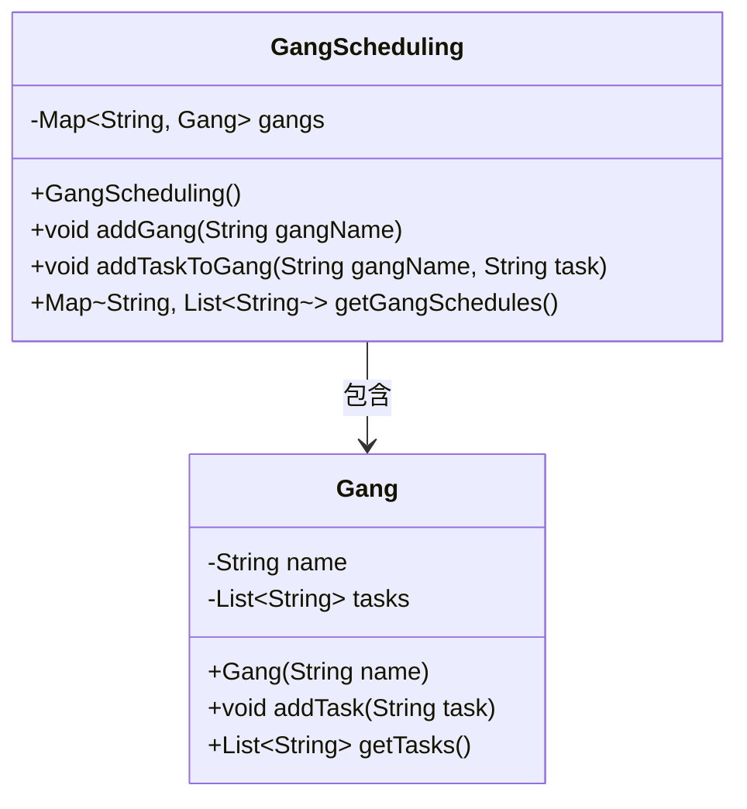
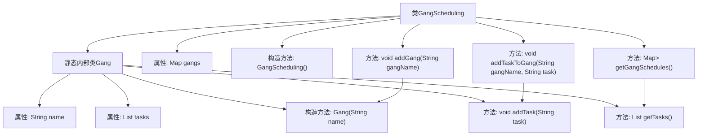

# 基础信息

|      |      |
|------|------|
| 名称 | GangScheduling |
| 编码语言 | .java |
| 代码路径 | Java/src/main/java/com/thealgorithms/scheduling/GangScheduling.java |
| 包名 | com.thealgorithms.scheduling |
| 依赖项 | ['java.util.ArrayList', 'java.util.HashMap', 'java.util.List', 'java.util.Map'] |
| 概述说明 | GangScheduling类管理任务组及任务，支持添加组、任务和获取计划。 |

# 说明

GangScheduling类负责管理任务组及其相关任务，提供添加组、添加任务以及获取任务计划的功能。通过该类，用户可以高效地组织和调度任务组，确保任务按照计划执行。

# 类列表 Class Summary

| 名称   | 类型  | 说明 |
|-------|------|-------------|
| GangScheduling | class | GangScheduling类管理任务组及其任务，支持添加组、任务和获取任务计划。 |

## 类 GangScheduling

|      |      |
|------|------|
| 访问范围 | public final |
| 类型 | class |
| 名称 | GangScheduling |
| 说明 | GangScheduling类管理任务组及其任务，支持添加组、任务和获取任务计划。 |

### UML类图

### 描述
该代码实现了一个名为 `GangScheduling` 的类，用于管理多个 `Gang` 的任务调度。`Gang` 类包含任务列表，并提供添加任务和获取任务的方法。`GangScheduling` 类通过 `Map` 存储多个 `Gang`，并提供添加 `Gang`、添加任务到 `Gang` 以及获取所有 `Gang` 任务调度的方法。类之间的关系是 `GangScheduling` 包含多个 `Gang`。

### 内部方法调用关系图

这段代码定义了一个名为 `GangScheduling` 的类，用于管理多个 `Gang` 对象及其任务。`Gang` 是一个静态内部类，包含任务列表和添加任务的方法。`GangScheduling` 类通过 `Map` 存储 `Gang` 对象，并提供添加 `Gang`、添加任务到 `Gang` 以及获取所有 `Gang` 任务调度的方法。流程图展示了类与内部类之间的关系以及方法的调用顺序。

### 字段列表 Field List

| 名称  | 类型  | 说明 |
|-------|-------|------|
| gangs | Map<String, Gang> | 存储帮派信息的私有映射变量。 |

### 方法列表 Method List

| 名称  | 类型  | 说明 |
|-------|-------|------|
| addTaskToGang | void | 方法向指定帮派添加任务，若帮派存在则执行添加操作。 |
| addGang | void | 方法`addGang`用于添加帮派，若帮派名不存在则创建新帮派。 |
| getGangSchedules | Map<String, List<String>> | 获取帮派任务计划表的方法。 |

