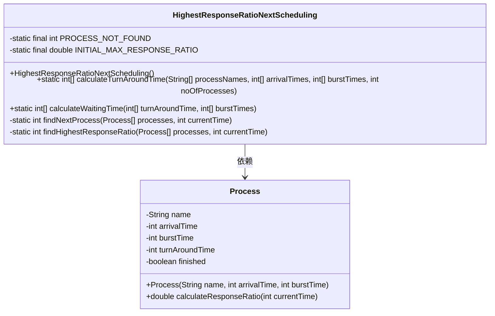
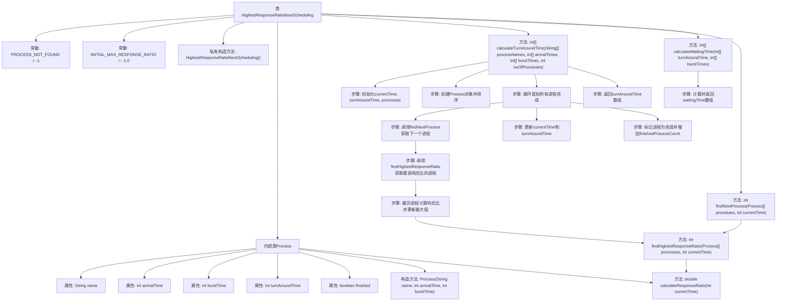

# 基础信息

|      |      |
|------|------|
| 名称 | HighestResponseRatioNextScheduling |
| 编码语言 | .java |
| 代码路径 | Java/src/main/java/com/thealgorithms/scheduling/HighestResponseRatioNextScheduling.java |
| 包名 | com.thealgorithms.scheduling |
| 依赖项 | ['java.util.Arrays', 'java.util.Comparator'] |
| 概述说明 | 实现最高响应比优先调度算法，计算进程周转时间和等待时间。 |

# 说明

实现最高响应比优先调度算法，该算法通过计算每个进程的响应比来决定调度顺序，响应比越高，优先级越高。调度过程中，需要计算每个进程的周转时间和等待时间。周转时间是指从进程提交到完成的总时间，等待时间是指进程在就绪队列中等待CPU的时间。通过这种调度方式，可以有效提高系统的响应速度和资源利用率。

# 类列表 Class Summary

| 名称   | 类型  | 说明 |
|-------|------|-------------|
| HighestResponseRatioNextScheduling | class | 实现最高响应比优先调度算法，计算进程周转时间和等待时间。 |

## 类 HighestResponseRatioNextScheduling

|      |      |
|------|------|
| 访问范围 | public final |
| 类型 | class |
| 名称 | HighestResponseRatioNextScheduling |
| 说明 | 实现最高响应比优先调度算法，计算进程周转时间和等待时间。 |

### UML类图

这段代码实现了一个基于最高响应比优先（HRRN）的调度算法。`HighestResponseRatioNextScheduling`类包含静态方法用于计算进程的周转时间和等待时间。`Process`类表示调度算法中的进程，包含计算响应比的方法。`calculateTurnAroundTime`方法根据进程的到达时间和执行时间计算周转时间，而`calculateWaitingTime`方法则根据周转时间和执行时间计算等待时间。`findNextProcess`和`findHighestResponseRatio`方法用于确定下一个要调度的进程。

### 内部方法调用关系图

这段代码实现了一个基于最高响应比优先（HRRN）的调度算法。代码首先定义了`Process`类来表示进程，并提供了计算响应比的方法。`calculateTurnAroundTime`方法计算每个进程的周转时间，而`calculateWaitingTime`方法则根据周转时间和突发时间计算等待时间。`findNextProcess`和`findHighestResponseRatio`方法用于找到下一个要调度的进程，确保选择响应比最高的进程。整个过程通过循环和条件判断确保所有进程都被调度并完成。

### 字段列表 Field List

| 名称  | 类型  | 说明 |
|-------|-------|------|
| PROCESS_NOT_FOUND = -1 | int | 定义私有静态常量，表示进程未找到，值为-1。 |
| INITIAL_MAX_RESPONSE_RATIO = -1.0 | double | 私有静态常量INITIAL_MAX_RESPONSE_RATIO初始值为-1.0。 |

### 方法列表 Method List

| 名称  | 类型  | 说明 |
|-------|-------|------|
| calculateWaitingTime | int[] | 计算等待时间：周转时间减执行时间。 |
| findNextProcess | int | 查找当前时间下响应比最高的进程。 |
| calculateTurnAroundTime | int[] | 计算进程周转时间，按到达时间排序并模拟执行。 |
| findHighestResponseRatio | int | 该方法在当前时间找到响应比最高的未完成进程并返回其索引。 |

