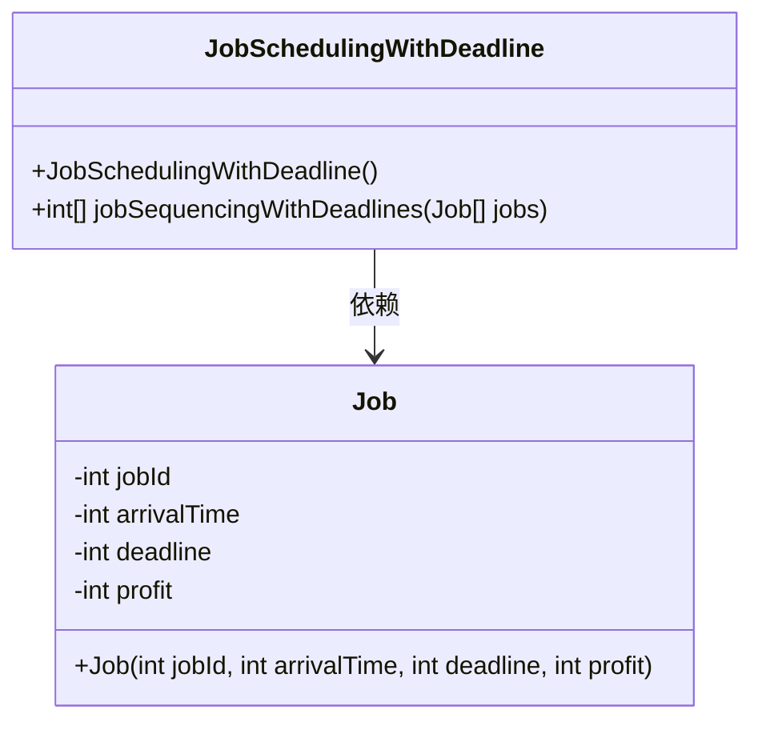
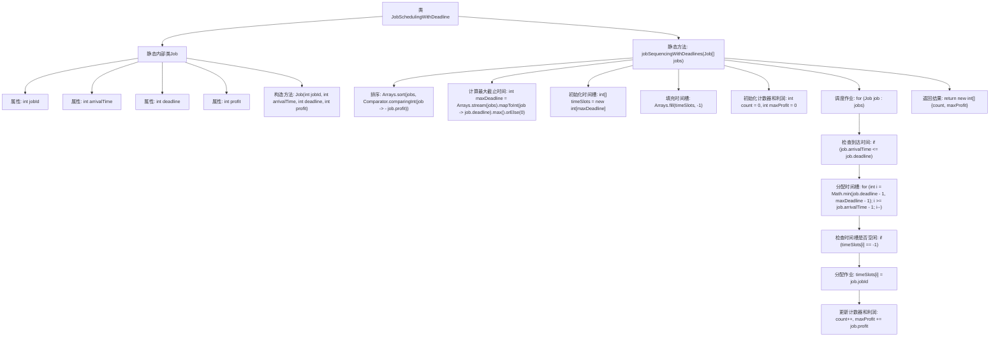

# 基础信息

|      |      |
|------|------|
| 名称 | JobSchedulingWithDeadline |
| 编码语言 | .java |
| 代码路径 | Java/src/main/java/com/thealgorithms/scheduling/JobSchedulingWithDeadline.java |
| 包名 | com.thealgorithms.scheduling |
| 依赖项 | ['java.util.Arrays', 'java.util.Comparator'] |
| 概述说明 | JobSchedulingWithDeadline类按利润最大化调度任务，考虑到达和截止时间。 |

# 说明

类JobSchedulingWithDeadline包含一个内部类Job和一个方法jobSequencingWithDeadlines。该类的目的是通过调度任务来实现利润最大化，同时考虑每个任务的到达时间和截止时间。Job类用于定义任务的基本属性，而jobSequencingWithDeadlines方法则负责根据这些属性对任务进行排序和调度，以确保在截止时间前完成并最大化总利润。

# 类列表 Class Summary

| 名称   | 类型  | 说明 |
|-------|------|-------------|
| JobSchedulingWithDeadline | class | 类JobSchedulingWithDeadline包含Job类和方法jobSequencingWithDeadlines，用于按利润最大化调度任务，考虑到达时间和截止时间。 |

## 类 JobSchedulingWithDeadline

|      |      |
|------|------|
| 访问范围 | public final |
| 类型 | class |
| 名称 | JobSchedulingWithDeadline |
| 说明 | 类JobSchedulingWithDeadline包含Job类和方法jobSequencingWithDeadlines，用于按利润最大化调度任务，考虑到达时间和截止时间。 |

### UML类图

### 描述
`JobSchedulingWithDeadline` 是一个用于调度作业以最大化利润的类，考虑了作业的到达时间和截止时间。它包含一个内部类 `Job`，用于表示作业的ID、到达时间、截止时间和利润。`jobSequencingWithDeadlines` 方法通过按利润降序排序作业，并尝试在截止时间之前分配时间槽来调度作业，最终返回成功调度的作业数量和总利润。

### 内部方法调用关系图

这段代码实现了一个作业调度算法，目的是在满足作业的到达时间和截止时间的前提下，最大化利润。代码首先对作业按利润降序排序，然后根据作业的截止时间和到达时间，将作业分配到时间槽中。最终返回成功调度的作业数量和总利润。

### 字段列表 Field List

| 名称  | 类型  | 说明 |
|-------|-------|------|

### 方法列表 Method List

| 名称  | 类型  | 说明 |
|-------|-------|------|
| jobSequencingWithDeadlines | int[] | 按利润排序任务，安排任务以最大化收益。 |

