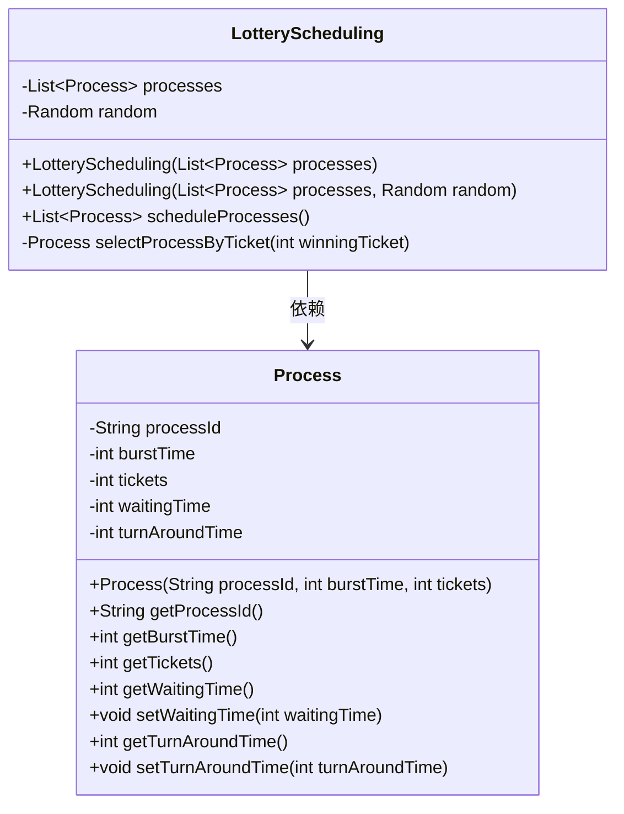

# 基础信息

|      |      |
|------|------|
| 名称 | LotteryScheduling |
| 编码语言 | .java |
| 代码路径 | Java/src/main/java/com/thealgorithms/scheduling/LotteryScheduling.java |
| 包名 | com.thealgorithms.scheduling |
| 依赖项 | ['java.util.ArrayList', 'java.util.List', 'java.util.Random'] |
| 概述说明 | 彩票调度算法随机选进程，计算等待与周转时间。 |

# 说明

彩票调度算法是一种进程调度方法，通过随机选择进程来执行，以确保公平性和避免优先级反转。该算法会为每个进程分配一定数量的彩票，调度时随机抽取一张彩票，拥有该彩票的进程获得执行机会。通过这种方式，每个进程都有机会被选中执行，从而减少等待时间和周转时间。该算法适用于需要公平分配CPU时间的场景，能够有效提高系统的响应速度和资源利用率。

# 类列表 Class Summary

| 名称   | 类型  | 说明 |
|-------|------|-------------|
| LotteryScheduling | class | 彩票调度算法实现，随机选择进程执行，计算等待和周转时间。 |

## 类 LotteryScheduling

|      |      |
|------|------|
| 访问范围 | public final |
| 类型 | class |
| 名称 | LotteryScheduling |
| 说明 | 彩票调度算法实现，随机选择进程执行，计算等待和周转时间。 |

### UML类图

这段代码实现了一个基于彩票调度算法的进程调度器。`LotteryScheduling`类负责管理进程列表并使用随机数生成器来选择执行进程。`Process`类表示每个进程，包含进程ID、执行时间、彩票数量、等待时间和周转时间等属性。`LotteryScheduling`类通过`scheduleProcesses`方法模拟进程调度，计算每个进程的等待时间和周转时间，并返回执行完成的进程列表。`selectProcessByTicket`方法根据彩票数量选择要执行的进程。

### 内部方法调用关系图

```mermaid
graph TD
    A["类LotteryScheduling"]
    B["属性: List<Process> processes"]
    C["属性: Random random"]
    D["构造方法: LotteryScheduling(List<Process> processes)"]
    E["构造方法: LotteryScheduling(List<Process> processes, Random random)"]
    F["方法: List<Process> scheduleProcesses()"]
    G["方法: Process selectProcessByTicket(int winningTicket)"]
    H["类Process"]
    I["属性: String processId"]
    J["属性: int burstTime"]
    K["属性: int tickets"]
    L["属性: int waitingTime"]
    M["属性: int turnAroundTime"]
    N["构造方法: Process(String processId, int burstTime, int tickets)"]
    O["方法: String getProcessId()"]
    P["方法: int getBurstTime()"]
    Q["方法: int getTickets()"]
    R["方法: int getWaitingTime()"]
    S["方法: void setWaitingTime(int waitingTime)"]
    T["方法: int getTurnAroundTime()"]
    U["方法: void setTurnAroundTime(int turnAroundTime)"]

    A --> B
    A --> C
    A --> D
    A --> E
    A --> F
    A --> G
    A -.-> H
    H --> I
    H --> J
    H --> K
    H --> L
    H --> M
    H --> N
    H --> O
    H --> P
    H --> Q
    H --> R
    H --> S
    H --> T
    H --> U
```

该流程图展示了 `LotteryScheduling` 类及其内部 `Process` 类的结构。`LotteryScheduling` 类包含两个构造方法和两个主要方法：`scheduleProcesses()` 用于调度进程，`selectProcessByTicket()` 用于根据随机选择的票数选择进程。`Process` 类表示调度系统中的进程，包含进程ID、执行时间、票数、等待时间和周转时间等属性，以及相应的构造方法和访问器方法。

### 字段列表 Field List

| 名称  | 类型  | 说明 |
|-------|-------|------|
| processes | List<Process> | 私有进程列表变量定义。 |
| random | Random | 声明了一个私有的Random类型变量random。 |

### 方法列表 Method List

| 名称  | 类型  | 说明 |
|-------|-------|------|
| scheduleProcesses | List<Process> | 方法通过彩票调度算法选择和执行进程，计算等待和周转时间。 |
| selectProcessByTicket | Process | 根据票数选择进程，累加票数直到超过中奖票数，返回对应进程。 |

