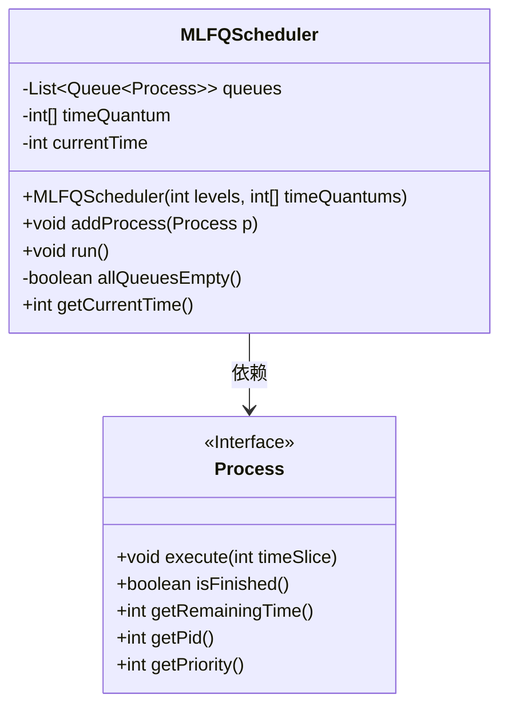
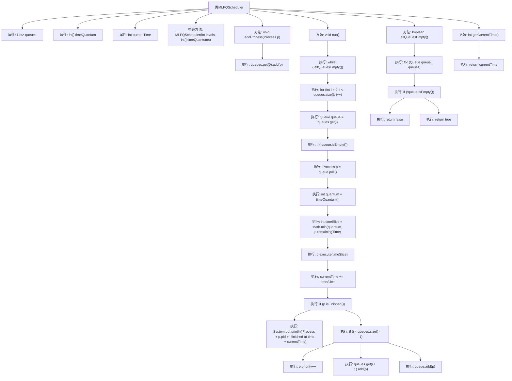
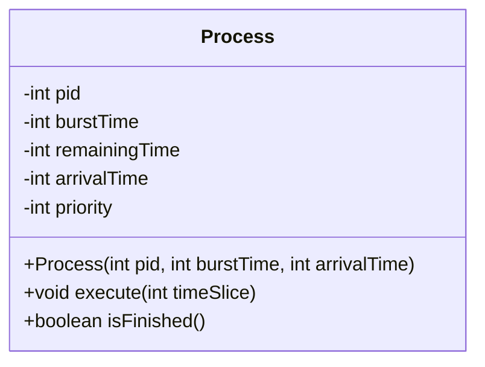
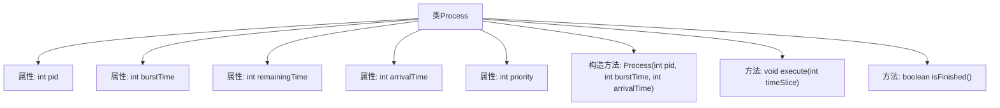

# 基础信息

|      |      |
|------|------|
| 名称 | MLFQScheduler |
| 编码语言 | .java |
| 代码路径 | Java/src/main/java/com/thealgorithms/scheduling/MLFQScheduler.java |
| 包名 | com.thealgorithms.scheduling |
| 依赖项 | ['java.util.ArrayList', 'java.util.LinkedList', 'java.util.List', 'java.util.Queue'] |
| 概述说明 | MLFQScheduler实现多级反馈队列调度，支持进程优先级和时间片调整。Process类包含进程信息和执行功能。 |

# 说明

MLFQScheduler实现了多级反馈队列调度机制，支持动态调整进程优先级和分配时间片。Process类封装了进程的基本属性，包括进程ID、执行时间、剩余时间、到达时间和优先级，并提供了执行和完成检查的功能，确保调度过程的准确性和高效性。

# 类列表 Class Summary

| 名称   | 类型  | 说明 |
|-------|------|-------------|
| MLFQScheduler | class | MLFQScheduler实现多级反馈队列调度，支持进程优先级调整和时间片分配。 |
| Process | class | Process类包含进程ID、执行时间、剩余时间、到达时间和优先级，提供执行和完成检查功能。 |

## 类 MLFQScheduler

|      |      |
|------|------|
| 访问范围 | public |
| 类型 | class |
| 名称 | MLFQScheduler |
| 说明 | MLFQScheduler实现多级反馈队列调度，支持进程优先级调整和时间片分配。 |

### UML类图

**描述：**  
`MLFQScheduler` 类实现了一个多级反馈队列调度器，用于管理多个优先级的进程队列。它通过 `addProcess` 方法将新进程添加到最高优先级队列，并通过 `run` 方法执行调度逻辑，根据进程的执行情况将其在不同队列之间进行升级或降级。`Process` 接口定义了进程的基本操作，如执行、检查是否完成等。调度器通过 `allQueuesEmpty` 方法检查所有队列是否为空，并通过 `getCurrentTime` 方法获取当前系统时间。

### 内部方法调用关系图

这段代码实现了一个多级反馈队列调度器（MLFQScheduler），用于管理多个优先级的进程队列。调度器通过时间片轮转的方式执行进程，并根据进程的执行情况动态调整其优先级。代码包含构造方法、添加进程、运行调度器、检查队列是否为空以及获取当前时间等功能。流程图展示了这些功能的调用关系和执行顺序，清晰地描述了调度器的工作流程。

### 字段列表 Field List

| 名称  | 类型  | 说明 |
|-------|-------|------|
| queues | List<Queue<Process>> | 定义了一个包含多个进程队列的私有列表。 |
| currentTime | int | 定义了一个私有整型变量currentTime。 |
| timeQuantum | int[] | 私有整型数组用于存储时间片。 |

### 方法列表 Method List

| 名称  | 类型  | 说明 |
|-------|-------|------|
| getCurrentTime | int | 获取当前时间的整型值。 |
| addProcess | void | 该方法将进程添加到队列的第一个位置。 |
| allQueuesEmpty | boolean | 检查所有队列是否为空，若全空则返回真，否则返回假。 |
| run | void | 多级队列调度算法执行进程，按时间片运行并调整优先级。 |

## 类 Process

|      |      |
|------|------|
| 访问范围 | None |
| 类型 | class |
| 名称 | Process |
| 说明 | Process类包含进程ID、执行时间、剩余时间、到达时间和优先级，提供执行和完成检查功能。 |

### UML类图

这段代码定义了一个 `Process` 类，用于模拟操作系统中的进程。该类包含进程的ID、CPU执行时间、剩余执行时间、到达时间和优先级等属性。构造函数用于初始化进程，`execute` 方法用于模拟进程的执行，`isFinished` 方法用于检查进程是否已完成执行。通过这种方式，可以模拟进程在操作系统中的调度和执行过程。

### 内部方法调用关系图

这段代码定义了一个名为 `Process` 的类，用于表示一个进程。类中包含五个属性：`pid`（进程ID）、`burstTime`（CPU执行时间）、`remainingTime`（剩余执行时间）、`arrivalTime`（到达时间）和 `priority`（优先级）。类提供了一个构造方法用于初始化进程，以及两个方法：`execute` 用于执行进程并更新剩余时间，`isFinished` 用于检查进程是否已完成执行。流程图展示了类的结构及其内部方法的关系。

### 字段列表 Field List

| 名称  | 类型  | 说明 |
|-------|-------|------|
| burstTime | int | 定义整型变量burstTime。 |
| remainingTime | int | 定义整型变量remainingTime。 |
| pid | int | 定义了一个整型变量pid。 |
| arrivalTime | int | 定义一个整型变量arrivalTime，用于存储到达时间。 |
| priority | int | 定义了一个整型变量priority。 |

### 方法列表 Method List

| 名称  | 类型  | 说明 |
|-------|-------|------|
| execute | void | 方法执行时间切片，更新剩余时间，确保不小于零。 |
| isFinished | boolean | 方法检查剩余时间是否为零，返回布尔值。 |

