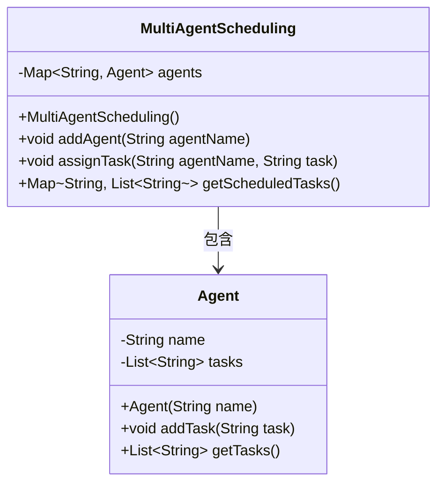
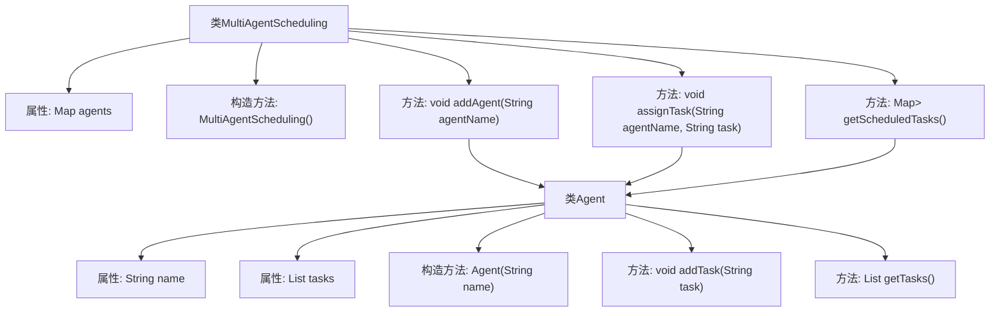

# 基础信息

|      |      |
|------|------|
| 名称 | MultiAgentScheduling |
| 编码语言 | .java |
| 代码路径 | Java/src/main/java/com/thealgorithms/scheduling/MultiAgentScheduling.java |
| 包名 | com.thealgorithms.scheduling |
| 依赖项 | ['java.util.ArrayList', 'java.util.HashMap', 'java.util.List', 'java.util.Map'] |
| 概述说明 | 多代理调度类支持代理添加、任务分配及计划获取。 |

# 说明

多代理调度类是一个用于管理和协调多个代理的模块，支持添加新的代理、为代理分配具体任务以及获取任务执行计划。该类的核心功能包括代理的动态管理、任务分配逻辑的优化以及任务计划的生成与查询。通过该调度类，用户可以高效地组织和监控多个代理的工作流程，确保任务按时完成并优化资源利用。

# 类列表 Class Summary

| 名称   | 类型  | 说明 |
|-------|------|-------------|
| MultiAgentScheduling | class | 多代理调度类，支持添加代理、分配任务及获取任务计划。 |

## 类 MultiAgentScheduling

|      |      |
|------|------|
| 访问范围 | public |
| 类型 | class |
| 名称 | MultiAgentScheduling |
| 说明 | 多代理调度类，支持添加代理、分配任务及获取任务计划。 |

### UML类图

这段代码定义了一个多代理调度系统 `MultiAgentScheduling`，其中包含一个内部类 `Agent`。`MultiAgentScheduling` 类负责管理多个代理，并允许为每个代理分配任务。`Agent` 类表示单个代理，包含代理的名称和任务列表。`MultiAgentScheduling` 通过 `addAgent` 方法添加代理，通过 `assignTask` 方法为指定代理分配任务，并通过 `getScheduledTasks` 方法获取所有代理的任务调度情况。类图展示了 `MultiAgentScheduling` 与 `Agent` 之间的包含关系，`MultiAgentScheduling` 类中包含一个 `Map` 用于存储代理及其任务。

### 内部方法调用关系图

这段代码定义了一个多代理调度系统，其中包含一个`MultiAgentScheduling`类和一个嵌套的`Agent`类。`MultiAgentScheduling`类负责管理多个代理（`Agent`），每个代理可以分配任务并获取任务列表。`Agent`类表示单个代理，包含代理的名称和任务列表。代码通过`addAgent`方法添加代理，通过`assignTask`方法为代理分配任务，并通过`getScheduledTasks`方法获取所有代理的任务调度情况。流程图展示了类之间的关系和方法调用流程。

### 字段列表 Field List

| 名称  | 类型  | 说明 |
|-------|-------|------|
| agents | Map<String, Agent> | 私有不可变Map存储字符串与Agent对象映射。 |

### 方法列表 Method List

| 名称  | 类型  | 说明 |
|-------|-------|------|
| getScheduledTasks | Map<String, List<String>> | 获取所有代理的计划任务，返回任务名称与任务列表的映射。 |
| assignTask | void | 该方法为指定代理分配任务，若代理存在则添加任务。 |
| addAgent | void | 该方法用于添加代理，若代理名不存在则创建新代理。 |

