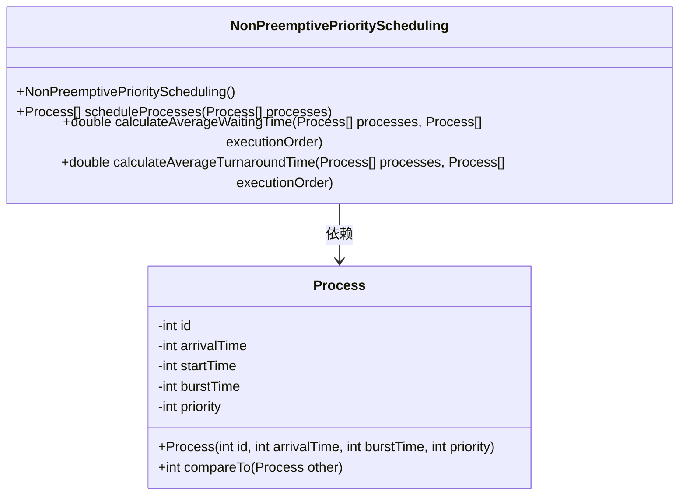
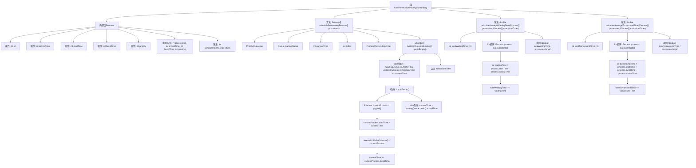

# 基础信息

|      |      |
|------|------|
| 名称 | NonPreemptivePriorityScheduling |
| 编码语言 | .java |
| 代码路径 | Java/src/main/java/com/thealgorithms/scheduling/NonPreemptivePriorityScheduling.java |
| 包名 | com.thealgorithms.scheduling |
| 依赖项 | ['java.util.Collections', 'java.util.LinkedList', 'java.util.PriorityQueue', 'java.util.Queue'] |
| 概述说明 | 非抢占式优先级调度算法，按优先级和到达时间调度进程，计算平均等待和周转时间。 |

# 说明

非抢占式优先级调度算法是一种进程调度方法，它根据进程的优先级和到达时间来决定执行顺序。在该算法中，进程一旦开始执行，就不会被更高优先级的进程打断，直到其完成。调度过程中，系统首先选择优先级最高的进程，若优先级相同，则选择先到达的进程。计算平均等待时间和周转时间时，需统计所有进程的等待时间和周转时间，并求其平均值。等待时间指进程从到达就绪队列到开始执行的时间，周转时间指进程从到达系统到完成执行的总时间。该算法适用于优先级明确且进程执行时间较短的场景。

# 类列表 Class Summary

| 名称   | 类型  | 说明 |
|-------|------|-------------|
| NonPreemptivePriorityScheduling | class | 非抢占式优先级调度算法，按优先级和到达时间调度进程，计算平均等待时间和周转时间。 |

## 类 NonPreemptivePriorityScheduling

|      |      |
|------|------|
| 访问范围 | public final |
| 类型 | class |
| 名称 | NonPreemptivePriorityScheduling |
| 说明 | 非抢占式优先级调度算法，按优先级和到达时间调度进程，计算平均等待时间和周转时间。 |

### UML类图

这段代码实现了一个非抢占式优先级调度算法。`NonPreemptivePriorityScheduling`类包含调度进程、计算平均等待时间和平均周转时间的方法。`Process`类表示一个进程，包含进程的ID、到达时间、开始时间、执行时间和优先级。`Process`类实现了`Comparable`接口，用于根据优先级和到达时间对进程进行比较。调度算法使用优先队列和等待队列来管理进程的执行顺序。

### 内部方法调用关系图

这段代码实现了一个非抢占式优先级调度算法，用于调度进程的执行顺序。代码通过内部类`Process`表示进程，并使用优先级队列和等待队列来管理进程的执行顺序。`scheduleProcesses`方法根据进程的优先级和到达时间进行调度，`calculateAverageWaitingTime`和`calculateAverageTurnaroundTime`方法分别计算平均等待时间和平均周转时间。流程图清晰地展示了类结构、方法调用关系以及调度过程中的关键步骤。

### 字段列表 Field List

| 名称  | 类型  | 说明 |
|-------|-------|------|

### 方法列表 Method List

| 名称  | 类型  | 说明 |
|-------|-------|------|
| calculateAverageTurnaroundTime | double | 计算进程平均周转时间的方法。 |
| scheduleProcesses | Process[] | 调度进程，按到达时间和执行时间排序。 |
| calculateAverageWaitingTime | double | 计算进程平均等待时间的方法。 |

